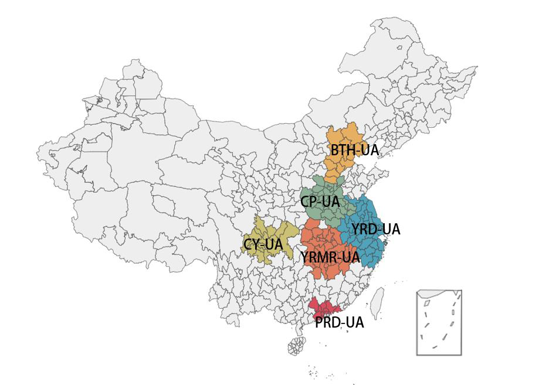
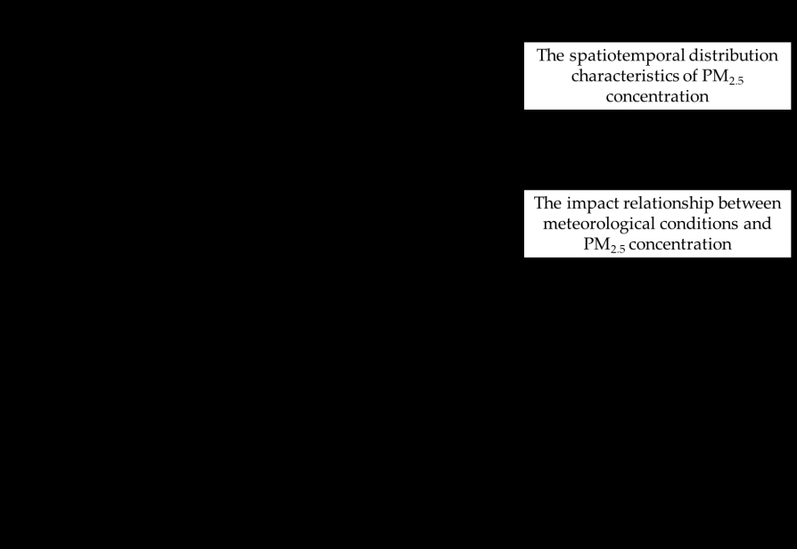
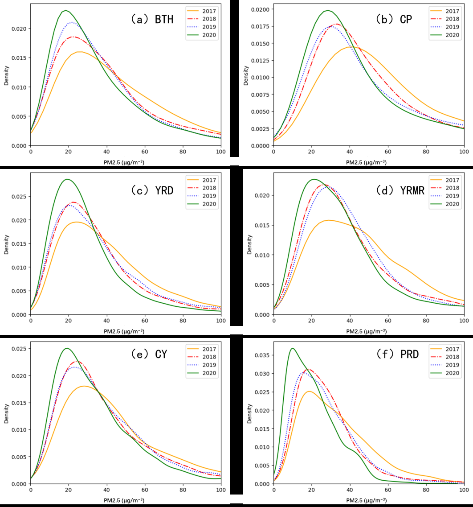
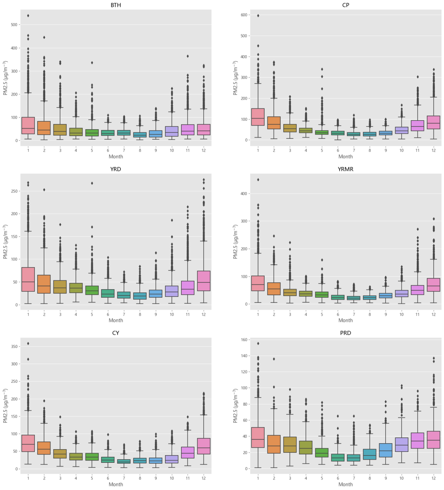
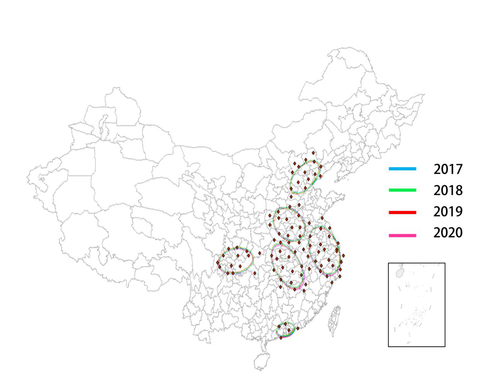
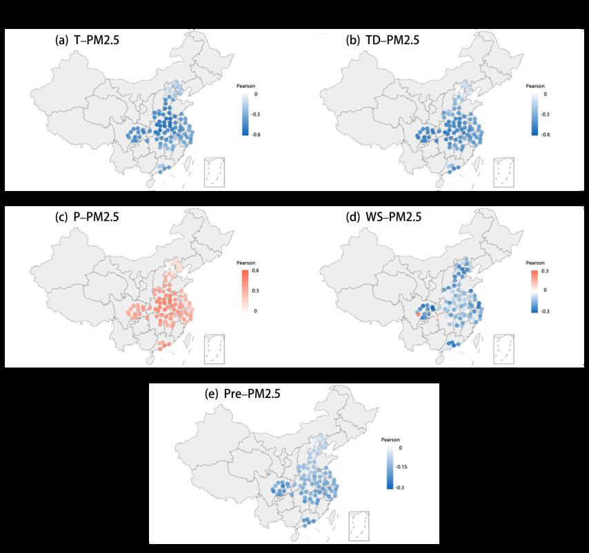
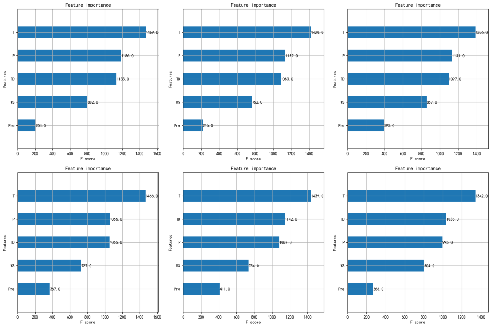

# 深圳大学计算机与软件学院

# 毕业设计（论文）材料

# 文献翻译

| 项目 | 内容 |
|---|---|
| 毕业论文题目 | 基于地理分组泛化与异构专家融合的多源农业环境数据 PM2.5 浓度预测研究 |
| 文献题名 | PM2.5 Concentration Prediction in Six Major Chinese Urban Agglomerations: A Comparative Study of Various Machine Learning Methods Based on Meteorological Data |
| 中文译名 | 中国六大城市群 PM2.5 浓度预测：基于气象数据的多种机器学习方法比较研究 |
| 文献来源 | Atmosphere, 2023, 14, 903. https://doi.org/10.3390/atmos14050903 |
| 专业 | 计算机科学与技术 |
| 学生姓名 | 曹博宇 |
| 学号 | 2022080182 |
| 指导教师 | 张昊迪 |
| 完成时间 | 2026 年 6 月 |

> 版权与翻译说明：原文为 MDPI 开放获取论文，依据 Creative Commons Attribution 4.0 International License 发布。本文按毕业设计外文文献翻译材料要求进行严格翻译，保留原文的章节结构、图表编号、表格数据、文内引用编号、作者贡献、资助信息和参考文献顺序。图 1 至图 7 均由原文 PDF 提取并在译文中按原位置插入；参考文献条目保留英文原格式。

---

# 中国六大城市群 PM2.5 浓度预测：基于气象数据的多种机器学习方法比较研究

Duan, M.; Sun, Y.; Zhang, B.; Chen, C.; Tan, T.; Zhu, Y.

南京农业大学公共管理学院；南京农业大学信息管理学院

收稿日期：2023 年 4 月 23 日；修回日期：2023 年 5 月 17 日；录用日期：2023 年 5 月 17 日；发表日期：2023 年 5 月 22 日。

## 摘要

中国快速发展的城市地区中，空气污染问题日益加剧，这促使人们更加关注气象条件在 PM2.5 污染中的作用。本研究使用日均数据，考察 2017 年至 2020 年中国六大城市群 PM2.5 浓度的时空分布，以及其与气象因素之间的关系。本文采用统计分析和空间分析技术，同时构建八种机器学习模型用于预测。研究还比较了影响 PM2.5 浓度的不同气象因素的特征重要性。结果表明，平均 PM2.5 水平和气象影响均存在显著区域差异。多层感知机（MLP）模型在 PM2.5 浓度预测中表现出最高预测精度。根据 MLP 模型的特征重要性识别结果，温度是所有城市群中影响 PM2.5 浓度的最重要因素，而风速和降水的影响最小。然而，气压和露点温度的贡献在不同城市群之间存在差异。本研究考虑了城市群和气象条件对 PM2.5 的影响，也提供了基于人工智能的有价值认识，用以识别不同区域影响 PM2.5 浓度的关键气象因素，从而为制定有效的空气污染控制政策提供参考。

**关键词**：PM2.5；机器学习；气象因素；预测

## 1 引言

在过去几十年中，PM2.5 污染已经成为全球范围内一个重要的环境问题。中国是受 PM2.5 污染影响最严重的地区之一。随着中国经济快速发展、工业化和城市化快速推进，大量由化石燃料燃烧、工厂排放、机动车排放和建筑施工活动产生的污染物被排放到空气中，导致由细颗粒物 PM2.5 引起的环境污染问题频繁发生[1]。这对生态系统[2]、食品安全[3]和人类健康[4,5]产生了严重负面影响。近年来，在一系列环境保护规划和法律的影响下，中国空气质量已有改善，但中国城市地区仍然面临来自 PM2.5 浓度的极高威胁[6]，有关 PM2.5 生成、分布和影响的研究也逐渐受到关注。

为了探索 PM2.5 的变化规律，并制定良好的政策规划以应对空气污染问题，PM2.5 的时空分布特征、影响因素和健康评价已得到广泛研究[7,8]。PM2.5 浓度的驱动因素大致可以分为自然因素和社会因素。GDP、能源消耗、人类活动、政府措施[9]和城市公共交通使用[10]等社会因素能够影响空气污染物的形成。自然因素通常会影响 PM2.5 的转移和消解，例如森林能够有效吸收 PM2.5 颗粒物，提高城市植被覆盖率可以降低 PM2.5 污染[11]。气象条件被认为是影响 PM2.5 浓度的重要自然因素之一[12]。温度影响大气稳定度和化学反应速率，高温会增强 PM2.5 的扩散和分解。逆温也是中国各地秋冬季 PM2.5 高污染的主要原因之一[13]。气压通常影响风向变化，高气压促进空气集中，有利于 PM2.5 积累[14]。风速影响 PM2.5 的扩散速率和稀释效率[15]。相对湿度对 PM2.5 的影响较为复杂，一方面会促进 PM2.5 在空气中的溶解，另一方面也会刺激化学反应，进一步形成二次污染物[16]。降水对 PM2.5 具有冲刷和沉降作用[17]。因此，气象条件通过多种机制影响 PM2.5 的扩散、沉降和化学反应过程。由于不同区域之间气候不同，气象条件对空气污染物的影响也存在空间差异[9]。近海地区容易受到大气环流引起的跨境污染影响。

与此同时，近期研究表明，在城市群尺度上，PM2.5 的局部空间集聚效应更加明显[18-20]。京津冀地区[21]、长江三角洲[22]、珠江三角洲[23]、江汉-洞庭湖平原（两湖盆地）[24]、中原城市群[25]和成渝盆地[26]都曾经历严重的区域性雾霾问题。此外，由于各城市群气象条件不同，气象条件对 PM2.5 的影响表现出空间异质性，并且这种差异在不同城市群之间更加明显[27,28]。因此，对 PM2.5 污染问题进行综合分析需要考虑 PM2.5 的区域分布差异，而城市群是研究气象条件与 PM2.5 关系区域差异的重要空间尺度。

已有研究为气象因素与 PM2.5 浓度之间的线性关系提供了详细证据[27,29]。然而，由于不同气象因素之间存在相互作用，线性相关系数无法完全解释气象对 PM2.5 的影响[30]。近年来，机器学习方法越来越多地被用于预测 PM2.5 浓度。与传统统计模型相比，机器学习方法具有更强的非线性拟合能力和更高的预测精度[31]。目前，许多研究已经尝试使用多种机器学习方法预测 PM2.5 浓度，例如逻辑回归[32]、支持向量机[33]、决策树[34]、随机森林[35]、极端梯度提升[36]和神经网络[37]。这些研究表明，机器学习方法在 PM2.5 浓度预测中具有很有前景的应用价值。

然而，当前基于机器学习方法预测气象条件对 PM2.5 浓度影响的研究仍存在一些不足。第一，大多数研究关注单一机器学习方法，对不同方法性能和适用性的比较分析较少[32,38]。第二，现有研究多集中于特定区域和时间范围[39,40]，缺少从城市群视角开展的比较分析[41]。

综上，本文以中国六大城市群为研究对象，结合各城市 PM2.5 浓度数据和气象数据，采用统计分析、空间分析和机器学习等多种方法：（1）揭示六大城市群 PM2.5 浓度的年际变化、月度变化和空间分布模式；（2）测度多种气象因素对 PM2.5 浓度变化的影响；（3）构建八种机器学习模型，基于多种气象因素的影响预测 PM2.5 浓度，并比较不同模型的预测性能；（4）进一步比较不同城市群中不同气象因素在预测 PM2.5 浓度时的重要性，确定各城市群 PM2.5 预测中最重要的特征，从而丰富现有 PM2.5 预测研究体系。

## 2 研究区、数据与方法

### 2.1 研究区

如图 1 所示，本文研究区为中国大陆，并选取六个城市群，包括京津冀城市群（BTH-UA）、中原城市群（CP-UA）、长江三角洲城市群（YRD-UA）、长江中游城市群（YRMR-UA）、成渝城市群（CY-UA）和珠江三角洲城市群（PRD-UA）。京津冀城市群位于中国北部，包括北京、天津两个特大城市以及河北省内若干城市，是中国重要的政治和文化中心。中原城市群主要由河南省组成，同时包括安徽省北部和山东省西部的若干城市，郑州为其中心城市。长江三角洲城市群位于长江下游，覆盖上海以及江苏、浙江和安徽等省份，包括上海、南京、杭州和合肥等城市，是中国经济最发达的地区之一。珠江三角洲城市群位于南部沿海地区，是华南重要经济中心，连接香港和澳门，并包括广州和深圳两个特大城市。长江中游城市群覆盖湖北、湖南和江西等省份的若干主要城市。该区域包括江汉-洞庭湖平原[29]，是中国经济发展的新支柱。成渝城市群位于中国西部，包括四川盆地，并包含成都和重庆两个大城市。所选城市群覆盖了中国经济发展水平相对较高的六大城市群，这些地区经历过多次区域性 PM2.5 污染事件，并受到学术研究的广泛关注。

所选城市群也充分考虑了气象条件差异。BTH-UA 和 CP-UA 位于中国北方，平均气温和总体湿度较低。YRD-UA 和 PRD-UA 均属于沿海城市群，气象条件复杂多变。大气环流显著受到海洋气压影响[14]，且 PRD-UA 位于南部沿海，平均温度、湿度和降水量较高。YRMR-UA 和 CY-UA 位于内陆，PM2.5 污染物更易受到季风和气团输送影响[24,26]。由于纬度、地形和其他条件的影响，六大城市群具有明显气象差异。

### 2.2 研究数据与说明

本文选取的数据样本时间维度为 2017 年 1 月至 2020 年 12 月。PM2.5 浓度数据来自中国环境监测总站（CNEMC）提供的中国 342 个城市小时平均 PM2.5 浓度监测数据。各城市日均 PM2.5 浓度数据由这些数据计算得到。

气象数据来自美国国家气候数据中心（NCDC）公开提供的中国地面气象数据。数据包括中国 400 多个气象监测站每 3 小时记录的平均温度（T）、气压（P）、露点温度（TD）、风速（WS）和降水（Pre）。其中，露点温度用于间接测量空气湿度。这些气象指标与中国国家气象科学数据中心的指标一致，并已被许多研究采用[42-44]。通过计算获得各城市 24 小时日均气象数据，具体指标信息见表 1。同时，通过同一渠道获得站点的海拔、经度和纬度。

表 1 数据信息列表

| 变量 | 符号 | 单位 | 时段 | 来源 |
|---|---|---|---|---|
| PM2.5 浓度 | PM2.5 | µg/m³ | 2017 年 1 月至 2020 年 12 月 | 中国环境监测总站 |
| 气温 | T | ℃ | 2017 年 1 月至 2020 年 12 月 | 美国国家气候数据中心 |
| 气压 | P | hPa | 2017 年 1 月至 2020 年 12 月 | 美国国家气候数据中心 |
| 露点温度 | TD | ℃ | 2017 年 1 月至 2020 年 12 月 | 美国国家气候数据中心 |
| 风速 | WS | m/s | 2017 年 1 月至 2020 年 12 月 | 美国国家气候数据中心 |
| 降水 | Pre | mm | 2017 年 1 月至 2020 年 12 月 | 美国国家气候数据中心 |

由于两套数据的地理层级不同，本文根据观测站所在城市，将气象数据与城市 PM2.5 数据进行匹配和整合。最终获得六大城市群 95 个城市 2017 年至 2020 年的 PM2.5 浓度数据和气象数据集合。

### 2.3 研究方法

#### 2.3.1 核密度估计（KDE）

核密度估计（KDE）是一种非参数检验方法。KDE 不对数据分布施加任何假设，而是从数据样本本身研究数据分布特征的方法。其估计公式如下：

$$
f(x)=\frac{1}{ab}\sum_{i=1}^{a}A\left(\frac{x_i-x}{b}\right)
$$

本文使用 KDE 计算 PM2.5 密度函数，用于表征六大城市群年度 PM2.5 浓度分布，并绘制核密度曲线。曲线横轴表示 PM2.5 浓度值，纵轴表示密度。曲线峰值表示一年中 PM2.5 浓度出现频率最高的位置。

#### 2.3.2 标准差椭圆（SDE）

标准差椭圆（SDE）又称方向分布，广泛用于地理研究。在本研究中，SDE 使用椭圆形状描绘六大城市群中各城市群 PM2.5 浓度的标准差，椭圆长轴和短轴用于判断 PM2.5 的离散程度和分布情况。椭圆平均中心表示 PM2.5 浓度的中心位置。椭圆每年的移动轨迹和范围变化可以揭示城市群 PM2.5 分布趋势的变化。分析使用 GIS 10.8 软件空间统计工具中的方向分布（标准差椭圆）工具完成。

#### 2.3.3 Pearson 相关系数

Pearson 相关系数是一种用于判断两个变量之间线性相关关系的统计检验方法。两个变量之间的 Pearson 相关系数定义为协方差与两个变量标准差乘积的比值：

$$
\rho =
\frac{\sum_{i=1}^{n}(X_i-\bar{X})(Y_i-\bar{Y})}
{\sqrt{\sum_{i=1}^{n}(X_i-\bar{X})^2}\sqrt{\sum_{i=1}^{n}(Y_i-\bar{Y})^2}}
$$

在本研究中，计算每个城市日均 PM2.5 浓度与五个气象因素之间的 Pearson 相关系数，以评估各气象因素对 PM2.5 浓度的影响。相关系数范围为 -1 至 1，0 至 1 表示 PM2.5 浓度与气象因素正相关，即该气象因素有助于 PM2.5 积累；-1 至 0 表示负相关，即该气象因素有助于 PM2.5 去除；0 表示该气象因素不影响 PM2.5。

#### 2.3.4 机器学习预测

本研究尝试使用机器学习技术预测城市群 PM2.5 浓度。本文使用八种机器学习算法构建回归预测模型，包括 XGBT、KNN、LR、RF、DT、SVM、GBDT 和 MLP。

DT、GBDT、RF 和 XGBT 均为决策树机器学习算法。DT（Decision Tree，决策树）是最基本的决策树算法，可以根据给定训练数据集构建决策树模型并进行分类，本质上是从训练集中推导出一组分类规则。GBDT（Gradient Boosting Decision Tree，梯度提升决策树）是一种迭代决策树算法，每次迭代都基于残差构建新的决策树，通过迭代增强进一步提高预测结果精度。RF（Random Forest，随机森林）是一种监督集成学习方法，它在回归模型中使用决策树训练样本，构建大量决策树并取预测值平均值，不易过拟合且训练速度较快[42]。XGBT（XGBoost）是一种增强决策树方法，可以基于模型残差创建更好的学习器并实现分布式梯度提升，相比传统 GBDT 改进了算法，并能更好地控制模型复杂度，已广泛用于区域 PM2.5 浓度预测[36,45]。KNN（K-Nearest Neighbor，K 近邻）是一种方法，其中一个样本具有 k 个最近邻，并根据样本特征把这些邻近样本的加权平均值赋给该样本，从而生成预测[46]。LR（Linear Regression，线性回归）是最简单的回归模型，只涉及一个自变量，并被广泛用于 PM2.5 预测及多种预测方法比较研究[47]。支持向量机（SVM）是一种判别分类器技术，可以使用核函数使原始线性算法“非线性化”，并广泛用于小样本集预测[48]。MLP（Multilayer Perceptron，多层感知机）又称人工神经网络（ANN），是由多个感知机组成的神经网络，在处理非线性系统方面具有显著优势[49]。

#### 2.3.5 机器学习模型评价

在评价模型精度时，计算机器学习预测数据集的均方根误差（RMSE）来评价模型。RMSE 是衡量回归模型预测性能的常用指标之一[49,50]。

$$
RMSE = \sqrt{\frac{1}{m}\sum_{i=1}^{m}(y_{test}^{(i)}-\hat{y}_{test}^{(i)})^2}
$$

随后，使用由 10 折交叉验证计算得到的均方根误差的平均交叉验证分数（MCVS）进一步评价模型预测性能。上述八种模型使用分层随机抽样，以 80/20 比例将数据集划分为训练集和测试集。然后对预测模型进行 10 折交叉验证，将数据集划分为 10 个相等部分，其中一部分作为测试集，剩余九部分作为训练集，并多次计算模型均方根误差精度，以评价模型平均精度。RMSE 和 MCVS 均反映预测值与真实值之间的偏差，数值越小，回归模型精度越高。研究方法框架见图 2。

## 3 六大城市群 PM2.5 的时空特征

### 3.1 PM2.5 浓度年际变化

2017 年至 2020 年六大城市群 PM2.5 浓度的核密度估计结果见图 3。根据核密度曲线，2017 年至 2020 年六大城市群曲线峰值随年份变化变得更陡峭并向左移动，说明城市群 PM2.5 浓度逐年持续降低，低 PM2.5 浓度天数不断增加。40 µg/m³ 以上的密度曲线稳定下降且逐年降低，说明 40 µg/m³ 以上高 PM2.5 浓度天数的频率正在下降，城市群空气质量正在改善。所有城市群 2018 年和 2020 年 PM2.5 浓度相较上一年均发生显著变化，这可能是由于 2018 年《大气污染防治法》修订以及《打赢蓝天保卫战三年行动计划》实施，使大气污染综合治理取得良好效果[51]。

2017 年至 2020 年，BTH-UA、CP-UA、YRD-UA、YRMR-UA、CY-UA 和 PRD-UA 的平均 PM2.5 浓度分别为 45.5、57.3、36.8、43.7、41 和 27.4 µg/m³。六大城市群 PM2.5 浓度的年均降幅分别为 5.05、5.38、3.84、4.79、4.73 和 4.22 µg/m³。污染水平较高的城市群具有相对更高的 PM2.5 浓度下降速率。

PRD-UA 的平均 PM2.5 浓度最低，2017 年至 2020 年 PRD-UA 核密度曲线峰值对应的 PM2.5 浓度低于 20 µg/m³，说明 PRD-UA 整体 PM2.5 污染水平较低。CP-UA 的平均 PM2.5 浓度最高，2017 年 CP-UA 核密度曲线峰值对应的 PM2.5 浓度高于 40 µg/m³，比第二位 CY-UA 高出 10 µg/m³ 以上。尽管 2018 年至 2020 年有所改善，但峰值对应的 PM2.5 浓度仍高于 20 µg/m³，说明 CP 地区污染相对最为严重。

### 3.2 PM2.5 浓度月度变化

2017 年至 2020 年六大城市群 PM2.5 浓度月度变化见图 4。中国各地区 PM2.5 浓度表现出秋冬季高、春夏季低的 U 型趋势。1 月平均 PM2.5 浓度通常最高，日 PM2.5 最高浓度也出现在 1 月。PM2.5 浓度从 1 月至 6 月下降，7 月至 9 月保持稳定并具有最低平均浓度，10 月至 12 月开始上升。BTH-UA 的最低 PM2.5 浓度出现在 8 月，而 CP-UA、YRD-UA、YRMR-UA 和 CY-UA 的最低 PM2.5 浓度出现在 7 月，PRD-UA 的最低 PM2.5 浓度出现在 6 月和 7 月。BTH-UA 和 CP-UA 秋冬季污染水平比其他城市群更严重。

### 3.3 标准差椭圆分析

本文使用 SDE 方法表征六大城市群 PM2.5 浓度的空间分布特征。如图 5 所示，六大城市群的椭圆特征不同，说明 PM2.5 具有不同空间模式。椭圆平均中心位于各城市群的中心城市。在 BTH-UA 中，PM2.5 主要沿东北-西南方向分布；椭圆方位角从 2018 年的 58.09 下降到 2020 年的 56.43，且椭圆面积持续收缩，整体空间格局向东偏移并收缩；平均中心位于北京和天津之间。CP-UA 的椭圆相对较圆，长轴与短轴之比小于其他城市群，约为 1.5，整体呈西北-东南方向分布。YRD-UA 主要沿西北-东南方向分布，这与合肥-南京-上海-杭州的主要城市分布更加一致，平均中心位于南京，方位角在 142.3 左右波动，没有明显移动趋势。YRMR-UA 的 PM2.5 浓度总体沿西北-东南方向分布，中心位于武汉。CY-UA 总体沿东北-西南方向分布，椭圆方位角一直在 83 左右，更接近东西向分布。长轴与短轴之比从 2017 年的 1.95 增加到 2020 年的 2.01，PM2.5 分布变得更加分散。PRD-UA 的椭圆方位角保持在 82 左右，整体 PM2.5 浓度沿东北-西南方向分布，接近东西向分布，中心位于广州。

## 4 气象条件与 PM2.5 浓度之间的关系

为了全面探索不同城市群 PM2.5 浓度的变化规律，本文计算 2017 年至 2020 年不同城市中 PM2.5 浓度与各气象因素之间的 Pearson 相关系数。

如图 6a 所示，六大城市群所有城市的温度均与 PM2.5 浓度呈负相关，温度因素总体上对 PM2.5 浓度具有负向影响。最大 Pearson 系数出现在北京，数值为 -0.084，BTH-UA 中的负相关呈现“北弱南强”的分布。最小值出现在河南省南阳市，数值为 -0.62。由图可知，河南、安徽和湖北等省份的负相关强度高于其他地区。

如图 6b 所示，除北京外，几乎所有城市的露点温度均与 PM2.5 浓度呈负相关，北京具有最大 Pearson 系数 0.062。最小值出现在湖北省宜昌市，数值为 -0.6。CP-UA 南部、YRD-UA 西部、YRMR-UA 和 CY-UA 的负相关较强。与温度相比，露点温度与 PM2.5 浓度之间的负相关向南移动，南部地区的负相关更加明显。BTH-UA 几乎不存在相关关系。

如图 6c 所示，几乎所有城市的气压均与 PM2.5 浓度呈正相关。气压 Pearson 相关系数的布局与露点温度相似，但方向相反。负相关仅出现在北京，Pearson 系数为 -0.023，BTH-UA 北部首都经济圈城市几乎不存在相关关系。最大 Pearson 系数为 0.56，出现在安徽省阜阳市，河南、安徽和湖北等省份相关性较强。

如图 6d 所示，大多数城市的风速与 PM2.5 浓度呈负相关，而少数城市如峨眉山（四川省）、酉阳和长沙（湖南省）呈正相关，Pearson 系数分别为 0.26、0.053 和 0.02。较高负相关区域集中在 YRD-UA 东部沿海地区、BTH-UA 首都经济圈、PRD-UA 和 CY-UA。

如图 6e 所示，降水与 PM2.5 浓度呈负相关，且纬度越高，负相关越强。负相关从北向南变得更加明显。CY-UA、PRD-UA 和 YRMR-UA 南部均表现出较高负相关。降水也是多数沿海地区的主要气象影响因素[17]，在 YRD-UA 和 PRD-UA 沿海城市中的影响比内陆城市更加明显。

综上，气象条件对 PM2.5 的影响存在显著区域差异。在一些内陆城市，温度是影响 PM2.5 浓度的主要因素[12]。在一些沿海城市，降水对 PM2.5 浓度有更大影响。如图 6 所示，气象对 PM2.5 的总体影响在南方强于北方，在内陆强于沿海地区。

## 5 基于机器学习方法的中国城市群 PM2.5 浓度预测

各模型经过学习预测和 10 折交叉验证后，得到六大城市群 PM2.5 浓度与气象条件训练数据集的 RMSE 和 MCVS，见表 2 和表 3。为了从六大城市群角度比较预测精度，计算所有模型对每个城市群预测得到的平均 RMSE 和 MCVS，并记为 Mean-UA。Mean-UA 越大，城市群预测精度越低，气象条件对 PM2.5 的相对影响越小。BTH-UA 和 CP-UA 两个北方城市群的平均 RMSE 和 MCVS 水平高于其他城市群，差值超过 10，说明预测误差较大。PRD-UA 具有最低的平均 RMSE 和 MCVS 水平，预测误差较小。城市群预测误差大小排序与 RMSE 和 MCVS 均值水平排序一致，从高到低为：BTH-UA、CP-UA、YRMR-UA、CY-UA、YRD-UA、PRD-UA。

表 2 使用八种机器学习模型预测六大城市群 PM2.5 浓度的预测精度（RMSE）

| 模型 | BTH-UA | CP-UA | YRD-UA | YRMR-UA | CY-UA | PRD-UA | Mean-ML |
|---|---:|---:|---:|---:|---:|---:|---:|
| XGBT | 35.3 | 35.2 | 21.9 | 25.1 | 23.1 | 14.2 | 25.8 |
| KNN | 36.0 | 36.4 | 23.0 | 26.2 | 24.3 | 14.1 | 26.7 |
| LR | 38.6 | 37.0 | 23.3 | 26.3 | 24.6 | 14.6 | 27.4 |
| RF | 36.8 | 36.4 | 22.9 | 26.1 | 24.2 | 14.3 | 26.8 |
| DT | 46.5 | 47.6 | 30.8 | 36.0 | 30.7 | 18.7 | 35.0 |
| SVM | 40.4 | 38.4 | 24.1 | 27.0 | 25.2 | 15.0 | 28.4 |
| GBDT | 34.5 | 34.2 | 21.8 | 24.9 | 23.0 | 13.4 | 25.3 |
| MLP | 34.0 | 33.7 | 21.7 | 24.7 | 22.4 | 13.3 | 24.9 |
| Mean-UA | 37.8 | 37.4 | 23.7 | 27.0 | 24.7 | 14.7 | 27.5 |

表 3 十折交叉验证后使用八种机器学习模型预测六大城市群 PM2.5 浓度的预测精度（MCVS）

| 模型 | BTH-UA | CP-UA | YRD-UA | YRMR-UA | CY-UA | PRD-UA | Mean-ML |
|---|---:|---:|---:|---:|---:|---:|---:|
| XGBT | 34.3 | 33.8 | 22.0 | 26.3 | 23.3 | 14.6 | 25.7 |
| KNN | 35.3 | 35.3 | 23.2 | 27.4 | 24.0 | 14.8 | 26.7 |
| LR | 38.3 | 36.1 | 23.3 | 27.3 | 24.6 | 15.3 | 27.5 |
| RF | 35.5 | 35.2 | 23.3 | 27.3 | 24.3 | 14.9 | 26.8 |
| DT | 47.7 | 46.7 | 30.4 | 36.5 | 31.8 | 19.9 | 35.5 |
| SVM | 40.4 | 37.4 | 24.1 | 27.9 | 25.2 | 15.7 | 28.4 |
| GBDT | 33.8 | 33.1 | 21.8 | 25.7 | 22.9 | 14.1 | 25.2 |
| MLP | 33.4 | 32.9 | 21.7 | 25.6 | 22.3 | 13.9 | 25.0 |
| Mean-UA | 37.3 | 36.3 | 23.7 | 28.0 | 24.8 | 15.4 | 27.6 |

为了比较八种机器学习模型的预测精度，计算每种机器学习模型在所有城市群上获得的平均 RMSE 和 MCVS，并记为 Mean-ML。Mean-ML 越大，机器学习模型预测性能越差。比较 Mean-ML 可知，MLP 模型获得最低 RMSE 和 MCVS，并且在预测所有城市群时几乎都获得最低 RMSE 和 MCVS，预测性能最佳。GBDT 和 XGBT 模型的表现接近 MLP。DT 模型具有最高 RMSE 和 MCVS，预测性能最差。Mean-ML 大小排序与 RMSE 和 MCVS 排序一致，预测性能从好到坏为：MLP、GBDT、XGBT、KNN、RF、LR、SVM、DT。

如上所述，MLP 模型获得最佳预测性能。基于 MLP 模型，对六大城市群中受气象因素影响的 PM2.5 浓度进行特征重要性识别，结果见图 7。在六大城市群中，温度是最显著的预测因子，而风速和降水分别排在倒数第二和最后。气压和露点温度的预测贡献能力相近，但其贡献水平具有区域差异。在 BTH-UA、YRD-UA、YRMR-UA 和 CP-UA 中，气压的预测贡献高于露点温度；而在 CY-UA 和 PRD-UA 中，露点温度的预测贡献高于气压。

## 6 讨论

基于上述内容，本研究从中国六大城市群视角探索了不同城市群 PM2.5 的时空分布以及气象因素对 PM2.5 的影响，并使用八种不同机器学习算法比较了六大城市群 PM2.5 的预测情况。

首先，根据 PM2.5 浓度月度变化的核密度估计和时间序列分析，可以发现 2017 年至 2020 年所有城市群的 PM2.5 密度逐年下降，冬季 1 月和 12 月 PM2.5 浓度最高，夏季 6 月至 8 月最低。CP-UA 具有最高 PM2.5 密度和平均浓度，污染相对更严重，而 PRD-UA 污染相对较轻。标准差椭圆平均中心位于城市群中心城市，BTH-UA 的 PM2.5 分布范围显著收缩。这与多数 PM2.5 分布研究结论相似，即秋冬季是 PM2.5 高污染季节[27,28]，PM2.5 具有中心城市集聚趋势[22,23,25]，北方地区由于工业能源消耗大和冬季采暖排放[23]，污染更严重[52]，且近年来受到了大量环境治理计划影响[51,53]。

其次，与已有研究类似，本文通过 Pearson 相关系数检验揭示了气象条件对 PM2.5 的影响，发现温度、露点温度、风速和降水与 PM2.5 浓度负相关，而气压与 PM2.5 浓度正相关。其中，风速和降水影响相对较小，中国不同地区的气象条件及其对 PM2.5 的影响存在显著差异。例如，降水对沿海地区影响更大[54]，且降水对 PM2.5 具有双重影响[55]。华北冬季强风频率相对较高[17]。在 BTH-UA 中，除风速外其他气象因素的影响几乎可以忽略，这基本证实人类因素对 BTH-UA 中 PM2.5 积累的影响更显著[23]。

接着，本研究使用八种机器学习算法预测气象因素对 PM2.5 浓度的影响。根据 RMSE 和 MCVS，获得预测精度最高的城市群和机器学习模型。在城市群预测精度比较方面，预测精度排序与城市群 PM2.5 平均浓度排序相似。BTH-UA 在所有城市群中预测精度最差，而 PRD-UA 预测精度最好。这与已有研究所显示的沿海地区显著受到气象因素影响[54]、北方地区受到气象和社会等多种因素影响[16]的结论一致。

在模型预测精度比较方面，MLP 是预测精度最高的模型，这意味着气象对 PM2.5 的整体影响是一个相对复杂的系统，非线性关系特征更加明显[49]。同时，研究发现 GBDT 和 XGBT 两种迭代机器学习算法的预测性能也较好。经典基础模型决策树在所有模型中对 PM2.5 的预测性能最差，说明复杂模型和集成学习模型更适合预测气象对 PM2.5 的影响。

最后，基于预测精度最佳的 MLP 模型，进一步比较并分析六大城市群 PM2.5 的特征贡献。结果表明，温度是影响所有城市群 PM2.5 的最显著贡献因素，而风速和降水是影响最小的因素。不同城市群中，气压和露点温度的影响程度不同。这与 Pearson 相关系数得到的影响关系一致，降水和风速存在显著区域差异。在多气象因素研究中，也证实了温度在全国所有季节中对 PM2.5 浓度具有最强且最稳定的影响[17]。

与已有研究相比，本文具有一些创新点。第一，考虑到气象条件的区域差异，本文采用城市群作为研究尺度。城市群是现代国家区域经济发展的新模式，该尺度有利于讨论若干经济集中区域的特征。与传统单城市尺度研究相比，城市群尺度具有更强可推广性，也能更好地说明气象条件的区域特征。第二，在方法广度方面，本研究从城市群视角为气象条件与 PM2.5 研究提供了综合分析框架，通过说明 PM2.5 浓度时空分布现状、解释气象与 PM2.5 的影响关系、预测影响因素的特征重要性展开研究。在研究深度方面，本研究应用八种被广泛接受的机器学习算法构建预测模型，并发现 MLP 模型取得较高精度。进一步使用 MLP 确定不同城市群中气象条件的重要性排序，为分析各地区 PM2.5 浓度关键影响因素提供人工智能技术支持，并有助于制定空气污染控制政策。本研究也是少数在考虑不同城市群和气象条件影响的情况下，比较多种机器学习模型预测 PM2.5 浓度的研究之一。本文结果拓展了该领域研究，为寻求确定最适合决策模型的研究人员提供了有用且全面的信息。

本研究也存在许多不足。第一，本研究只考虑了气象条件对 PM2.5 的影响，其他已被广泛研究的因素，如人为排放和地理环境，尚未纳入模型分析。从本研究可以看出，基于 Pearson 系数计算，BTH 区域大多数气象因素的影响接近 0，说明人为排放和其他因素在导致北方 PM2.5 污染方面仍发挥相对重要作用。第二，本研究基于回归模型预测区域 PM2.5 浓度，分类模型的预测分析仍需进一步研究。第三，特征贡献仅基于 MLP 模型的特征重要性，尚未进行更深入的特征选择和新特征构造过程。未来将进一步克服这些不足，提高机器学习的深度和广度，最大限度提升 PM2.5 预测精度，为改善中国空气质量奠定更准确的科学基础。

**作者贡献**：确定写作主题、综述与方法，M.D.；概念化、数据整理、初稿写作与编辑，Y.S.；数据整理、审阅与编辑，B.Z.；数据整理、编辑，C.C.；监督与指导，T.T.；监督与指导，Y.Z.。所有作者均已阅读并同意发表版本。

**资助**：本研究由“111”项目资助（Grant No. B17024）。

**伦理审查声明**：不适用。

**知情同意声明**：不适用。

**数据可用性声明**：当前研究期间生成和/或分析的数据集可根据合理请求从通讯作者处获得。

**致谢**：作者衷心感谢匿名审稿人提出的优秀意见和付出的努力。

**利益冲突**：作者声明不存在利益冲突。

## 参考文献

1. Yue, H.; He, C.; Huang, Q.; Yin, D.; Bryan, B.A. Stronger Policy Required to Substantially Reduce Deaths from PM2.5 Pollution in China. *Nat. Commun.* 2020, 11, 1462.
2. Wu, X.; Xin, J.; Zhang, X.; Klaus, S.; Wang, Y.; Wang, L.; Wen, T.; Liu, Z.; Si, R.; Liu, G.; et al. A New Approach of the Normalization Relationship between PM2.5 and Visibility and the Theoretical Threshold, a Case in North China. *Atmos. Res.* 2020, 245, 105054.
3. Zhou, L.; Chen, X.; Tian, X. The Impact of Fine Particulate Matter (PM2.5) on China’s Agricultural Production from 2001 to 2010. *J. Clean. Prod.* 2018, 178, 133-141.
4. Burnett, R.; Chen, H.; Szyszkowicz, M.; Fann, N.; Hubbell, B.; Pope, C.A.; Apte, J.S.; Brauer, M.; Cohen, A.; Weichenthal, S.; et al. Global Estimates of Mortality Associated with Long-Term Exposure to Outdoor Fine Particulate Matter. *Proc. Natl. Acad. Sci. USA* 2018, 115, 9592-9597.
5. Shou, Y.; Huang, Y.; Zhu, X.; Liu, C.; Hu, Y.; Wang, H. A Review of the Possible Associations between Ambient PM2.5 Exposures and the Development of Alzheimer’s Disease. *Ecotoxicol. Environ. Saf.* 2019, 174, 344-352.
6. Yang, X.; Jiang, L.; Zhao, W.; Xiong, Q.; Zhao, W.; Yan, X. Comparison of Ground-Based PM2.5 and PM10 Concentrations in China, India, and the U.S. *Int. J. Environ. Res. Public Health* 2018, 15, 1382.
7. Geng, G.; Xiao, Q.; Liu, S.; Liu, X.; Cheng, J.; Zheng, Y.; Xue, T.; Tong, D.; Zheng, B.; Peng, Y.; et al. Tracking Air Pollution in China: Near Real-Time PM2.5 Retrievals from Multisource Data Fusion. *Environ. Sci. Technol.* 2021, 55, 12106-12115.
8. Huang, C.; Hu, J.; Xue, T.; Xu, H.; Wang, M. High-Resolution Spatiotemporal Modeling for Ambient PM2.5 Exposure Assessment in China from 2013 to 2019. *Environ. Sci. Technol.* 2021, 55, 2152-2162.
9. Wong, Y.J.; Yeganeh, A.; Chia, M.Y.; Shiu, H.Y.; Ooi, M.C.G.; Chang, J.H.W.; Shimizu, Y.; Ryosuke, H.; Try, S.; Elbeltagi, A. Quantification of COVID-19 Impacts on NO2 and O3: Systematic Model Selection and Hyperparameter Optimization on AI-Based Meteorological-Normalization Methods. *Atmos. Environ.* 2023, 301, 119677.
10. Wong, Y.J.; Shiu, H.-Y.; Chang, J.H.-H.; Ooi, M.C.G.; Li, H.-H.; Homma, R.; Shimizu, Y.; Chiueh, P.-T.; Maneechot, L.; Nik Sulaiman, N.M. Spatiotemporal Impact of COVID-19 on Taiwan Air Quality in the Absence of a Lockdown: Influence of Urban Public Transportation Use and Meteorological Conditions. *J. Clean. Prod.* 2022, 365, 132893.
11. Wu, W.; Zhang, M.; Ding, Y. Exploring the Effect of Economic and Environment Factors on PM2.5 Concentration: A Case Study of the Beijing-Tianjin-Hebei Region. *J. Environ. Manag.* 2020, 268, 110703.
12. Chen, Z.; Chen, D.; Zhao, C.; Kwan, M.; Cai, J.; Zhuang, Y.; Zhao, B.; Wang, X.; Chen, B.; Yang, J.; et al. Influence of Meteorological Conditions on PM2.5 Concentrations across China: A Review of Methodology and Mechanism. *Environ. Int.* 2020, 139, 105558.
13. Qi, L.; Zheng, H.; Ding, D.; Ye, D.; Wang, S. Effects of Meteorology Changes on Inter-Annual Variations of Aerosol Optical Depth and Surface PM2.5 in China-Implications for PM2.5 Remote Sensing. *Remote Sens.* 2022, 14, 2762.
14. Chen, Y.; Fung, J.C.H.; Chen, D.; Shen, J.; Lu, X. Source and Exposure Apportionments of Ambient PM2.5 under Different Synoptic Patterns in the Pearl River Delta Region. *Chemosphere* 2019, 236, 124266.
15. Liu, Y.; Shi, G.; Zhan, Y.; Zhou, L.; Yang, F. Characteristics of PM2.5 Spatial Distribution and Influencing Meteorological Conditions in Sichuan Basin, Southwestern China. *Atmos. Environ.* 2021, 253, 118364.
16. Cheng, Y.; He, K.; Du, Z.; Zheng, M.; Duan, F.; Ma, Y. Humidity Plays an Important Role in the PM2.5 Pollution in Beijing. *Environ. Pollut.* 2015, 197, 68-75.
17. Chen, Z.; Xie, X.; Cai, J.; Chen, D.; Gao, B.; He, B.; Cheng, N.; Xu, B. Understanding Meteorological Influences on PM2.5 Concentrations across China: A Temporal and Spatial Perspective. *Atmos. Chem. Phys.* 2018, 18, 5343-5358.
18. Ouyang, X.; Wei, X.; Li, Y.; Wang, X.-C.; Klemeš, J.J. Impacts of Urban Land Morphology on PM2.5 Concentration in the Urban Agglomerations of China. *J. Environ. Manag.* 2021, 283, 112000.
19. Li, G.; Fang, C.; Wang, S.; Sun, S. The Effect of Economic Growth, Urbanization, and Industrialization on Fine Particulate Matter (PM2.5) Concentrations in China. *Environ. Sci. Technol.* 2016, 50, 11452-11459.
20. Cheng, Z.; Li, L.; Liu, J. Identifying the Spatial Effects and Driving Factors of Urban PM2.5 Pollution in China. *Ecol. Indic.* 2017, 82, 61-75.
21. Yan, D.; Lei, Y.; Shi, Y.; Zhu, Q.; Li, L.; Zhang, Z. Evolution of the Spatiotemporal Pattern of PM2.5 Concentrations in China-A Case Study from the Beijing-Tianjin-Hebei Region. *Atmos. Environ.* 2018, 183, 225-233.
22. Xu, G.; Ren, X.; Xiong, K.; Li, L.; Bi, X.; Wu, Q. Analysis of the Driving Factors of PM2.5 Concentration in the Air: A Case Study of the Yangtze River Delta, China. *Ecol. Indic.* 2020, 110, 105889.
23. Pan, Y.; Zhu, Y.; Jang, J.; Wang, S.; Xing, J.; Chiang, P.-C.; Zhao, X.; You, Z.; Yuan, Y. Source and Sectoral Contribution Analysis of PM2.5 Based on Efficient Response Surface Modeling Technique over Pearl River Delta Region of China. *Sci. Total Environ.* 2020, 737, 139655.
24. Bai, Y.; Zhao, T.; Hu, W.; Zhou, Y.; Xiong, J.; Wang, Y.; Liu, L.; Shen, L.; Kong, S.; Meng, K.; et al. Meteorological Mechanism of Regional PM2.5 Transport Building a Receptor Region for Heavy Air Pollution over Central China. *Sci. Total Environ.* 2022, 808, 151951.
25. Liu, X.; Zhao, C.; Shen, X.; Jin, T. Spatiotemporal Variations and Sources of PM2.5 in the Central Plains Urban Agglomeration, China. *Air Qual. Atmos. Health* 2022, 15, 1507-1521.
26. Cai, K.; Zhang, Q.; Li, S.; Li, Y.; Ge, W. Spatial-Temporal Variations in NO2 and PM2.5 over the Chengdu-Chongqing Economic Zone in China during 2005-2015 Based on Satellite Remote Sensing. *Sensors* 2018, 18, 3950.
27. Li, Z.; Zhang, X.; Liu, X.; Yu, B. PM2.5 Pollution in Six Major Chinese Urban Agglomerations: Spatiotemporal Variations, Health Impacts, and the Relationships with Meteorological Conditions. *Atmosphere* 2022, 13, 1696.
28. Luo, H.; Han, Y.; Cheng, X.; Lu, C.; Wu, Y. Spatiotemporal Variations in Particulate Matter and Air Quality over China: National, Regional and Urban Scales. *Atmosphere* 2020, 12, 43.
29. Chen, L.; Zhu, J.; Liao, H.; Yang, Y.; Yue, X. Meteorological Influences on PM2.5 and O3 Trends and Associated Health Burden since China’s Clean Air Actions. *Sci. Total Environ.* 2020, 744, 140837.
30. Chen, Z.; Cai, J.; Gao, B.; Xu, B.; Dai, S.; He, B.; Xie, X. Detecting the Causality Influence of Individual Meteorological Factors on Local PM2.5 Concentration in the Jing-Jin-Ji Region. *Sci. Rep.* 2017, 7, 40735.
31. Karimian, H.; Li, Q.; Wu, C.; Qi, Y.; Mo, Y.; Chen, G.; Zhang, X.; Sachdeva, S. Evaluation of Different Machine Learning Approaches to Forecasting PM2.5 Mass Concentrations. *Aerosol Air Qual. Res.* 2019, 19, 1400-1410.
32. Tian, H.; Zhao, Y.; Luo, M.; He, Q.; Han, Y.; Zeng, Z. Estimating PM2.5 from Multisource Data: A Comparison of Different Machine Learning Models in the Pearl River Delta of China. *Urban Clim.* 2021, 35, 100740.
33. Zhou, Y.; Chang, F.-J.; Chang, L.-C.; Kao, I.-F.; Wang, Y.-S.; Kang, C.-C. Multi-Output Support Vector Machine for Regional Multi-Step-Ahead PM2.5 Forecasting. *Sci. Total Environ.* 2019, 651, 230-240.
34. He, W.; Meng, H.; Han, J.; Zhou, G.; Zheng, H.; Zhang, S. Spatiotemporal PM2.5 Estimations in China from 2015 to 2020 Using an Improved Gradient Boosting Decision Tree. *Chemosphere* 2022, 296, 134003.
35. Zhao, C.; Wang, Q.; Ban, J.; Liu, Z.; Zhang, Y.; Ma, R.; Li, S.; Li, T. Estimating the Daily PM2.5 Concentration in the Beijing-Tianjin-Hebei Region Using a Random Forest Model with a 0.01° × 0.01° Spatial Resolution. *Environ. Int.* 2020, 134, 105297.
36. Pan, B. Application of XGBoost Algorithm in Hourly PM2.5 Concentration Prediction. *IOP Conf. Ser. Earth Environ. Sci.* 2018, 113, 012127.
37. He, Z.; Guo, Q.; Wang, Z.; Li, X. Prediction of Monthly PM2.5 Concentration in Liaocheng in China Employing Artificial Neural Network. *Atmosphere* 2022, 13, 1221.
38. Chen, G.; Li, S.; Knibbs, L.D.; Hamm, N.A.S.; Cao, W.; Li, T.; Guo, J.; Ren, H.; Abramson, M.J.; Guo, Y. A Machine Learning Method to Estimate PM2.5 Concentrations across China with Remote Sensing, Meteorological and Land Use Information. *Sci. Total Environ.* 2018, 636, 52-60.
39. Wang, M.; Wang, Y.; Teng, F.; Li, S.; Lin, Y.; Cai, H. Estimation and Analysis of PM2.5 Concentrations with NPP-VIIRS Nighttime Light Images: A Case Study in the Chang-Zhu-Tan Urban Agglomeration of China. *Int. J. Environ. Res. Public Health* 2022, 19, 4306.
40. Chen, W.; Ran, H.; Cao, X.; Wang, J.; Teng, D.; Chen, J.; Zheng, X. Estimating PM2.5 with High-Resolution 1-Km AOD Data and an Improved Machine Learning Model over Shenzhen, China. *Sci. Total Environ.* 2020, 746, 141093.
41. Shen, Y.; Zhang, L.; Fang, X.; Ji, H.; Li, X.; Zhao, Z. Spatiotemporal Patterns of Recent PM2.5 Concentrations over Typical Urban Agglomerations in China. *Sci. Total Environ.* 2019, 655, 13-26.
42. Zamani Joharestani, M.; Cao, C.; Ni, X.; Bashir, B.; Talebiesfandarani, S. PM2.5 Prediction Based on Random Forest, XGBoost, and Deep Learning Using Multisource Remote Sensing Data. *Atmosphere* 2019, 10, 373.
43. Tai, A.P.K.; Mickley, L.J.; Jacob, D.J. Correlations between Fine Particulate Matter (PM2.5) and Meteorological Variables in the United States: Implications for the Sensitivity of PM2.5 to Climate Change. *Atmos. Environ.* 2010, 44, 3976-3984.
44. Zhao, D.; Chen, H.; Yu, E.; Luo, T. PM2.5/PM10 Ratios in Eight Economic Regions and Their Relationship with Meteorology in China. *Adv. Meteorol.* 2019, 2019, 1-15.
45. Ma, J.; Yu, Z.; Qu, Y.; Xu, J.; Cao, Y. Application of the XGBoost Machine Learning Method in PM2.5 Prediction: A Case Study of Shanghai. *Aerosol Air Qual. Res.* 2020, 20, 128-138.
46. Danesh Yazdi, M.; Kuang, Z.; Dimakopoulou, K.; Barratt, B.; Suel, E.; Amini, H.; Lyapustin, A.; Katsouyanni, K.; Schwartz, J. Predicting Fine Particulate Matter (PM2.5) in the Greater London Area: An Ensemble Approach Using Machine Learning Methods. *Remote Sens.* 2020, 12, 914.
47. Kumar, V.; Sahu, M. Evaluation of Nine Machine Learning Regression Algorithms for Calibration of Low-Cost PM2.5 Sensor. *J. Aerosol Sci.* 2021, 157, 105809.
48. Masood, A.; Ahmad, K. A Model for Particulate Matter (PM2.5) Prediction for Delhi Based on Machine Learning Approaches. *Procedia Comput. Sci.* 2020, 167, 2101-2110.
49. Feng, X.; Li, Q.; Zhu, Y.; Hou, J.; Jin, L.; Wang, J. Artificial Neural Networks Forecasting of PM2.5 Pollution Using Air Mass Trajectory Based Geographic Model and Wavelet Transformation. *Atmos. Environ.* 2015, 107, 118-128.
50. Ou, C.; Li, F.; Zhang, J.; Hu, Y.; Chen, X.; Kong, S.; Guo, J.; Zhou, Y. Multiple Driving Factors and Hierarchical Management of PM2.5: Evidence from Chinese Central Urban Agglomerations Using Machine Learning Model and GTWR. *Urban Clim.* 2022, 46, 101327.
51. Cai, S.; Ma, Q.; Wang, S.; Zhao, B.; Brauer, M.; Cohen, A.; Martin, R.V.; Zhang, Q.; Li, Q.; Wang, Y.; et al. Impact of Air Pollution Control Policies on Future PM2.5 Concentrations and Their Source Contributions in China. *J. Environ. Manag.* 2018, 227, 124-133.
52. Wang, S.; Sun, P.; Sun, F.; Jiang, S.; Zhang, Z.; Wei, G. The Direct and Spillover Effect of Multi-Dimensional Urbanization on PM2.5 Concentrations: A Case Study from the Chengdu-Chongqing Urban Agglomeration in China. *Int. J. Environ. Res. Public Health* 2021, 18, 10609.
53. Chen, Z.; Chen, D.; Wen, W.; Zhuang, Y.; Kwan, M.-P.; Chen, B.; Zhao, B.; Yang, L.; Gao, B.; Li, R.; et al. Evaluating the “2 + 26” Regional Strategy for Air Quality Improvement during Two Air Pollution Alerts in Beijing: Variations in PM2.5 Concentrations, Source Apportionment, and the Relative Contribution of Local Emission and Regional Transport. *Atmos. Chem. Phys.* 2019, 19, 6879-6891.
54. Zhao, X.; Sun, Y.; Zhao, C.; Jiang, H. Impact of Precipitation with Different Intensity on PM2.5 over Typical Regions of China. *Atmosphere* 2020, 11, 906.
55. Shan, Y.; Wang, X.; Wang, Z.; Liang, L.; Li, J.; Sun, J. The Pattern and Mechanism of Air Pollution in Developed Coastal Areas of China: From the Perspective of Urban Agglomeration. *PLoS ONE* 2020, 15, e0237863.

**免责声明/出版者说明**：所有出版物中包含的陈述、观点和数据仅代表个别作者和贡献者本人，并不代表 MDPI 和/或编辑的观点。MDPI 和/或编辑对内容中提及的任何想法、方法、说明或产品导致的人身或财产损害不承担责任。

