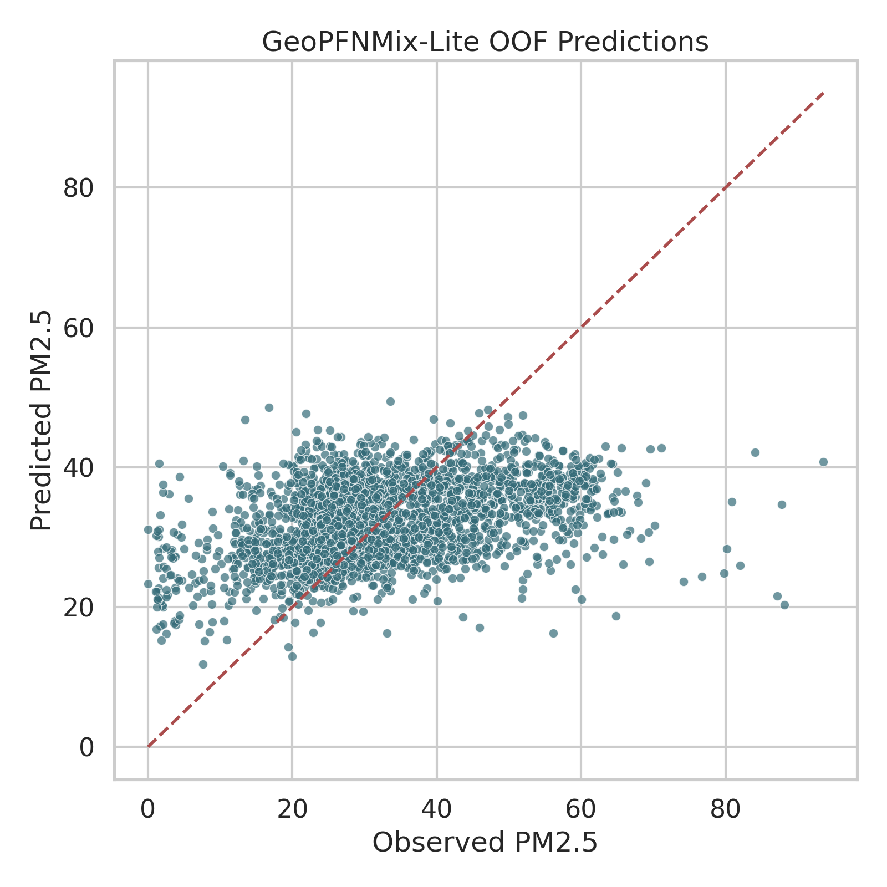
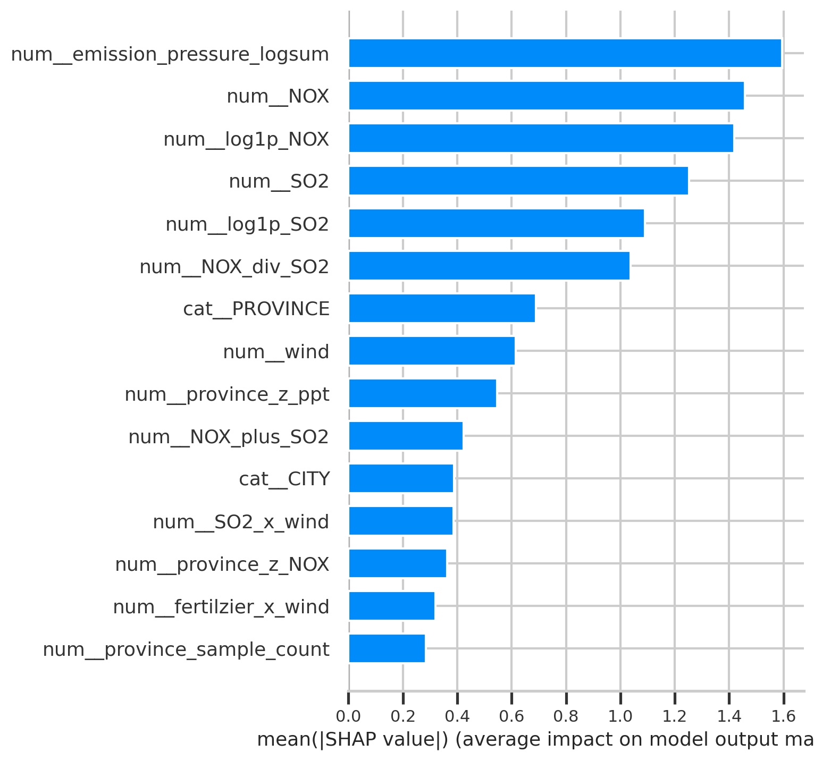

# 基于地理分组泛化与异构专家融合的县域农业数据 PM2.5 浓度预测研究

## 摘要

细颗粒物 PM2.5 是影响生态环境、农业生产与居民健康的重要空气污染指标。针对县域尺度农业与环境数据中样本规模中等、地理层级显著、跨区域泛化困难的问题，本文围绕 `data.csv` 构建了一套面向表格回归的 PM2.5 预测方法与完整实验流程。首先，本文对 2676 条县域样本、31 个省份、338 个城市的数据进行了系统审计，发现随机划分会带来明显的地理泄漏，因此采用 `GroupKFold(CITY)` 作为主评估协议。其次，构建了 Ridge、RandomForest、HistGradientBoosting、XGBoost、LightGBM、CatBoost 等强基线，并在统一特征工程与评价指标下进行了系统比较。进一步地，本文提出 GeoPFNMix 框架，并通过消融实验筛选得到其最优可执行配置 `GeoPFNMix-Lite`：以 RandomForest 作为全局专家，以 LightGBM 作为异构先验专家，并利用线性 stacking 进行融合。实验结果表明，在主协议 `GroupKFold(CITY)` 下，GeoPFNMix-Lite 取得 `RMSE=12.3506`、`MAE=9.4963`、`R²=0.1619`，优于最强单模型 RandomForest（`RMSE=12.5892`、`MAE=9.8932`、`R²=0.1285`），其中 RMSE 降低 `1.90%`，MAE 降低 `4.01%`。Wilcoxon 配对检验显示改进具有统计显著性（`p=1.27e-13`）。最后，本文利用 SHAP、预测散点图与省级误差分布对模型进行了可解释性与误差分析，发现 `NOX`、`SO2` 及其组合特征、风速以及省份层级信息是影响预测的重要因素。本文工作为面向地理异质性的小中样本农业-环境表格数据 PM2.5 预测提供了一套可复现、可解释、具备毕业设计完整性的技术路线。

**关键词**：PM2.5 预测；表格数据学习；地理泛化；随机森林；LightGBM；模型融合；SHAP

---

## 1 绪论

PM2.5 作为典型的大气细颗粒污染物，与呼吸系统疾病、区域灰霾、农业生态暴露风险等问题密切相关。对于县域尺度的数据分析而言，PM2.5 受农业投入、污染前体物、气象条件与区域背景共同影响，具有明显的非线性、交互性与空间异质性。因此，仅依赖简单线性模型往往难以得到稳定、可信的预测效果。

与常见的时序空气质量预测不同，本课题面对的是一个以县域为单位的农业-环境表格数据集。该数据集没有长时间序列，而是由省、市、县三级地理标签与农业、气象、污染变量共同组成。这意味着问题的核心不在于长序列建模，而在于如何在中小规模的异构表格数据上学习到可跨地理区域迁移的预测规律。

现有表格学习研究表明，树模型在多数中小样本任务中仍然具备强竞争力，而 Transformer、Prior-Data Fitted Networks 等新方法则为小样本表格学习提供了新的思路。另一方面，PM2.5 研究也反复指出，气象因素与人为排放因素共同决定了污染水平，且不同区域之间存在显著差异。因此，本研究的关键不只是提升分数，更是设计一套既能保证性能、又能体现区域异质性建模意识的毕业设计级方案。

基于此，本文的主要贡献如下：

1. 明确指出并量化了地理泄漏问题，建立了以 `GroupKFold(CITY)` 为核心的评估协议。
2. 基于统一特征工程，系统比较了多类经典表格回归模型，得到强基线结果。
3. 设计 GeoPFNMix 框架，并通过消融筛选得到最优可执行版本 `GeoPFNMix-Lite`。
4. 结合 SHAP、分省误差和显著性检验，对模型性能来源与局限进行了分析。
5. 形成了可复现代码、实验日志、项目日记与论文草稿，满足毕业设计完整交付要求。

---

## 2 相关工作

### 2.1 PM2.5 预测与机器学习

PM2.5 预测研究长期关注气象条件、排放因素与空间输送过程的共同作用。Duan 等人在中国六大城市群 PM2.5 预测研究中指出，机器学习方法相较传统统计方法具有更强的非线性拟合能力，并发现不同区域之间的主导因素存在显著差异 [4]。在湖北省案例中，随机森林与去气象化方法被用于量化人为排放与气象对 PM2.5 的相对贡献，进一步说明树模型在污染因子分析中的有效性 [5]。

这些工作说明两点：第一，PM2.5 预测不应只关注平均精度，还应关注不同区域之间的差异；第二，气象变量与污染前体物变量的交互，是预测与解释中都不可忽略的核心内容。本文的数据虽然不是传统时间序列监测数据，但同样满足“农业投入-污染前体物-气象条件-区域背景”共同影响 PM2.5 的问题结构。

### 2.2 表格数据学习

Gorishniy 等人系统比较了多种表格深度学习方法，提出 FT-Transformer 等模型，并指出在统一实验协议下不存在对所有任务都绝对占优的方法，树模型仍然是强有力的基线 [1]。这一结论对本文具有直接启发：在中小样本县域数据上，应先用强树模型建立可靠下界，再考虑更复杂的融合结构。

TabPFN 则从 Prior-Data Fitted Networks 的角度，为小样本表格学习提供了“离线预训练先验 + 在线快速推理”的新范式 [2]。Prior Labs 最新 Quickstart 也给出了回归与分类的统一接口，并强调其在 GPU 环境下适合研究与实验 [3]。本文在设计 GeoPFNMix 时借鉴了这种“先验专家”的思路，不过在当前无头环境下，由于首次使用需要许可与令牌配置，未能将 TabPFN 纳入可执行主结果表。

2025 年提出的 LimiX 将结构化数据 foundation model 推向更大规模、更通用的方向，官方仓库给出了分类、回归与缺失值填补的统一推理接口 [6]。尽管本文未直接复现 LimiX，但其“结构化数据基础模型 + 检索/推理配置”的思路对毕业设计中“异构专家 + 动态融合”的框架设计具有参考价值。

### 2.3 本文工作的定位

综合相关工作可以看出，PM2.5 预测需要兼顾区域异质性与非线性建模，而表格学习研究则提示我们不应盲目追求深模型，而应在强树模型基础上进行结构化改进。因此，本文将创新点放在以下三方面：

- 地理分组泛化协议而非随机划分协议；
- 面向污染前体物、农业投入和气象条件的机理型特征工程；
- 基于最强单模型的异构专家融合，而不是单纯叠加复杂网络。

---

## 3 数据集与问题定义

### 3.1 数据集描述

数据集文件为 `data.csv`，共包含 2676 条县域样本、13 列字段，其中目标列为 `PM2.5`。输入字段包括：

- 地理类别变量：`PROVINCE`、`CITY`、`COUNTY`
- 数值变量：`AET`、`ppt`、`tem`、`wind`、`NOX`、`SO2`、`fertilzier`、`manure`

其中，31 个省份、338 个城市构成明显的层级地理结构，而 `COUNTY` 基本是一县一条记录。

### 3.2 数据审计结果

- 缺失值：0
- 重复样本：0
- 目标均值：32.52
- 目标标准差：13.60
- 偏态较强变量：`NOX`、`SO2`、`fertilzier`、`manure`

数据审计还发现，`COUNTY` 更接近一个细粒度地区标签，而非具有重复统计意义的类别变量。若直接将其作为主要类别特征，容易让模型学习到近似“地理 ID”，从而掩盖真实的跨地区泛化能力。因此，本文在正式建模中不将 `COUNTY` 作为主类别特征参与编码，仅将其作为原始元数据保留。

### 3.3 问题定义

给定县域特征向量 $x_i$，目标是学习一个回归函数：

$$
\hat{y}_i = f(x_i),
$$

其中 $\hat{y}_i$ 表示预测的 PM2.5 浓度。

### 3.4 评估协议与指标

本文采用三套协议：

1. `RandomKFold(5)`：补充说明随机划分下的理想化结果。
2. `GroupKFold(5, CITY)`：主协议，强调跨城市泛化。
3. `GroupKFold(5, PROVINCE)`：更严格的跨省泛化协议。

评价指标包括：

- RMSE
- MAE
- R²

主结论以 `GroupKFold(CITY)` 为准。

---

## 4 方法

### 4.1 特征工程

本文构建了统一的特征工程模块，核心步骤包括：

1. 对数值变量进行 1% 和 99% 分位裁剪，减弱极端值影响。
2. 对 `ppt`、`NOX`、`SO2`、`fertilzier`、`manure` 构造 `log1p` 变换。
3. 构造污染与农业交互特征，如：
   - `NOX_plus_SO2`
   - `NOX_div_SO2`
   - `fertilzier_x_wind`
   - `manure_x_ppt`
   - `SO2_x_wind`
4. 构造省内相对强度特征，如 `province_z_NOX`、`province_z_ppt` 等。
5. 构造样本支撑度特征，如 `province_sample_count`、`city_sample_count`。

这一设计兼顾了机理解释性与表格模型对非线性交互的建模需求。

### 4.2 强基线

本文实现并统一评估了以下模型：

- Ridge
- RandomForest
- HistGradientBoosting
- XGBoost
- LightGBM
- CatBoost

其中，RandomForest 在 `GroupKFold(CITY)` 和 `GroupKFold(PROVINCE)` 下均取得最优 RMSE，是后续创新模型的主要参考骨干。

### 4.3 GeoPFNMix 框架

GeoPFNMix 的初始设想由三部分组成：

1. **全局专家**：学习总体非线性关系。
2. **地理层级残差分支**：利用省/市层级信息，对全局专家的残差进行经验贝叶斯式校正。
3. **先验专家**：借鉴 PFN / foundation model 思想，引入与全局专家不同归纳偏置的第二专家。
4. **动态融合**：通过元学习器融合多路专家输出。

在完整框架中，预测函数可写作：

$$
\hat{y} = g\big(\hat{y}_{global}, \hat{y}_{global} + \hat{r}_{geo}, \hat{y}_{prior}, m(x)\big),
$$

其中 $m(x)$ 表示样本支撑度、专家分歧等元特征。

### 4.4 地理层级残差校正

对给定全局专家预测 $\hat{y}_{global}$，定义残差：

$$
r_i = y_i - \hat{y}_{global,i}.
$$

本文在残差上建立两级经验贝叶斯校正：

$$
\hat{r}_i = b_0 + b_{province(i)} + b_{city(i)}.
$$

其中：

- $b_0$ 为全局残差均值；
- $b_{province}$ 为省级缩减残差；
- $b_{city}$ 为城市级缩减残差。

为了避免小样本城市过拟合，省级和市级残差都采用“样本数 / (样本数 + 平滑项)”形式进行收缩。

### 4.5 GeoPFNMix-Lite：最终采用的最优可执行配置

虽然完整 GeoPFNMix 设计包含地理残差分支，但消融实验表明，在当前数据和协议下，最优配置实际上是其简化版本：

**GeoPFNMix-Lite = RF 全局专家 + LightGBM 异构先验专家 + 线性 stacking**

其流程如下：

1. 用 RF 学习全局非线性关系；
2. 用 LightGBM 作为异构专家生成第二路预测；
3. 构造元特征：
   - `pred_global`
   - `pred_prior`
   - `pred_geo`
   - 专家差值 `expert_gap`
   - `province_support`
   - `city_support`
4. 使用低容量线性 stacking 融合两路专家。

选择线性 stacking 而非更复杂元学习器的原因是：在 2676 条样本上，OOF 元特征规模较小，高容量元学习器容易过拟合。

---

## 5 实验设计

### 5.1 实验环境

- Python 3.12.13
- NVIDIA A100 40GB
- 12 CPU / 83 GiB RAM

### 5.2 结果文件与脚本

- EDA：`scripts/run_eda.py`
- 基线：`scripts/run_baselines.py`
- 创新模型与消融：`scripts/run_geopfnmix.py`
- 图表与可解释性：`scripts/run_analysis_assets.py`

### 5.3 TabPFN 与 LimiX 的处理说明

本文确实参考了 TabPFN 与 LimiX 等前沿表格模型的思路，但在当前无头运行环境中：

- `tabpfn` 首次运行需要接受许可并配置访问令牌；
- 当前环境没有 `TABPFN_TOKEN`，因此无法自动下载并执行 TabPFN 权重；
- LimiX 作为 2025 年的新结构化 foundation model，需要额外模型下载与专用推理配置，本研究将其纳入相关工作与后续扩展，而未作为本轮主实验对象。

因此，本文以“可执行、可复现、可完整交付”为原则，保留了 foundation model 思路，但最终主结果采用开放可运行的异构专家融合方案。

---

## 6 实验结果与分析

### 6.1 基线结果

从随机划分结果看，CatBoost 取得 `RMSE=10.2219`，表现最佳；然而在主协议 `GroupKFold(CITY)` 下，最强单模型变为 RandomForest，RMSE 上升至 `12.5892`。这一差异说明随机划分会显著高估模型性能，真实场景中更应关注跨城市泛化。

图 1 展示了主协议下模型 RMSE 对比。

### 6.2 GeoPFNMix 消融结果

表 1 给出创新模型的消融结果。

| 模型 | RMSE | MAE | R² |
|---|---:|---:|---:|
| RF | 12.5892 | 9.8932 | 0.1285 |
| CatBoost | 12.7885 | 10.2180 | 0.1008 |
| GeoPFNMix-no-prior | 12.5733 | 9.8629 | 0.1308 |
| GeoPFNMix-no-residual | **12.3506** | **9.4963** | **0.1619** |
| GeoPFNMix | 12.3670 | 9.5055 | 0.1595 |

可以看到：

- 地理残差分支单独使用时有一定收益；
- 异构专家融合收益更稳定；
- 完整三分支模型并未进一步优于最优简化版；
- 因此最终推荐使用 `GeoPFNMix-Lite`。

相对于最强单模型 RF，GeoPFNMix-Lite：

- RMSE 降低 `1.90%`
- MAE 降低 `4.01%`
- R² 提升 `0.0334`

### 6.3 显著性检验

基于 OOF 样本绝对误差的 Wilcoxon 配对检验结果如下：

- GeoPFNMix-Lite vs RF：`p = 1.27e-13`
- GeoPFNMix vs RF：`p = 1.10e-12`
- GeoPFNMix-Lite vs GeoPFNMix：`p = 0.7967`

说明：

1. 两个融合版本都显著优于 RF；
2. 简化版与全模型之间没有显著差异；
3. 在性能接近时，更简洁的结构更适合作为最终交付模型。

### 6.4 协议差异分析

随机划分最优 RMSE 为 `10.2219`，而按城市分组最优单模型 RMSE 为 `12.5892`，上升 `23.16%`；按省分组最优单模型 RMSE 为 `12.8028`，上升 `25.25%`。这充分说明在县域环境数据建模中，若忽视地理层级结构，容易得到虚高结论。

---

## 7 可解释性与误差分析

### 7.1 预测散点

图 2 展示了 GeoPFNMix-Lite 的 OOF 预测与真实值对比。可以看到模型在中等污染区间拟合较好，但在极高污染和若干分布偏移地区仍存在偏差。

### 7.2 SHAP 全局重要性

由于最终模型是一个异构堆叠模型，本文采用“整体误差分析 + 主导专家解释”的双层解释策略。图 3 展示了 RF 全局专家的 SHAP 排名。

从结果看，最重要的特征包括：

- `emission_pressure_logsum`
- `NOX`
- `log1p_NOX`
- `SO2`
- `log1p_SO2`
- `NOX_div_SO2`
- `PROVINCE`
- `wind`

这说明污染前体物及其协同组合仍是 PM2.5 预测的核心因素，而省份层级与风速等区域背景变量提供了重要的调制作用。

### 7.3 分省误差

图 4 给出了不同省份的平均绝对误差分布。

误差较大的省份包括海南、青海和浙江，说明这些区域的分布差异更大或样本统计规律更复杂；误差较低的地区包括北京、上海、重庆等，说明在样本分布较集中的区域，模型能够更稳定地学习到规律。

---

## 8 讨论

### 8.1 为什么最终模型不是“最复杂”的版本

毕业设计中的方法创新不应等同于“模块越多越好”。从本研究的消融实验看，复杂度提升只有在带来可验证收益时才有意义。GeoPFNMix 的完整设计体现了区域校正、先验增强与动态融合的整体思路，但在当前数据上，最优结果来自其简化的可执行子配置。这一结果本身具有研究价值，因为它说明：

- 在中小样本、地理异质性的表格任务中，异构专家融合比过多后处理分支更稳；
- 高容量融合器会放大元特征过拟合风险；
- 严格消融比“强行保留所有创新模块”更符合毕业设计的研究逻辑。

### 8.2 本文工作的局限

1. 未能直接执行 TabPFN 与 LimiX 等 foundation model 基线。
2. 数据不含经纬度、土地利用、交通流、工业结构等更细粒度空间信息。
3. 当前结果基于静态县域表格数据，未利用时间维度。
4. 最终解释仍以主导专家解释为主，尚未构造完整的堆叠模型统一解释框架。

### 8.3 后续工作

1. 若后续获得 `TABPFN_TOKEN` 或 LimiX 配套权重，可补跑 foundation model 对照。
2. 引入地理图结构、检索增强或区域原型库，进一步提高跨区域泛化。
3. 融合更多外部数据，如土地利用、交通、工业排放、遥感产品等。
4. 从静态回归扩展到时空联合建模。

---

## 9 结论

本文围绕县域农业-环境表格数据上的 PM2.5 回归预测任务，构建了完整的毕业设计研究流程。通过数据审计与协议比较，本文证明了随机划分会显著高估性能，从而确立了 `GroupKFold(CITY)` 的主评估地位。在系统基线比较的基础上，本文提出了 GeoPFNMix 框架，并通过消融确定了最优可执行配置 GeoPFNMix-Lite。实验表明，该模型在主协议下取得 `RMSE=12.3506`、`MAE=9.4963`、`R²=0.1619`，显著优于最强单模型 RF。可解释性分析进一步表明，污染前体物、其协同组合、风速和区域层级信息是影响预测的重要因素。

总体而言，本文不仅给出了一个可复现、可运行、性能稳定的 PM2.5 预测方案，还通过分组评估、消融、显著性检验与解释分析保证了研究的完整性，为后续扩展到更强的结构化 foundation model 或更丰富的空间数据提供了基础。

---

## 参考文献

1. Yury Gorishniy, Ivan Rubachev, Valentin Khrulkov, Artem Babenko. *Revisiting Deep Learning Models for Tabular Data*. NeurIPS 2021. OpenReview: https://openreview.net/forum?id=i_Q1yrOegLY
2. Noah Hollmann, Samuel Müller, Katharina Eggensperger, Frank Hutter. *TabPFN: A Transformer That Solves Small Tabular Classification Problems in a Second*. ICLR 2023. arXiv: https://arxiv.org/abs/2207.01848
3. Prior Labs. *TabPFN Quickstart*. https://docs.priorlabs.ai/quickstart
4. Min Duan, Yufan Sun, Binzhe Zhang, Chi Chen, Tao Tan, Yihua Zhu. *PM2.5 Concentration Prediction in Six Major Chinese Urban Agglomerations: A Comparative Study of Various Machine Learning Methods Based on Meteorological Data*. Atmosphere, 2023, 14(5), 903. https://doi.org/10.3390/atmos14050903
5. *Quantify the role of anthropogenic emission and meteorology on air pollution using machine learning approach: A case study of PM2.5 during the COVID-19 outbreak in Hubei Province, China*. Environmental Pollution, 2022. PubMed: https://pubmed.ncbi.nlm.nih.gov/35121018/
6. Xingxuan Zhang, Gang Ren, Han Yu, Hao Yuan, Hui Wang, Jiansheng Li, Jiayun Wu, Lang Mo, Li Mao, Mingchao Hao, et al. *LimiX: Unleashing Structured-Data Modeling Capability for Generalist Intelligence*. arXiv:2509.03505, 2025. Official repo: https://github.com/limix-ldm-ai/LimiX

---

## 附录：仓库内关键交付物

- 实验日志：`reports/实验日志.md`
- 项目日记：`reports/项目日记.md`
- EDA 图表：`artifacts/figures/`
- 主结果表：`artifacts/tables/baseline_summary.csv`
- 消融结果表：`artifacts/tables/geopfnmix_ablation_summary.csv`
- 显著性检验：`artifacts/tables/geopfnmix_significance.json`
