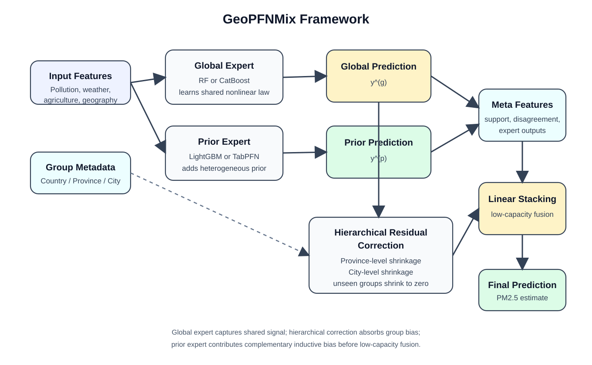

# 基于地理分组泛化与异构专家融合的多源农业环境数据 PM2.5 浓度预测研究

## 摘要

细颗粒物 PM2.5 是衡量区域空气污染水平、生态环境风险与人群暴露的重要指标。与常见的城市站点时间序列预测不同，本文研究对象是多来源、静态截面的农业环境表格数据。该类数据同时面临两类核心挑战：其一，不同来源之间存在字段命名、地理层级和统计口径差异；其二，样本天然带有显著地理结构，若继续沿用随机划分，模型容易借助区域身份信息产生性能高估。围绕这一问题，本文从统一数据标准化、严格地理分组评估和异构专家融合三个层面展开研究。

在统一特征工程下，本文系统比较 Ridge、RandomForest、HistGradientBoosting、XGBoost、LightGBM、CatBoost 和 TabPFN 等基线模型，量化不同协议下的泛化代价。为缓解单一来源样本规模有限的问题，本文将 Australia、Brazil、China、EU 和 USA 五个来源数据统一标准化为同一结构，形成包含 12445 条样本、5 个国家或区域、144 个一级地理组和 1025 个二级地理组的正式数据集。实验结果表明：`TabPFN` 在 `RandomKFold` 下取得最优单模型结果 `RMSE=4.8426`、`MAE=2.1188`、`R²=0.8425`；而在更具现实意义的 `GroupKFold(CITY)` 与 `GroupKFold(PROVINCE)` 协议下，最优单模型均转为 `CatBoost`，分别达到 `RMSE=6.0109`、`MAE=3.2069`、`R²=0.7542` 和 `RMSE=6.8052`、`MAE=4.5704`、`R²=0.6820`。

在方法层面，本文构建 GeoPFNMix 框架，并在此基础上进一步比较 GeoPFNMix-Lite、GeoPFNMix-CatBoost 及其 PFN 先验增强版本。结果显示，在当前对比范围内，`GeoPFNMix-CatBoost-TabPFN` 在主协议 `GroupKFold(CITY)` 下取得最优均值结果，即 `RMSE=5.9225`、`MAE=3.1078`、`R²=0.7622`；相较单模型 `CatBoost`，RMSE 下降 `1.47%`、MAE 下降 `3.09%`，属于幅度有限但方向稳定的边际提升，且 Wilcoxon 配对检验表明该改进具有统计显著性（`p=2.14e-21`）。与此同时，`GeoPFNMix-Lite-CatBoost-TabPFN` 取得 `RMSE=5.9281`、`MAE=3.1220`、`R²=0.7618`，成为当前第二优融合配置，并显著优于 `GeoPFNMix-Lite-CatBoost`（`p=1.17e-02`）。这说明在更强全局专家条件下，即使不启用残差分支，PFN 先验仍能提供稳定补充。

进一步结合协议热力图、消融结果、目标区间误差、来源拆分指标、省级或州级误差分布与 SHAP 解释可以发现，`COUNTRY`、`SO2`/`NOX` 等污染前体物及其协同特征、`AET` 与 `CITY` 等变量共同影响最终预测效果。其中，`COUNTRY` 的高重要性一方面说明跨来源域偏移是任务核心难点，另一方面也提示模型对来源代理信息仍较敏感，后续仍需通过更严格的跨来源外推实验进一步验证。本文的主要结论是：对于多源、异质、地理结构显著的 PM2.5 表格回归任务，只有将严格地理分组评估、统一的数据标准化、强单模型基线和可插拔的异构专家融合机制放在同一研究框架中，才能得到相对可信且可复现的结论。

**关键词**：PM2.5 预测；地理泛化；多源表格数据；GeoPFNMix；GeoPFNMix-Lite；GeoPFNMix-CatBoost；TabPFN；CatBoost；SHAP

## Abstract

PM2.5 is a key indicator for air pollution assessment, ecological risk analysis, and exposure evaluation. Unlike conventional city-level time-series forecasting, this thesis studies a multi-source static tabular regression task built from agricultural-environmental datasets. This problem is challenging because it simultaneously involves cross-source schema inconsistency and severe geographic leakage under random splits. To address these issues, this thesis develops a unified technical route that combines data harmonization, geographically grouped evaluation, and heterogeneous expert fusion.

Under a unified feature engineering pipeline, Ridge, RandomForest, HistGradientBoosting, XGBoost, LightGBM, CatBoost, and TabPFN are systematically compared. The final dataset harmonizes Australia, Brazil, China, the EU, and the USA into a common schema with 12,445 samples, 5 countries or regions, 144 first-level geographic groups, and 1,025 second-level geographic groups. The results show that TabPFN is the strongest single model under `RandomKFold`, whereas CatBoost becomes the strongest single model under both grouped protocols.

On the primary protocol `GroupKFold(CITY)`, the best mean result within the current comparison set is achieved by `GeoPFNMix-CatBoost-TabPFN`, with `RMSE=5.9225`, `MAE=3.1078`, and `R²=0.7622`, representing a statistically significant yet practically moderate improvement over single-model CatBoost. The newly added `GeoPFNMix-Lite-CatBoost-TabPFN` becomes the second-best fused variant, indicating that a Lite structure can still benefit from a PFN prior under a strong global expert. Additional protocol comparison, ablation studies, source-wise analysis, error-bin analysis, province/state-level error analysis, and SHAP interpretation further show that country-level domain shift, regional hierarchy, pollution precursors, and meteorological conditions jointly shape the final performance, while also suggesting that stricter cross-source validation is still necessary.

This work provides a reproducible, interpretable, and academically coherent technical route for geographically heterogeneous tabular regression in PM2.5 prediction.

**Key Words**: PM2.5 prediction; geographic generalization; multi-source tabular data; GeoPFNMix; CatBoost; TabPFN; model fusion; SHAP

---

# 1 绪论

## 1.1 研究背景与意义

细颗粒物 PM2.5 由于粒径小、停留时间长、输送范围广，既能直接影响大气能见度与区域气候，也与呼吸系统和心血管系统健康风险密切相关[1-3,20]。已有流行病学研究表明，长期暴露于较高浓度 PM2.5 会增加全因死亡率与心肺疾病风险，而空气中细颗粒物水平的下降又与寿命改善存在显著关联[1-2,20]。因此，如何准确刻画 PM2.5 的空间差异和变化规律，一直是环境科学、公共卫生与数据智能交叉领域的重要问题。

从机理上看，PM2.5 的形成与累积并非由单一因素决定，而是受排放源强、污染前体物、区域输送、气象条件和地理背景共同影响[3-5]。其中，`SO2`、`NOX` 等前体物能够通过大气化学过程参与二次颗粒物生成，风速、湿度、降水和边界层条件又会进一步影响颗粒物的扩散、转化与沉降[3-5]。这意味着 PM2.5 预测不仅是一个统计问题，也具有明确的环境机理约束；合理的建模方法应当能够同时吸收污染、气象、农业活动和空间异质性的综合信息。

现有 PM2.5 预测研究大多围绕站点级时间序列、遥感反演或时空联合建模展开[6-9]，而本文面对的是另一类数据情境：样本以行政区域单元为粒度，输入为农业、气象和污染相关的静态表格特征，数据既没有长时间连续序列，也具有显著地理层级结构。在这种条件下，如果简单使用随机划分，模型可能主要学习到“样本来自哪个区域”这一身份信息，而不是能够迁移到未见区域的环境规律。由此带来的性能高估，会直接削弱结论的可信度。

与此同时，单一数据源又容易带来样本量不足和分布覆盖有限的问题。若希望结论更稳健、模型比较更充分，就必须把研究从单一场景扩展到多来源、多口径和多区域的统一验证框架之中。基于这一背景，本文将研究目标明确界定为：在多源农业环境静态表格数据上，探索一种能够经受严格地理分组检验、同时兼顾性能、解释性与可复现性的 PM2.5 回归预测方法。

## 1.2 国内外研究现状

国内外关于 PM2.5 的研究大体可以归纳为三条主线。

第一条主线是从环境健康与机理角度理解 PM2.5 的危害及其影响因素。该方向的研究强调 PM2.5 与健康结局之间的长期关联，并分析气象条件、污染前体物和区域输送对 PM2.5 的综合作用[1-5,20]。这一类研究为本文提供了两个直接启示：其一，PM2.5 预测必须重视污染物与气象因子的协同关系，而不能把它们视为彼此独立的普通变量；其二，区域差异本身不是噪声，而是构成 PM2.5 空间异质性的关键来源。

第二条主线是 PM2.5 预测与估计方法研究。早期工作更多依赖线性模型、地统计模型或遥感反演框架，近年来则逐步引入随机森林、梯度提升树、深度学习和混合模型[6-9,19,22]。这类研究普遍证明，机器学习方法在 PM2.5 估计中具有较强拟合能力，但其性能往往高度依赖于输入数据类型、空间尺度和评价协议。尤其在跨区域预测场景中，如果忽略地理异质性，模型很容易在表面上取得较高分数，却难以真正推广到未见区域。

第三条主线是表格学习与异构集成方法研究。表格学习领域已经反复说明，在小中样本监督任务上，树模型仍然是非常强的基线；同时，TabPFN 等 foundation model 风格方法又为表格学习带来了新的归纳偏置[10-17]。这一方向的研究提示我们：一方面，任何新结构都必须在强树模型基线之上展开比较；另一方面，不同归纳偏置之间可能具有互补性，若能在严格协议下进行受控融合，就有望进一步提升稳健性。

总体来看，现有研究分别在 PM2.5 机理、预测方法和表格学习上提供了充分启发，但针对“多来源、静态截面、地理层级显著”的农业环境表格数据，仍然缺少一套将数据统一、严格评估和异构融合系统结合起来的完整研究框架。本文正是在这一空缺上展开工作。

## 1.3 研究内容与主要贡献

围绕上述问题，本文重点研究以下四个方面：

1. 如何在多源农业环境数据上建立统一的数据标准化与层级映射方案，使不同来源样本能够进入同一建模语境；
2. 如何通过严格地理分组评估协议量化随机划分带来的性能高估，并据此确定更可信的主评估口径；
3. 如何构建同时刻画全局规律、区域系统偏差和异构先验补充的 GeoPFNMix 框架，并分析其轻量化与强骨干变体；
4. 如何通过消融、显著性检验、误差结构分析与 SHAP 解释，对模型性能来源给出系统论证。

本文的主要贡献可以概括为以下五点：

1. 完成了多源农业环境数据的统一标准化，将不同来源字段映射为同一建模结构，并构建了可复现的数据处理管线；
2. 从评估协议层面系统识别并量化了地理泄漏问题，明确采用 `GroupKFold(CITY)` 作为主评估协议；
3. 提出了面向地理分组泛化的 GeoPFNMix 框架，并在此基础上发展出 GeoPFNMix-Lite、GeoPFNMix-CatBoost 及其 PFN 先验增强版本；
4. 将 TabPFN 从强单模型基线进一步扩展为可插拔先验专家，验证了其在不同结构位置上的作用差异；
5. 通过多协议比较、消融实验、显著性检验、来源拆分分析和 SHAP 解释，对模型性能来源进行了较完整的实证说明。

## 1.4 论文组织结构

全文共分七章。第一章说明研究背景、问题来源、研究现状与主要贡献；第二章梳理 PM2.5 形成机理、预测方法、表格学习与地理异质性建模相关理论；第三章介绍数据基础、字段统一与评估协议；第四章给出统一特征工程和 GeoPFNMix 家族方法设计；第五章展示正式实验结果，包括基线比较、消融、显著性检验与解释性分析；第六章对结果进行讨论，并分析方法边界与后续工作；第七章总结全文结论。

---

# 2 相关工作与理论基础

本章主要从理论基础与方法脉络两个层面展开综述。首先，结合环境科学研究梳理 PM2.5 的形成机理及其与污染前体物、气象条件和区域差异之间的关系，从而明确本文为何必须同时关注环境规律与地理异质性。其次，围绕 PM2.5 预测方法、表格学习方法以及地理异质性建模展开文献回顾，以说明本文所采用的强基线体系、严格分组评估协议和异构专家融合框架并非孤立提出，而是建立在已有研究积累之上的进一步整合与推进。

## 2.1 PM2.5 的形成机理与影响因素

PM2.5 可以来源于一次排放，也可以由 `SO2`、`NOX`、挥发性有机物和氨等前体物在大气中转化形成二次颗粒物[3-5]。因此，颗粒物浓度既受到排放强度影响，也与大气氧化性、湿度、降水和风场条件紧密相关[3-5]。从观测研究来看，气温、相对湿度、降水和风速往往能够解释相当一部分 PM2.5 的波动，而这种关系又在地区和季节之间表现出明显差异[3-5]。

这一理论基础对本文有两点直接启示。首先，PM2.5 预测不宜只依赖单一污染物或单一气象变量，而应同时考虑前体物、气象背景与农业活动的共同作用。其次，PM2.5 与环境因子之间的关系本身具有区域异质性，这意味着“统一全局函数”与“区域局部偏差”应当被区分建模，而不能简单交给一个黑箱模型隐式吸收。

## 2.2 PM2.5 预测方法进展

在 PM2.5 预测与估计领域，研究方法大致经历了从线性统计模型到机器学习模型再到混合或深度模型的发展过程[6-9,19,22]。传统方法强调参数可解释性，但在强非线性和复杂交互关系面前往往表达能力有限。随着多源遥感和环境数据的积累，随机森林、XGBoost、LightGBM 等树模型逐渐成为 PM2.5 估计的重要工具[6-9]，并在不少场景中表现出较好的稳健性。

然而，现有大量研究仍以时间序列站点预测或遥感反演为主，且常在随机划分或近似同分布的条件下评价模型[6-9]。对于本文关注的“多来源、静态截面、行政层级显著”的区域表格任务，这样的评价方式并不足以反映真实泛化能力。因而，本文在吸收机器学习方法优势的同时，将评价重点转向严格地理分组条件下的跨区域泛化。

## 2.3 表格学习、集成模型与 PFN

表格学习研究普遍指出，在小中样本监督任务中，梯度提升树和随机森林等集成模型仍然是极具竞争力的强基线[10-14,16-17]。随机森林通过 Bagging 和特征随机子采样提升稳健性[10]，梯度提升框架则通过逐步拟合残差提高逼近能力[11]。在此基础上，XGBoost、LightGBM 和 CatBoost 分别从系统优化、直方图加速和类别特征处理等角度进一步强化了树模型在表格数据上的表现[12-14]。

另一方面，TabPFN 等方法为表格学习提供了与树模型不同的先验视角[15]。相关综述表明，深度模型和 PFN 风格方法虽然尚未在所有表格任务上稳定超越树模型，但其归纳偏置可能在某些任务中与树模型形成互补[16-17]。本文正是基于这一认识，将 TabPFN 同时作为强单模型基线和潜在的先验专家纳入统一框架。

## 2.4 地理异质性、分层建模与本文定位

地理数据分析领域强调，空间异质性不是建模中的偶然噪声，而是决定局部关系是否稳定的重要因素。地理加权回归及其后续扩展工作表明，同一组环境变量在不同区域上的作用强度可能存在显著差异[18-19]。对于本文任务而言，`COUNTRY`、`PROVINCE` 和 `CITY` 等变量不仅是普通类别标识，更代表了来源差异、制度背景、地理环境和统计口径等多重因素的叠加。

因此，本文的研究定位并不是简单提出一个新的模型名称，而是试图建立一套更完整的研究链条：先通过统一数据标准化把不同来源置于同一语义空间，再通过严格地理分组协议确保结论可信，最后通过 GeoPFNMix 家族讨论“全局规律—层级偏差—异构先验”三者之间的关系。相较只比较若干黑箱模型的工作，本文更关注结论成立的条件与边界。

---

# 3 数据基础与问题定义

本章旨在说明本文实验结论所依赖的数据基础与问题设定。具体而言，先介绍 Australia、Brazil、China、EU 和 USA 五个来源数据的统一标准化原则，解释多源数据为何不能直接拼接使用；再给出字段映射、层级构造与数据审计结果，说明正式数据的规模、缺失情况与异质性特征；最后形式化定义预测任务，并明确 `RandomKFold`、`GroupKFold(CITY)` 与 `GroupKFold(PROVINCE)` 三套协议的作用分工，为后续方法设计和结果分析提供统一评价框架。

## 3.1 正式数据集组成与统一原则

本文最终使用的正式数据集来自 Australia、Brazil、China、EU 和 USA 五个来源。各来源在原始形态上存在字段命名不一致、层级结构不统一和缺失模式不同等问题，因此在建模前需要完成统一标准化。标准化的基本原则包括：统一目标语义、统一类别层级、统一数值变量命名、保留来源标识并避免跨来源字段歧义。

表 1 给出了正式多源数据集的来源构成。

表 1 正式多源数据组成

| 数据源 | 标准化后样本数 | 层级说明 |
|---|---:|---|
| Australia | 1124 | 由 `ID` 编码构造一级与二级代理组 |
| Brazil | 5303 | 由原始分县编码构造一级与二级代理组 |
| China | 2676 | 直接使用 `PROVINCE`、`CITY`、`COUNTY` |
| EU | 276 | 由区域代码构造国家级与二级代理组 |
| USA | 3066 | `State` 作为一级组，`County` 作为细粒度元信息 |
| 合计 | 12445 | 统一进入正式建模流程 |

多源标准化并不等同于“把几份表格直接纵向拼接”。如果不同来源的地理层级、字段命名和目标含义没有经过统一映射，那么模型学到的将只是混乱的编码差异，而不是可迁移的环境规律。正因为如此，本文将 `COUNTRY`、`PROVINCE`、`CITY`、`COUNTY` 明确拆分，并对污染变量、气象变量和农业投入变量统一命名，以确保不同来源样本能够进入同一语义空间。

## 3.2 字段统一与层级映射

标准化后的字段如表 2 所示。

表 2 标准化后字段说明

| 类型 | 字段名 | 说明 |
|---|---|---|
| 标识列 | `OBJECTID_1` | 标准化样本编号，不参与建模 |
| 类别列 | `COUNTRY` | 国家或区域来源标识 |
| 类别列 | `PROVINCE` | 一级地理组，表示省、州或一级代理区 |
| 类别列 | `CITY` | 二级地理组，表示城市或二级代理区 |
| 类别列 | `COUNTY` | 最细粒度元信息，不作为主类别编码 |
| 数值列 | `AET`、`ppt`、`tem`、`wind` | 气象变量 |
| 数值列 | `NOX`、`SO2` | 污染前体物变量 |
| 数值列 | `fertilzier`、`manure` | 农业投入相关变量 |
| 目标列 | `PM2.5` | 区域 PM2.5 浓度 |

需要特别说明的是，代码中仍使用 `CITY` 作为主分组列名，但在正式多源数据场景下，它表示的是统一后的二级地理组，而不必然等于行政意义上的“城市”。采用这一命名，是为了在保持代码接口一致的同时，兼容不同来源的层级表达方式。另一个容易引起误解的字段是 `fertilzier`。该写法继承自原始数据与既有代码接口中的变量命名，虽然从英文拼写看并不规范，但本文在正式实验与实现中保留这一字段名，以避免数据口径与代码实现之间出现额外偏差。

## 3.3 数据审计结果

经过统一标准化后，正式数据集的审计摘要如表 3 所示。

表 3 数据审计摘要

| 指标 | 数值 |
|---|---:|
| 样本数 | 12445 |
| 字段数 | 14 |
| 国家或区域数 | 5 |
| 一级地理组数 | 144 |
| 二级地理组数 | 1025 |
| 重复样本数 | 0 |
| 目标均值 | 14.57 |
| 目标标准差 | 12.21 |

在缺失方面，`AET`、`ppt`、`tem`、`wind` 各缺失 1 条，`SO2` 缺失 2 条，`fertilzier` 缺失 188 条，`manure` 缺失 94 条。由于缺失比例整体较低，本文不在原始数据清洗环节直接删除样本，而是在模型管线内部统一采用中位数或众数插补。

图 1 展示了正式数据集的 PM2.5 分布，图 2 给出了二级地理组样本规模分布，图 3 和图 4 则分别展示数值特征相关性与关键特征同目标之间的关系。

这些审计结果说明，正式数据既具有多来源异质性，也存在明显的层级不均衡与长尾分布。也正因为如此，后续建模既需要稳健的数值处理和特征工程，也需要足够严格的评估协议来防止模型借助地理身份信息产生虚高结果。

## 3.4 问题定义与评估协议

设第 $i$ 个样本的输入特征为 $x_i$，目标值为 $y_i$，则本文任务可形式化为监督回归问题：

$$
\hat{y}_i = f(x_i),
$$

其中，$\hat{y}_i$ 为模型对 PM2.5 的预测值。本文并不追求随意构造更复杂的函数，而是希望找到一种在严格地理分组条件下依旧稳定的预测函数。

为此，本文设置三套评估协议：

1. `RandomKFold(5)`：用于刻画随机划分下的理想化表现；
2. `GroupKFold(5, CITY)`：作为主协议，强调跨二级地理组泛化；
3. `GroupKFold(5, PROVINCE)`：作为更严格的跨一级地理组泛化对照。

评价指标采用 RMSE、MAE 和 R²。正式结论均以 `GroupKFold(CITY)` 为主，随机划分结果只用于量化泄漏风险，而不作为模型优劣判断的唯一依据。

选择 `GroupKFold(CITY)` 作为主协议而非更细粒度的 `COUNTY`，主要基于两点考虑。其一，正式多源数据中最细粒度字段的语义并不完全一致，若强行将其作为统一分组依据，反而会引入额外噪声；其二，本文希望在“足够严格”和“仍有稳定比较意义”之间取得平衡，因此采用统一后的二级地理组作为主评估单元，而以 `GroupKFold(PROVINCE)` 作为更严格补充。

更重要的是，协议本身决定了论文结论的可信度边界。若模型只在 `RandomKFold` 下表现优异，而在 `GroupKFold(CITY)` 下明显失效，那么它更可能是在记忆来源差异和区域身份，而不是学习真正可以迁移的环境规律。因此，本文对所有模型、所有图表和所有结论都坚持同一原则：正式结论必须能够经受严格地理分组协议的检验。

---

# 4 方法设计

本章围绕“如何在严格地理分组条件下构建更稳健的 PM2.5 回归模型”展开方法设计。首先介绍统一特征工程和强基线体系，为不同模型提供公平比较前提；随后给出 GeoPFNMix 的总体思想与数学表达，说明全局专家、地理残差分支、先验专家与低容量 stacking 各自承担的功能；在此基础上进一步讨论 GeoPFNMix-Lite、GeoPFNMix-CatBoost 及其 TabPFN 增强版本，从而形成一条由轻量化控制到强骨干扩展的完整方法谱系。

## 4.1 统一特征工程

为确保不同模型比较公平，本文先设计统一特征工程流程，而不是让每个模型使用完全不同的手工特征。该流程包括：

1. 对数值列进行 `1%` 与 `99%` 分位裁剪；
2. 对 `ppt`、`NOX`、`SO2`、`fertilzier`、`manure` 等偏态变量进行 `log1p` 变换；
3. 构造污染协同特征，如 `NOX_plus_SO2`、`NOX_div_SO2`；
4. 构造农业投入与气象交互特征，如 `fertilzier_x_wind`、`manure_x_ppt`；
5. 构造一级地理组内部的相对强度特征，如 `province_z_NOX`、`province_z_ppt`；
6. 构造样本支撑度特征，如 `province_sample_count`、`city_sample_count` 和 `is_low_support_city`。

这一特征工程设计有两个目的：其一，保留一定的环境机理解释性；其二，为 GeoPFNMix 家族各专家提供统一、稳定、不过度冗余的输入。对数变换和分位裁剪主要用于缓解污染变量与农业投入变量的长尾分布问题；污染协同特征用于表达前体物之间的耦合关系；地理层级内部标准化特征帮助模型识别样本在本地层级中的相对位置；样本支撑度特征则为后续残差校正与 stacking 提供“局部组是否可靠”的额外信息。

## 4.2 强基线体系

为了避免“新方法只战胜弱基线”的问题，本文构建如下强基线体系：

- Ridge
- RandomForest
- HistGradientBoosting
- XGBoost
- LightGBM
- CatBoost
- TabPFN

这组模型覆盖线性模型、Bagging 树、Boosting 树以及 foundation model 风格的表格方法[10-17]，能够较充分地刻画不同归纳偏置在本任务中的表现。之所以要把基线做得足够完整，是因为本文并不希望把 GeoPFNMix 家族的优势建立在“比较对象过弱”之上。只有当线性模型、传统树模型、强 Boosting 模型和 PFN 风格模型都被纳入统一协议下的比较，后续关于融合结构有效性的讨论才具有说服力。

## 4.3 GeoPFNMix 总框架

GeoPFNMix 的提出基于如下判断：单一模型虽然能够学习一定的非线性关系，但很难同时处理全局规律、区域系统偏差和异构先验补充。为此，本文将任务拆分为四个相互配合的组成部分：

1. **全局专家**：拟合总体非线性关系；
2. **地理残差分支**：显式刻画一级与二级地理层级上的系统偏差；
3. **先验专家**：引入不同于树模型的额外归纳偏置；
4. **低容量 stacking**：在有限自由度下完成稳定融合。

从数学上看，首先由全局专家 $f_g(\cdot)$ 给出基础预测：

$$
\hat{y}_i^{(g)} = f_g(x_i).
$$

随后，在训练折内利用全局专家残差

$$
e_i = y_i - \hat{y}_i^{(g)}
$$

估计地理层级上的系统偏差。若样本 $i$ 属于一级组 $p(i)$ 与二级组 $c(i)$，则可将层级校正概念性地写为：

$$
\hat{r}_{p(i)} = \lambda_p \cdot \mathbb{E}(e \mid p(i)), \qquad
\hat{r}_{c(i)} = \lambda_c \cdot \mathbb{E}(e - \hat{r}_{p(i)} \mid c(i)),
$$

其中 $\lambda_p$ 和 $\lambda_c$ 表示与样本支撑度相关的收缩系数。于是，校正后的层级预测为：

$$
\hat{y}_i^{(h)} = \hat{y}_i^{(g)} + \hat{r}_{p(i)} + \hat{r}_{c(i)}.
$$

与此同时，先验专家 $f_p(\cdot)$ 从另一种归纳偏置出发给出补充预测：

$$
\hat{y}_i^{(p)} = f_p(x_i).
$$

在最终融合时，本文构造由专家输出、专家分歧和样本支撑度组成的元特征：

$$
m_i = \big[\hat{y}_i^{(g)}, \hat{y}_i^{(h)}, \hat{y}_i^{(p)}, |\hat{y}_i^{(g)}-\hat{y}_i^{(p)}|, s_i\big],
$$

并使用低容量线性 stacking 得到最终预测：

$$
\hat{y}_i = \beta_0 + \beta^\top m_i.
$$

其中 $s_i$ 表示样本所在地理组的支撑度等元信息。对于未见地理组，残差分支的校正会自动收缩至接近零，从而避免因局部噪声导致的过度修正。

这一结构的核心思想是“职责分离”。全局专家负责吸收污染、气象与农业因子之间可共享的主体规律；地理残差分支负责处理不同地区相对于全局函数的系统偏移；先验专家则提供与全局专家不同的归纳偏置，以补足单一树模型可能忽略的信息；低容量 stacking 则避免在 OOF 元特征有限时再次引入高自由度过拟合。

图 5 给出了 GeoPFNMix 的结构示意。

## 4.4 GeoPFNMix-Lite 的提出

GeoPFNMix-Lite 是总框架的轻量化版本，其核心思路是：在 OOF 元特征数量有限、样本支持不足的条件下，主动控制结构复杂度，避免 stacking 层承担过高自由度。

在结构上，Lite 主要保留：

> `GeoPFNMix-Lite = RF 全局专家 + LightGBM 先验专家 + 线性 stacking`

当先验专家替换为 TabPFN 时，对应：

> `GeoPFNMix-Lite-TabPFN = RF 全局专家 + TabPFN 先验专家 + 线性 stacking`

Lite 的意义不只是追求更简洁，而是验证“复杂度控制本身是否是一种有效策略”。它提供了一个重要参照：如果在样本规模有限、协议严格的条件下，轻量化结构已经足够稳定，那么继续叠加更复杂模块未必一定带来净收益。

## 4.5 GeoPFNMix-CatBoost 及其增强版本

随着实验推进，本文发现更强的全局专家可能显著改变框架上限。尤其在正式多源数据上，`COUNTRY` 与分层类别信息的重要性明显提高，这使 CatBoost 的优势更加突出。因此，本文提出：

> `GeoPFNMix-CatBoost = CatBoost 全局专家 + 地理残差校正 + LightGBM 先验专家 + 线性 stacking`

其 PFN 先验增强版本为：

> `GeoPFNMix-CatBoost-TabPFN = CatBoost 全局专家 + 地理残差校正 + TabPFN 先验专家 + 线性 stacking`

为了进一步区分“更强骨干”和“更复杂结构”两种因素，本文还补充了两个中间对照：

> `GeoPFNMix-Lite-CatBoost = CatBoost 全局专家 + LightGBM 先验专家 + 线性 stacking`

> `GeoPFNMix-Lite-CatBoost-TabPFN = CatBoost 全局专家 + TabPFN 先验专家 + 线性 stacking`

这些变体的作用在于回答三个更具体的问题：第一，Lite 路线是否会因更强骨干而显著增强；第二，在不启用残差分支时，TabPFN 先验是否仍然提供稳定补充；第三，残差分支在强骨干和强先验的组合下是否仍有必要存在。

## 4.6 TabPFN 先验的引入动机

本文引入 TabPFN，并不是为了把它简单作为“又一个候选模型”加入比较，而是希望利用 PFN 风格先验与树模型归纳偏置之间的差异性[15-17]。树模型在处理类别结构、非线性和局部划分方面往往更稳健，而 PFN 类方法在小样本条件下可能提供更具全局性的先验补充。对于 GeoPFNMix 而言，TabPFN 的价值并不一定体现在替代树模型，而更可能体现在作为先验专家参与融合。

也正因为如此，本文在设计实验时并未预设“TabPFN 必然优于树模型”这一结论，而是通过单模型比较和多种结构位置下的消融，观察其在不同骨干和不同复杂度条件中的实际作用。这种处理方式使 PFN 先验在本文中既是研究对象，也是结构变量。

---

# 5 实验结果与分析

本章集中展示正式实验结果，并从多个层面对结论进行验证。首先比较不同评估协议下的单模型表现，以量化随机划分与地理分组之间的泛化差异；随后给出 GeoPFNMix 家族的系统消融结果和显著性检验，判断结构改进是否稳定成立；最后结合目标区间误差、来源拆分表现、一级地理组误差分布与 SHAP 解释，分析当前最优模型的优势来源、适用范围和局部不足。

## 5.1 实验设置与评价原则

为保证比较公平，本文所有模型均在统一特征工程下训练，并采用相同的 RMSE、MAE 与 R² 作为评价指标。实验重点不是追求随机划分下的最高分，而是比较不同模型在地理分组条件下的稳健性，因此正式结论以 `GroupKFold(CITY)` 为主，同时辅以 `RandomKFold` 和 `GroupKFold(PROVINCE)` 作为对照。

在结果解读上，本文遵循三个原则。第一，协议优先于分数，即只有在严格地理分组协议下表现稳定的结果，才具有更强的结论价值。第二，结构解释优先于冠军叙事，即不仅关注“谁最好”，更关注“为什么某类结构更好”。第三，来源拆分和误差结构优先于单一全局均值，即在总体指标之外，同时考察不同来源和不同目标区间上的表现差异。

## 5.2 基线结果与协议差异

表 4 给出了三套协议下的最佳单模型结果。

表 4 不同协议下的最佳单模型结果

| 协议 | 最优单模型 | RMSE | MAE | R² |
|---|---|---:|---:|---:|
| `RandomKFold` | TabPFN | 4.8426 | 2.1188 | 0.8425 |
| `GroupKFold(CITY)` | CatBoost | 6.0109 | 3.2069 | 0.7542 |
| `GroupKFold(PROVINCE)` | CatBoost | 6.8052 | 4.5704 | 0.6820 |

这一结果说明：最优单模型并不是固定不变的，而是会随协议和分布条件发生变化。TabPFN 在随机划分下最强，表明其小样本先验在近似同分布场景中非常有效；但一旦进入更严格的地理分组协议，CatBoost 反而展现出更高稳健性。

图 6 给出了各基线模型在三套协议下的 RMSE 热力图。

表 5 给出了主协议 `GroupKFold(CITY)` 下的完整基线结果。

表 5 主协议下的单模型结果

| 模型 | RMSE | MAE | R² |
|---|---:|---:|---:|
| CatBoost | 6.0109 | 3.2069 | 0.7542 |
| TabPFN | 6.6310 | 4.0478 | 0.7031 |
| LightGBM | 6.6828 | 4.2645 | 0.6944 |
| XGBoost | 6.7986 | 4.3365 | 0.6831 |
| HGBT | 7.0753 | 4.6046 | 0.6584 |
| RF | 7.6447 | 5.1453 | 0.6017 |
| Ridge | 8.4532 | 5.6997 | 0.5165 |

与随机划分最佳单模型相比，主协议最佳单模型的 RMSE 增加了 `24.13%`；从 `GroupKFold(CITY)` 到 `GroupKFold(PROVINCE)`，最佳单模型 RMSE 又从 `6.0109` 上升到 `6.8052`，增幅约为 `13.21%`。这说明地理分组带来的泛化代价是真实存在且层级递增的：模型即便已经能够跨二级地理组迁移，面对更粗粒度、域差异更强的一级地理组时仍会明显失稳。

## 5.3 GeoPFNMix 家族正式消融

表 6 给出了 GeoPFNMix 家族在主协议下的正式消融结果。

表 6 GeoPFNMix 家族正式消融结果

| 模型 | 说明 | RMSE | MAE | R² |
|---|---|---:|---:|---:|
| RF | RF 单模型基线 | 7.6447 | 5.1453 | 0.6017 |
| CatBoost | CatBoost 单模型基线 | 6.0229 | 3.2161 | 0.7534 |
| TabPFN | TabPFN 单模型基线 | 6.6310 | 4.0478 | 0.7031 |
| GeoPFNMix-no-prior | RF + 地理残差校正 | 7.6237 | 5.1266 | 0.6038 |
| GeoPFNMix-Lite | RF + LightGBM 先验 + stacking | 6.3829 | 3.7506 | 0.7227 |
| GeoPFNMix-Lite-CatBoost | CatBoost + LightGBM 先验 + stacking | 5.9526 | 3.1176 | 0.7595 |
| GeoPFNMix-Lite-TabPFN | RF + TabPFN 先验 + stacking | 6.2711 | 3.7003 | 0.7339 |
| GeoPFNMix-Lite-CatBoost-TabPFN | CatBoost + TabPFN 先验 + stacking | 5.9281 | 3.1220 | 0.7618 |
| GeoPFNMix | RF + 残差 + LightGBM 先验 + stacking | 6.3911 | 3.7542 | 0.7220 |
| GeoPFNMix-TabPFN | RF + 残差 + TabPFN 先验 + stacking | 6.2891 | 3.7093 | 0.7323 |
| GeoPFNMix-CatBoost | CatBoost + 残差 + LightGBM 先验 + stacking | 5.9551 | 3.1092 | 0.7593 |
| GeoPFNMix-CatBoost-TabPFN | CatBoost + 残差 + TabPFN 先验 + stacking | **5.9225** | **3.1078** | **0.7622** |

图 7 与图 8 分别展示了 GeoPFNMix 家族的 RMSE 对比和 RMSE/MAE 双指标消融图。

从表 6 可以得到五个较为明确的判断。第一，仅加入地理残差而不引入先验专家的 `GeoPFNMix-no-prior` 只比 RF 有极小改善，说明在当前多源数据上，单靠层级校正不足以解决全部问题。第二，RF 骨干下无论采用 LightGBM 先验还是 TabPFN 先验，Lite 路线都明显优于 RF，说明“低容量融合 + 异构先验”本身是成立的。第三，`GeoPFNMix-Lite-CatBoost` 相比单模型 `CatBoost` 已取得明显提升，说明 Lite 结构并不依赖 RF 才成立。第四，`GeoPFNMix-Lite-CatBoost-TabPFN` 又显著优于 `GeoPFNMix-Lite-CatBoost`，说明即使关闭残差分支，TabPFN 先验在强骨干条件下仍然可以提供额外信息。第五，`GeoPFNMix-CatBoost-TabPFN` 依然优于 `GeoPFNMix-Lite-CatBoost-TabPFN`，说明残差分支在 CatBoost+TabPFN 的强组合上仍保留稳定价值。与此同时，也需要看到，冠军模型相对最强单模型和相近融合模型的绝对提升幅度并不大，因此 GeoPFNMix 家族在当前阶段的主要价值，更体现在严格协议下提供可审计的边际改进，而不是带来数量级上的性能跃迁。

需要说明的是，表 5 与表 6 中同名 `CatBoost` 指标存在极小差异，例如主协议下分别为 `6.0109` 与 `6.0229`。这一差异并非论文口径错误，而是因为两张表来自不同正式重跑批次；即便在统一设置下，独立批次重跑仍可能出现 `0.01` 量级以内的微小波动，而这种差异远小于不同模型之间的性能差距，因此不会改变本文关于结构排序的任何实质性结论。

## 5.4 显著性检验与结果解释

为判断改进是否稳定存在，本文对关键模型对之间的样本级绝对误差进行 Wilcoxon 配对检验。表 7 汇总了最关键的比较结果。

表 7 关键模型对的 Wilcoxon 配对检验

| 对比 | p 值 | 解释 |
|---|---:|---|
| RF vs GeoPFNMix-Lite | `0.0` | Lite 显著优于 RF |
| RF vs GeoPFNMix | `0.0` | Full 显著优于 RF |
| GeoPFNMix-Lite vs GeoPFNMix | `0.9875` | RF 骨干下 Lite 与 Full 无显著差异 |
| CatBoost vs GeoPFNMix-Lite-CatBoost | `1.88e-28` | Lite-CatBoost 显著优于单模型 CatBoost |
| CatBoost vs GeoPFNMix-CatBoost | `8.68e-32` | CatBoost 版融合显著优于单模型 CatBoost |
| CatBoost vs GeoPFNMix-Lite-CatBoost-TabPFN | `2.14e-15` | Lite-CatBoost-TabPFN 显著优于单模型 CatBoost |
| GeoPFNMix-Lite-CatBoost vs GeoPFNMix-Lite-CatBoost-TabPFN | `1.17e-02` | Lite-CatBoost 路线接入 TabPFN 后仍有稳定增益 |
| GeoPFNMix-Lite-CatBoost-TabPFN vs GeoPFNMix-CatBoost-TabPFN | `5.83e-22` | 在 CatBoost+TabPFN 组合下，残差分支仍显著有效 |
| CatBoost vs GeoPFNMix-CatBoost-TabPFN | `2.14e-21` | 当前最佳均值模型显著优于单模型 CatBoost |
| GeoPFNMix-CatBoost vs GeoPFNMix-CatBoost-TabPFN | `1.16e-01` | TabPFN 先验相对 LightGBM 先验的增益未达显著 |
| TabPFN vs GeoPFNMix-Lite-TabPFN | `2.11e-145` | Lite-TabPFN 显著优于单模型 TabPFN |
| TabPFN vs GeoPFNMix-CatBoost-TabPFN | `0.0` | 最终最佳模型显著优于单模型 TabPFN |

从这些结果可以看出，在当前正式多源数据设定下，GeoPFNMix 的有效性依然成立，而且“更强骨干”和“是否引入 PFN 先验”都能带来收益，但两者的稳定性并不完全相同。更强骨干带来的收益最为稳固，而 PFN 先验的收益则更依赖于具体结构配置。特别是 `GeoPFNMix-CatBoost-TabPFN` 虽然取得了最佳均值表现，但它相对 `GeoPFNMix-CatBoost` 的优势未达到显著，这表明 TabPFN 先验在完整 CatBoost 结构中更多体现为均值层面的边际改善；相比之下，`GeoPFNMix-Lite-CatBoost-TabPFN` 相对 `GeoPFNMix-Lite-CatBoost` 的提升达到显著，说明在职责更直接、复杂度更低的 Lite-CatBoost 路线中，PFN 先验反而更容易表现出可检出的稳定增益。还需要强调的是，这里的极小 `p` 值主要说明误差差异在样本层面具有较强一致性，并不意味着改进幅度本身非常巨大；因此，统计显著性必须与 RMSE、MAE 的绝对变化幅度结合起来解释。

## 5.5 误差结构、来源差异与解释性分析

图 9 为当前最佳模型 `GeoPFNMix-CatBoost-TabPFN` 的 OOF 预测散点图。

表 8 给出了不同 PM2.5 区间上的误差情况。

表 8 当前最佳模型在不同 PM2.5 区间上的误差

| PM2.5 区间 | 样本数 | MAE | RMSE |
|---|---:|---:|---:|
| `<20` | 9802 | 1.7273 | 3.4687 |
| `20-35` | 1651 | 5.8858 | 7.3857 |
| `35-50` | 651 | 7.5635 | 9.0843 |
| `>=50` | 341 | 20.8337 | 22.7595 |

这说明当前模型在主体分布区间表现较好，而在高污染尾部仍存在明显难度。图 10 进一步给出了按目标区间统计得到的误差图。

图 11 展示了当前最佳模型按数据源拆分后的表现，表 9 给出了对应指标。

表 9 当前最佳模型按数据源拆分指标

| 数据源 | 样本数 | RMSE | MAE | R² |
|---|---:|---:|---:|---:|
| Australia | 1124 | 2.3777 | 1.5749 | 0.6966 |
| Brazil | 5303 | 1.9198 | 1.3436 | 0.8450 |
| China | 2676 | 12.2625 | 9.4783 | 0.1863 |
| EU | 276 | 2.4934 | 1.7414 | 0.5041 |
| USA | 3066 | 1.6511 | 1.2839 | -0.3916 |

从表 9 可以看到，全球整体均值掩盖了非常强的来源差异。`China` 明显是当前最难的来源，而 `Brazil`、`Australia` 与 `EU` 的绝对误差显著更低；`USA` 虽然 RMSE 和 MAE 都较低，但 `R²` 为负，说明该来源内部目标波动范围较小，模型即使取得较低绝对误差，也未必能显著优于来源内均值预测。

图 12 进一步给出“当前最优两个 GeoPFNMix 家族模型 + CatBoost + TabPFN”在不同来源上的并排对照，表 10 则总结了各来源 RMSE 最低的模型。

表 10 各数据源上 RMSE 最优的模型

| 数据源 | RMSE 最优模型 | RMSE | 解释 |
|---|---|---:|---|
| Australia | GeoPFNMix-CatBoost-TabPFN | 2.3777 | 融合模型在来源内保持最优 |
| Brazil | GeoPFNMix-CatBoost-TabPFN | 1.9198 | 融合模型在大样本来源上优势明显 |
| China | GeoPFNMix-CatBoost-TabPFN | 12.2625 | 当前最难来源仍由融合模型略占优 |
| EU | CatBoost | 2.4100 | 小样本来源上单模型更稳健 |
| USA | CatBoost | 1.5399 | 在该来源内 CatBoost 明显优于 TabPFN 路线 |

图 12 与表 10 共同说明了一个更细的事实：当前全球冠军并不意味着它在所有来源上都单独最优。`GeoPFNMix-CatBoost-TabPFN` 与 `GeoPFNMix-Lite-CatBoost-TabPFN` 在 Australia、Brazil 和 China 上整体占优，说明融合结构的收益主要集中在较难或样本更大的来源；但在 EU 和 USA 上，单模型 `CatBoost` 反而更优。这意味着 GeoPFNMix 家族的整体优势并不是“所有来源统一提升”，而更像是“在若干关键来源上提供更强修正，从而带动总体均值领先”。

图 13 展示了一级地理组误差分布。为避免中文标签在不同环境中的显示问题，图中已统一使用英文或代码化标签；表 11 则列出了误差最高和最低的若干一级地理组。

表 11 一级地理组误差高低对比

| 误差较高区域 | MAE | 误差较低区域 | MAE |
|---|---:|---|---:|
| `China::Hainan` | 17.63 | `USA::PENNSYLVANIA` | 0.75 |
| `China::Qinghai` | 15.41 | `EU::DE` | 0.74 |
| `China::Zhejiang` | 14.30 | `Brazil::24` | 0.70 |
| `China::Xinjiang` | 13.58 | `EU::LT` | 0.53 |
| `China::Ningxia` | 13.04 | `USA::WYOMING` | 0.12 |

最后，图 14 与表 12 展示了当前最佳全局专家 CatBoost 的 SHAP 结果。

表 12 当前最佳全局专家 SHAP Top 10

| 排名 | 特征 | 平均绝对 SHAP |
|---:|---|---:|
| 1 | `COUNTRY` | 3.8331 |
| 2 | `PROVINCE` | 0.8379 |
| 3 | `log1p_NOX` | 0.6156 |
| 4 | `NOX_div_SO2` | 0.4555 |
| 5 | `SO2` | 0.4444 |
| 6 | `CITY` | 0.3937 |
| 7 | `emission_pressure_logsum` | 0.3693 |
| 8 | `AET` | 0.3553 |
| 9 | `NOX_plus_SO2` | 0.3401 |
| 10 | `NOX` | 0.2933 |

这里最值得注意的现象是 `COUNTRY` 的重要性远高于其他特征，这说明在正式多源数据场景中，跨来源域偏移已经成为模型必须首先处理的核心问题；但与此同时，这也提示模型可能仍在较大程度上借助来源代理信息完成预测，因此其跨来源外推能力还不能仅凭当前结果就被过度乐观地解释。`PROVINCE` 与 `CITY` 提供层级地理信息，而 `log1p_NOX`、`NOX_div_SO2`、`SO2`、`NOX_plus_SO2` 等污染前体物及其协同特征则构成了可迁移规律的主要载体。综合来看，本文当前最优模型既不是“纯类别模型”，也不是“纯污染变量模型”，而是一个把来源差异、环境规律和异构先验统一到同一框架中的融合系统；但其解释仍需结合更严格的来源外推实验进一步检验。

---

# 6 讨论

## 6.1 为什么 CatBoost 路线成为最优实现

从正式结果看，最优结构最终收敛到 CatBoost 骨干路线，而不是早期更具代表性的 RF-Lite 路线。这并不意味着 Lite 路线没有价值，而是说明随着任务从相对单一的数据场景扩展到多来源、强异质、强类别结构的正式场景，决定模型上限的能力也发生了变化。与 RF 相比，CatBoost 在处理高质量类别编码、复杂非线性以及来源偏移方面更具优势[13-14]，因此更适合作为正式多源任务中的强全局专家。

与此同时，`GeoPFNMix-Lite-CatBoost-TabPFN` 已经非常逼近当前冠军，而 `GeoPFNMix-Lite-CatBoost` 与 `GeoPFNMix-CatBoost` 也保持接近，这说明 CatBoost 骨干本身已经吸收了大量收益；残差分支和 PFN 先验带来的，则是进一步的边际修正。换言之，正式结果支持的并不是“结构越复杂越好”，而是“在合适骨干之上，复杂度控制、层级校正和异构先验三者各自承担不同职责”。从结果幅度看，当前冠军相对最强单模型的领先更多体现为稳定但有限的增益，因此论文更应强调框架的可审计性和结构解释力，而不是把差距表述为决定性的性能跨越。

## 6.2 地理协议与来源异质性的启示

从协议差异看，`RandomKFold` 下的最佳单模型 RMSE 为 `4.8426`，而 `GroupKFold(CITY)` 下最优单模型的 RMSE 上升到 `6.0109`，最终最佳融合模型也仅将其降至 `5.9225`。这意味着即使引入融合结构，严格地理分组下的预测难度仍明显高于随机划分。若论文只报告随机划分结果，就会显著高估模型在真实跨区域泛化场景中的能力。

从来源拆分看，全球冠军并不等于“所有来源上的局部冠军”。`China` 仍然是当前最难来源，而在 `EU` 和 `USA` 上，单模型 `CatBoost` 反而优于当前冠军模型。这说明多源任务中的异质性具有双重含义：一方面，它要求模型具备更强的来源适配能力；另一方面，它也意味着全局均值的领先不应被误读为对所有局部情形的统一改进。进一步说，当前 `GroupKFold(CITY)` 结果虽然已经比随机划分更可信，但它仍不等同于真正意义上的跨来源外推评估，因此对于模型的外部有效性仍需保持克制表述。

## 6.3 本研究的局限

尽管本文已经形成较完整的研究链条，但仍存在以下局限：

1. 数据为静态表格而非时空序列，无法显式建模季节性与传播动态；
2. 多源数据虽然已统一到同一字段结构，但部分层级仍需依赖编码代理恢复，这不等价于真实空间邻接关系；
3. 当前缺少经纬度、地形、路网、土地利用和遥感产品等更丰富空间特征；
4. 解释性分析主要聚焦最佳全局专家，而非对整个融合系统建立统一解释框架；
5. 当前尚未系统执行 leave-one-country-out 一类更严格的跨来源外推实验，也尚未通过去除 `COUNTRY` 特征的对照量化模型对来源代理信息的依赖程度；
6. 结果仍主要基于交叉验证，尚未引入完全独立的封存外部测试集。

## 6.4 后续工作与适用边界

未来可从以下几个方向继续推进：一是优先补充 leave-one-country-out 一类更严格的跨来源外推实验，并配合去除 `COUNTRY` 特征的对照，直接检验模型对来源代理信息的依赖程度；二是引入更多空间辅助特征，弱化模型对来源标签的依赖；三是设计更严格的空间泛化协议，如空间块交叉验证；四是增加不确定性估计，使模型同时输出点预测与置信区间；五是继续研究 TabPFN 在不同骨干、不同样本规模和不同域偏移强度下的适配关系。

从更一般的视角看，本文的方法并不只适用于当前这一份 PM2.5 数据。只要任务同时满足“样本为静态表格”“存在明显地理层级”“跨区域分布差异显著”“单一模型难以同时兼顾全局规律与局部偏差”这几个条件，GeoPFNMix 的思想就具有一定迁移潜力，例如区域农业产量风险评估、环境暴露强度估计和生态脆弱性评价等任务都可能面临类似结构性问题。

当然，这种可迁移性并不意味着本文方法可以不加调整地直接复制到所有问题中。若任务转向强时序场景，或者拥有明确的空间邻接网络、遥感栅格和高密度站点观测，那么更适合的可能是时空图模型或空间统计模型，而不是以静态表格融合为主的框架。换言之，GeoPFNMix 的价值在于为“中等样本规模、强异质、强层级”的表格环境任务提供一条可靠路线，而不是取代一切时空建模方法。

---

# 7 结论

本文围绕多源农业环境静态表格数据上的 PM2.5 回归预测任务，构建了一套以统一数据标准化、严格地理分组评估和异构专家融合为核心的研究框架。正式数据集覆盖 12445 条样本、5 个国家或区域、144 个一级地理组和 1025 个二级地理组，使本文能够在比单一数据源更强异质的条件下验证结论。

研究结果表明，严格地理分组评估是本任务中不可绕开的前提。`TabPFN` 在随机划分下表现最优，但在 `GroupKFold(CITY)` 与 `GroupKFold(PROVINCE)` 下，`CatBoost` 成为更强的单模型基线。这说明在多源、异质、地理结构显著的正式数据上，类别结构建模能力与来源偏移处理能力，比近似同分布场景下的小样本先验更能决定模型上限。

在方法层面，GeoPFNMix 总框架在正式多源数据上仍然有效，但最优实现收敛到了更强全局专家路线。最终，在当前比较范围内，`GeoPFNMix-CatBoost-TabPFN` 在主协议下取得 `RMSE=5.9225`、`MAE=3.1078`、`R²=0.7622`，成为最佳均值模型；与此同时，`GeoPFNMix-Lite-CatBoost-TabPFN` 达到 `RMSE=5.9281`、`MAE=3.1220`、`R²=0.7618`，成为当前第二优融合配置，并说明 Lite 结构在强骨干条件下仍能从 PFN 先验中稳定获益。需要指出的是，这种领先更多体现为在强基线之上的边际而稳定的增益，而不是数量级上的性能跨越。

总体而言，本文的价值不只在于给出了一个最终可复现的最优模型，更在于建立了一条完整、连贯且可审计的研究证据链：数据标准化保证了不同来源样本可以进入同一建模语境；严格分组协议保证了结论不会被地理泄漏高估；强基线体系保证了创新方法的比较对象足够充分；消融、显著性检验、来源拆分分析与 SHAP 解释则共同说明了性能改进来自哪里，又在哪些场景下仍然存在局限。也正因为如此，本文更稳妥的结论应当是“GeoPFNMix 家族在当前设置下具有研究价值且能够提供边际稳健增益”，而不是简单宣称某一复杂结构已经在所有意义上完成了决定性超越。

因此，本文最终希望传达的并不只是“哪个模型分数最高”，而是：面对多源、异质、带有显著地理层级的环境表格数据，研究者应当优先保证协议可信、基线充分、结构动机清晰、结果可审计。在这一前提下，GeoPFNMix、GeoPFNMix-Lite 与 GeoPFNMix-CatBoost 所代表的不同演化路线，才真正具有可比较、可解释且可复现的研究意义。

---

## 参考文献

1. Pope C A III, Dockery D W. *Health Effects of Fine Particulate Air Pollution: Lines that Connect*. Journal of the Air & Waste Management Association, 2006.
2. Laden F, Schwartz J, Speizer F E, Dockery D W. *Reduction in Fine Particulate Air Pollution and Mortality: Extended Follow-up of the Harvard Six Cities Study*. American Journal of Respiratory and Critical Care Medicine, 2006.
3. Tai A P K, Mickley L J, Jacob D J. *Correlations between Fine Particulate Matter (PM2.5) and Meteorological Variables in the United States: Implications for the Sensitivity of PM2.5 to Climate Change*. Atmospheric Environment, 2010.
4. Zhang Z, Zhang X, Gong D, Quan W, Zhao X, Ma Z, Kim S J. *Spatial Variation of the Relationship between PM2.5 Concentrations and Meteorological Parameters in China*. BioMed Research International, 2015.
5. Shi S, Cheng T, Gu X, Guo H, Wu Y, Wang Y. *Investigating PM2.5 Responses to Other Air Pollutants and Meteorological Factors across Multiple Temporal Scales*. Scientific Reports, 2020.
6. Duan M, Sun Y, Zhang B, Chen C, Tan T, Zhu Y. *PM2.5 Concentration Prediction in Six Major Chinese Urban Agglomerations: A Comparative Study of Various Machine Learning Methods Based on Meteorological Data*. Atmosphere, 2023.
7. Joharestani M Z, Cao C, Ni X, Bashir B, Talebiesfandarani S. *PM2.5 Prediction Based on Random Forest, XGBoost, and Deep Learning Using Multisource Remote Sensing Data*. Atmosphere, 2019.
8. Hu X, Belle J H, Liu Y, et al. *Estimating PM2.5 Concentrations in the Conterminous United States Using the Random Forest Approach*. Environmental Science & Technology, 2017.
9. Zhong J, et al. *Robust Prediction of Hourly PM2.5 from Meteorological Data Using LightGBM*. National Science Review, 2021.
10. Breiman L. *Random Forests*. Machine Learning, 2001.
11. Friedman J H. *Greedy Function Approximation: A Gradient Boosting Machine*. Annals of Statistics, 2001.
12. Chen T, Guestrin C. *XGBoost: A Scalable Tree Boosting System*. Proceedings of the 22nd ACM SIGKDD International Conference on Knowledge Discovery and Data Mining, 2016.
13. Ke G, Meng Q, Finley T, et al. *LightGBM: A Highly Efficient Gradient Boosting Decision Tree*. Advances in Neural Information Processing Systems, 2017.
14. Prokhorenkova L, Gusev G, Vorobev A, Dorogush A V, Gulin A. *CatBoost: Unbiased Boosting with Categorical Features*. Advances in Neural Information Processing Systems, 2018.
15. Hollmann N, Müller S, Eggensperger K, Hutter F. *TabPFN: A Transformer That Solves Small Tabular Classification Problems in a Second*. International Conference on Learning Representations, 2023.
16. Gorishniy Y, Rubachev I, Khrulkov V, Babenko A. *Revisiting Deep Learning Models for Tabular Data*. Advances in Neural Information Processing Systems, 2021.
17. Borisov V, Leemann T, Seßler K, Haug J, Pawelczyk M, Kasneci G. *Deep Neural Networks and Tabular Data: A Survey*. International Journal of Data Science and Analytics, 2022.
18. Fotheringham A S, Brunsdon C, Charlton M. *Geographically Weighted Regression: The Analysis of Spatially Varying Relationships*. Wiley, 2002.
19. Zhang Y, et al. *Modeling the Determinants of PM2.5 in China Considering the Localized Spatiotemporal Effects: A Multiscale Geographically Weighted Regression Method*. Atmosphere, 2022.
20. Lepeule J, Laden F, Dockery D W, Schwartz J. *Chronic Exposure to Fine Particles and Mortality: An Extended Follow-up of the Harvard Six Cities Study from 1974 to 2009*. Environmental Health Perspectives, 2012.
21. Prior Labs. *TabPFN Quickstart*. https://docs.priorlabs.ai/quickstart
22. *Quantify the Role of Anthropogenic Emission and Meteorology on Air Pollution Using Machine Learning Approach: A Case Study of PM2.5 during the COVID-19 Outbreak in Hubei Province, China*. Environmental Pollution, 2022.

---

## 附录 A 主要实验产物说明

本文的正式实验产物主要包括以下几类内容：

1. 数据审计摘要与字段统计；
2. 不同评估协议下的基线模型比较结果；
3. GeoPFNMix 家族的消融结果与显著性检验结果；
4. 最佳模型在不同目标区间和不同来源上的误差统计；
5. 一级地理组误差分布与全局专家 SHAP 解释结果。

这些产物共同构成了论文中所有结果表、图表和结论的直接依据。

## 附录 B 复现性说明

为保证结果可复现，本文在正式实验中统一采用相同的数据标准化方案、相同的特征工程流程和相同的评估协议设置。所有模型的正式结果均来自统一的重跑批次，并在结果汇总后再次核对论文中的关键数字、图表和显著性结论，以避免文稿与实验产物之间出现口径不一致的问题。
