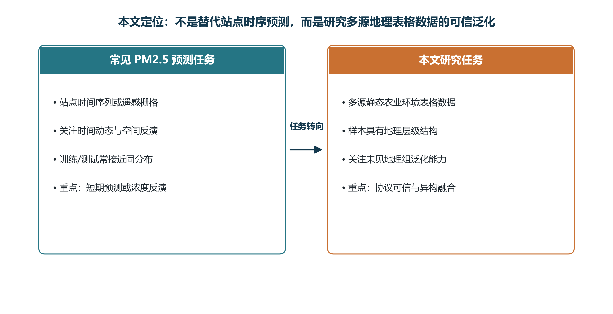
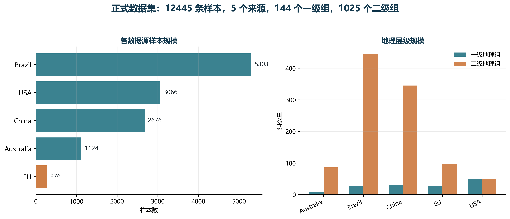
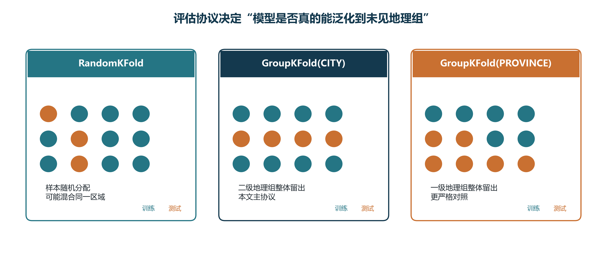
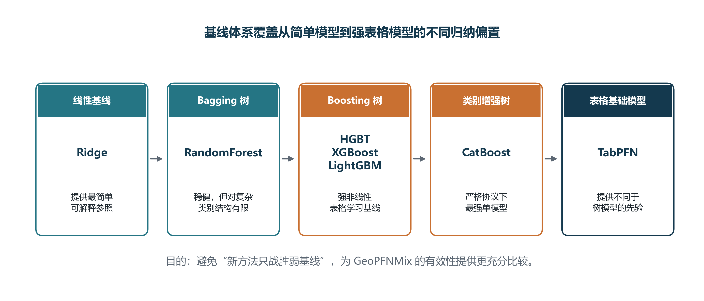
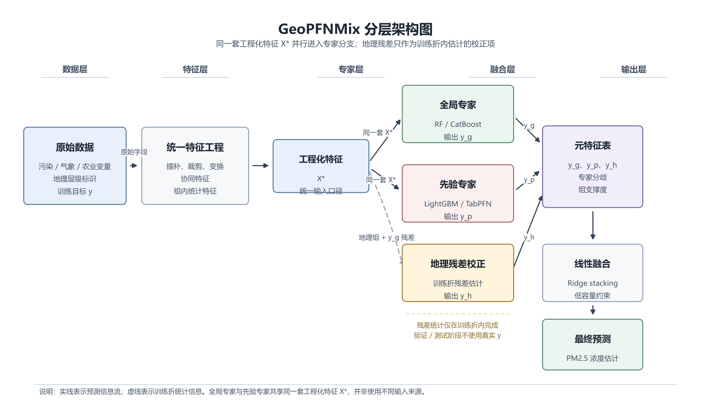
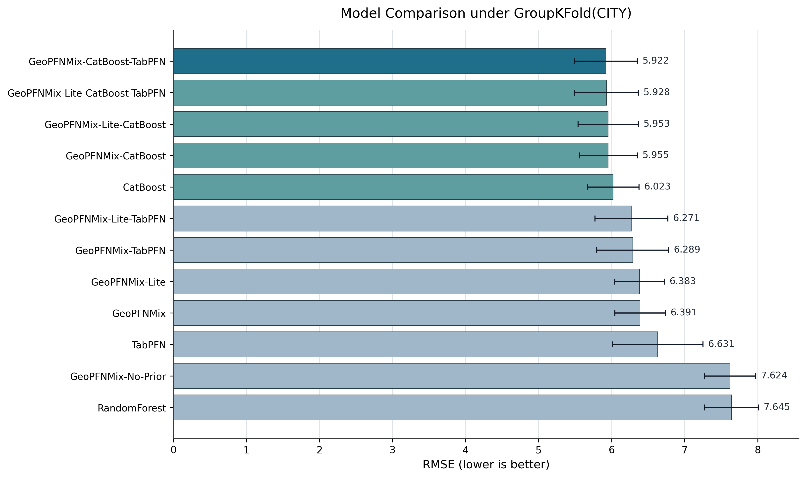
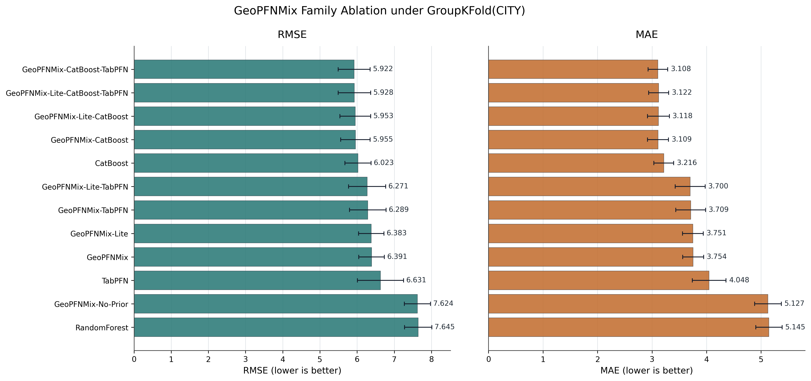
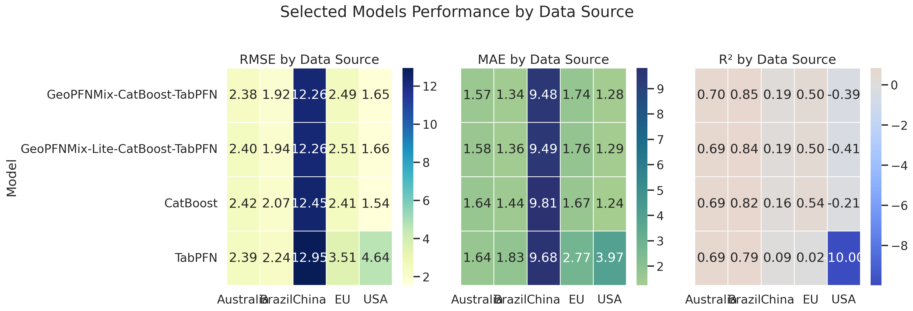
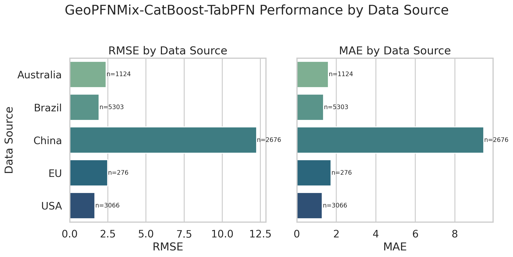

# 毕业论文答辩 PPT 大纲

论文题目：基于表格基础模型与集成学习的 PM2.5 浓度预测研究

建议页数：17 页

整体叙事主线：

> 研究背景与任务定位 -> 数据基础与实验协议 -> 方法设计 -> 实验结果与鲁棒性验证 -> 结论与展望

制作原则：PPT 不要把论文压缩成密集文字，而要围绕一个主问题讲清楚：**为什么随机划分不可信，为什么需要严格地理分组评估，以及 GeoPFNMix 如何在强基线基础上进一步改善多源 PM2.5 表格预测。**

---

# 封面(page 1)

## 页面内容

- 题目：基于表格基础模型与集成学习的 PM2.5 浓度预测研究
- 姓名：曹博宇
- 学号：2022080182
- 专业：计算机科学与技术
- 指导教师：张昊迪
- 答辩时间：2026 年 6 月

## 图表建议

- 不必放复杂实验图。
- 可使用简洁背景，例如地图网格、空气污染、农业环境或浅色渐变。

## 讲解重点

- 简短问候。
- 一句话说明研究对象：本文研究多源农业环境静态表格数据上的 PM2.5 浓度预测。
- 强调本文重点是“可信评估 + 表格基础模型与集成学习融合”，而不是传统站点时间序列预测。

---

# 目录(page 2)

## 页面内容

1. 研究背景与任务定位
2. 数据基础与实验协议
3. 方法设计
4. 实验结果与鲁棒性验证
5. 结论与展望

## 图表建议

- 可使用五段式流程条。
- 也可以使用简单图标：
  数据、协议、模型、实验、结论。

## 讲解重点

- 告诉老师接下来会按“问题为什么重要 -> 数据与协议如何设计 -> 方法如何提出 -> 实验说明什么 -> 结论与不足”展开。

---

# 研究背景与任务定位(page 3)

## 研究背景

## 页面内容

- PM2.5 是空气污染、生态风险和健康暴露的重要指标。
- PM2.5 的形成和累积受污染前体物、气象条件、区域输送、农业活动和地理背景共同影响。
- `NOX`、`SO2` 等前体物会参与二次颗粒物生成，降水、风速、温度等气象因素会影响扩散、转化和沉降。
- 因素之间存在非线性关系和交互作用，因此适合使用机器学习方法从多源表格数据中学习复杂映射。

## 图表建议

- 可使用机制示意图，放在右侧：
  `NOX/SO2 -> 二次颗粒物形成 -> PM2.5`
  `气象条件 -> 扩散/沉降`
  `地理背景 -> 区域差异`
- 如果不想新增图，使用三块文字卡片即可：
  污染前体物、气象条件、地理异质性。

## 讲解重点

- PM2.5 预测不是简单的一元回归问题。
- 本文使用机器学习的原因是：PM2.5 与污染、气象、农业投入和地理变量之间存在复杂非线性关系。
- 为后文引出“多源表格数据”和“地理泛化”做铺垫。

---

# 研究背景与任务定位(page 4)

## 任务定位

## 页面内容

- 常见 PM2.5 研究多关注站点时间序列、遥感反演或城市小时级预测。
- 本文研究的是多来源、静态截面、具有地理层级的农业环境表格数据。
- 本文核心问题不是“随机划分下谁分数最高”，而是“模型能否在未见地理组上保持可信预测”。
- 因此，本文将数据标准化、地理分组评估和异构模型融合放在同一研究框架中。

## 图表引用

## 讲解重点

- 这页要明确本文的定位：不是替代站点时序预测，而是研究多源地理表格任务。
- 说明“地理身份泄漏”是本文必须处理的核心风险。
- 强调本文的创新更偏向“问题设定、评估框架和融合结构”，不是单纯堆一个复杂模型。

---

# 数据基础与实验协议(page 5)

## 数据基础

## 页面内容

- 正式数据集来自 Australia、Brazil、China、EU 和 USA 五个来源。
- 统一后共包含 12445 条样本。
- 覆盖 144 个一级地理组和 1025 个二级地理组。
- 字段统一为地理层级、气象变量、污染变量、农业投入变量和 PM2.5 目标变量。
- 多源统一提升了覆盖范围，也带来了更强的来源异质性。

## 图表引用

## 页面可放的关键数字

| 指标 | 数值 |
|---|---:|
| 样本数 | 12445 |
| 数据来源 | 5 |
| 一级地理组 | 144 |
| 二级地理组 | 1025 |

## 讲解重点

- 本文不是单一地区的小数据实验。
- 多源数据让结论更有覆盖性，但也让模型必须面对更强分布差异。
- Brazil 和 USA 样本量较大，EU 样本量较小，数据天然不均衡。

---

# 数据基础与实验协议(page 6)

## 数据审计

## 页面内容

- PM2.5 目标分布存在长尾，高污染样本占比较少但预测难度更高。
- 二级地理组样本规模不均衡，说明不同区域的数据支撑度不同。
- 数值变量之间存在相关性，污染前体物和气象变量共同影响目标。
- 数据审计说明：模型既要处理长尾与缺失，也要处理地理组不均衡。

## 图表引用

建议二选一或二图并排：

可选补充：

## 讲解重点

- 数据分布并不理想，不能只依赖简单模型和随机划分。
- 长尾、高污染少样本、地理组样本不均衡共同构成预测难点。
- 这页承接后面为什么要使用稳健特征工程和分组协议。

---

# 数据基础与实验协议(page 7)

## 实验协议

## 页面内容

- `RandomKFold`：随机划分，用于观察近似同分布情况下的理想化表现。
- `GroupKFold(CITY)`：按二级地理组整体留出，是本文主协议。
- `GroupKFold(PROVINCE)`：按一级地理组整体留出，是更严格的泛化对照。
- 评价指标：RMSE、MAE、R²。

## 图表引用

## 讲解重点

- 这页是答辩中的关键页。
- 解释为什么随机划分可能把同一区域或相近区域分到训练集和测试集，造成性能高估。
- 指明本文正式结论以 `GroupKFold(CITY)` 为主，因为它在严格性和可比较性之间取得平衡。
- `GroupKFold(PROVINCE)` 用来观察更粗地理层级留出时性能是否进一步下降。

---

# 方法设计(page 8)

## 强基线体系

## 页面内容

- Ridge：线性基线，提供最简单可解释参照。
- RandomForest：Bagging 树模型，检验传统树集成表现。
- HistGradientBoosting、XGBoost、LightGBM：强 Boosting 表格模型。
- CatBoost：擅长类别特征处理，是严格地理协议下最强单模型。
- TabPFN：表格基础模型风格方法，提供不同于树模型的先验。

## 图表引用

## 讲解重点

- 强调“基线充分”是本文说服力的重要来源。
- 本文不是用新模型战胜弱基线，而是在 Ridge、树模型、Boosting、CatBoost 和 TabPFN 都纳入比较后再讨论融合收益。
- 为后面说明 GeoPFNMix 的优势不是偶然铺垫。

---

# 方法设计(page 9)

## GeoPFNMix

## 页面内容

- 单一模型难以同时处理三类信息：
  - 全局非线性规律。
  - 地理层级系统偏差。
  - 不同模型先验之间的互补。
- GeoPFNMix 将预测任务拆分为四个模块：
  - 全局专家：学习主体非线性关系。
  - 地理残差分支：校正区域系统偏差。
  - 先验专家：提供异构归纳偏置。
  - 低容量 stacking：稳定融合专家输出。

## 图表引用

## 讲解重点

- 说明 GeoPFNMix 的提出不是为了让模型变复杂，而是为了让不同模块各司其职。
- 强调残差分支只在训练折内估计，避免测试泄漏。
- 用一句话解释推理流程：
  全局专家先预测，残差分支修正地理偏差，先验专家提供补充预测，最后由线性 stacking 融合。

---

# 方法设计(page 10)

## GeoPFNMix 家族与消融逻辑

## 页面内容

建议放一张结构对照表：

| 模型 | 全局专家 | 残差分支 | 先验专家 | 目的 |
|---|---|---|---|---|
| GeoPFNMix-Lite | RF | 否 | LightGBM | 低复杂度融合 |
| GeoPFNMix | RF | 是 | LightGBM | 检验残差分支 |
| GeoPFNMix-Lite-CatBoost | CatBoost | 否 | LightGBM | 检验强骨干 |
| GeoPFNMix-CatBoost | CatBoost | 是 | LightGBM | 强骨干完整结构 |
| GeoPFNMix-CatBoost-TabPFN | CatBoost | 是 | TabPFN | 当前最优结构 |

## 图表建议

- 使用上表即可，不必额外放大图。
- 如果页面空间足够，可在右侧放三个问题：
  - 更强全局专家是否重要？
  - 残差分支是否稳定有效？
  - TabPFN 先验是否能补充树模型？

## 讲解重点

- 这些变体不是随意堆叠，而是为了做消融。
- Lite vs Full 检验残差分支。
- LightGBM vs TabPFN 检验先验专家。
- RF vs CatBoost 检验全局专家能力。

---

# 实验结果与鲁棒性验证(page 11)

## 实验结果

## 页面内容

### 协议差异

| 协议 | 最优单模型 | RMSE |
|---|---|---:|
| RandomKFold | TabPFN | 4.8426 |
| GroupKFold(CITY) | CatBoost | 6.0229 |
| GroupKFold(PROVINCE) | CatBoost | 6.8052 |

### 主协议最优融合模型

- GeoPFNMix-CatBoost-TabPFN：
  - RMSE = 5.9225
  - MAE = 3.1078
  - R² = 0.7622
- 第二优配置：
  - GeoPFNMix-Lite-CatBoost-TabPFN
  - RMSE = 5.9281

## 图表引用

建议左侧放协议热力图，右侧放主结果图：

## 讲解重点

- 不同协议下最优模型发生变化，说明协议本身会影响结论。
- RandomKFold 下 TabPFN 最强，但严格地理协议下 CatBoost 更稳健。
- GeoPFNMix-CatBoost-TabPFN 在主协议下取得当前最佳结果，但应表述为“强基线基础上的进一步改善”，不要夸大成数量级提升。

---

# 实验结果与鲁棒性验证(page 12)

## 消融与显著性

## 页面内容

建议放四个结论卡片：

- RF 骨干下，Lite 与 Full 差异不显著，说明残差分支不是在任何骨干上都自动有效。
- CatBoost + TabPFN 组合下，残差分支仍显著有效，说明强专家组合之后仍存在可校正的地理系统误差。
- GeoPFNMix-CatBoost vs GeoPFNMix-CatBoost-TabPFN 中，TabPFN 相对 LightGBM 先验的增益未达显著，说明 TabPFN 不是全面替代 LightGBM。
- GeoPFNMix-Lite-CatBoost 接入 TabPFN 后误差进一步降低，p=1.17e-02，说明在低复杂度融合结构中 TabPFN 与 CatBoost 的互补性更容易体现。

## 图表引用

也可在角落放关键检验：

| 对比 | p 值 | 含义 |
|---|---:|---|
| Lite vs Full(RF) | 0.9875 | 无显著差异 |
| Lite-CatBoost-TabPFN vs Full-CatBoost-TabPFN | 5.83e-22 | 残差分支显著有效 |
| GeoPFNMix-CatBoost vs GeoPFNMix-CatBoost-TabPFN | 1.16e-01 | TabPFN 增益未达显著 |
| Lite-CatBoost vs Lite-CatBoost-TabPFN | 1.17e-02 | TabPFN 带来显著补充 |

## 讲解重点

- 强调“模块之间存在交互”，不是模块越多越好。
- 这页能增强论文说服力，因为它说明你不是只报告冠军模型，而是在解释各模块为什么有效或何时有效。

---

# 实验结果与鲁棒性验证(page 13)

## 误差结构

## 页面内容

- 当前最佳模型在主体 PM2.5 区间表现较好。
- 高 PM2.5 尾部误差明显增大，高污染样本仍是难点。
- 按来源拆分后，不同数据源表现差异明显。
- China 是当前最难来源；USA 虽然 RMSE/MAE 较低，但 R² 为负，说明其来源内部目标波动范围较小。

## 图表引用

建议两图并排：

可选替代：

## 讲解重点

- 整体指标不能代表所有目标区间，也不能代表所有来源。
- 全球冠军不等于每个来源上都最优。
- 这页强调模型结果的细粒度审计，避免只看一个总体 RMSE。

---

# 实验结果与鲁棒性验证(page 14)

## 解释性分析

## 页面内容

- SHAP 结果显示，`COUNTRY` 是最重要特征，说明来源差异在当前多源数据中非常强。
- `PROVINCE`、`CITY` 等地理变量说明区域层级仍然影响预测。
- `NOX`、`SO2`、`NOX_div_SO2`、`NOX_plus_SO2` 等污染前体物及其协同特征具有较高重要性，符合 PM2.5 形成机理。
- `AET` 等气象变量也参与模型判断。

## 图表引用

## 讲解重点

- 解释性分析支持模型确实利用了环境变量和地理结构。
- 同时，`COUNTRY` 重要性高也提示：当前模型仍受来源代理信息影响。
- 这页要把“解释性支持”和“结论边界”同时讲出来。

---

# 实验结果与鲁棒性验证(page 15)

## 跨来源外推与来源依赖性补充验证

## 页面内容

### leave-one-country-out

- 将某个来源整体留出测试，模拟完全未见来源。
- 最佳均值模型转为 GeoPFNMix-Lite-CatBoost。
- 最佳均值 RMSE = 9.5264，明显高于主协议下的 5.9225。
- 所有模型平均 R² 均为负，说明完全跨来源外推仍然困难。

### 去除 `COUNTRY` 特征

- 去除 `COUNTRY` 后，所有模型 RMSE 均上升。
- CatBoost RMSE 从 6.0296 上升到 6.3863。
- GeoPFNMix-CatBoost-TabPFN RMSE 从 5.9192 上升到 6.1496。
- 说明来源代理信息确实对当前任务有重要贡献。

## 图表建议

建议直接做双表，或从论文中复制表 13 和表 14：

| leave-one-country-out | RMSE | MAE | R² |
|---|---:|---:|---:|
| CatBoost | 10.4097 | 9.0307 | -7.0608 |
| GeoPFNMix-Lite-CatBoost | 9.5264 | 8.0430 | -3.1767 |
| GeoPFNMix-CatBoost-TabPFN | 9.7775 | 8.2700 | -3.3080 |

| 去除 COUNTRY | 含 COUNTRY RMSE | 去除后 RMSE | 差值 |
|---|---:|---:|---:|
| CatBoost | 6.0296 | 6.3863 | +0.3567 |
| GeoPFNMix-Lite-CatBoost | 5.9599 | 6.1381 | +0.1782 |
| GeoPFNMix-CatBoost-TabPFN | 5.9192 | 6.1496 | +0.2304 |

## 讲解重点

- 这页要主动说明边界，反而能增强可信度。
- 本文证明的是严格地理分组下的改进，不是已经完全解决跨国家、跨来源外推。
- 后续工作应围绕域泛化、分布对齐、独立外部测试集展开。

---

# 结论与展望(page 16)

## 结论

## 页面内容

建议用四个结论卡片：

1. **评估协议是可信结论的前提。**  
   RandomKFold 会明显高估模型表现，GroupKFold(CITY) 更能反映未见地理组泛化。

2. **严格协议下 CatBoost 是最强单模型基线。**  
   TabPFN 在随机划分下最优，但 CatBoost 在地理分组协议下更稳健。

3. **GeoPFNMix 家族在强基线基础上进一步降低误差。**  
   GeoPFNMix-CatBoost-TabPFN 在主协议下取得 RMSE=5.9225、MAE=3.1078、R²=0.7622。

4. **跨来源域偏移仍是核心瓶颈。**  
   leave-one-country-out 与去除 COUNTRY 实验表明，完全跨来源外推仍然困难。

## 图表建议

- 可使用四卡片结论图，不必再放实验图。
- 如果想放一张总结图，可以放：
  `数据标准化 -> 严格协议 -> 强基线 -> GeoPFNMix -> 鲁棒性验证`

## 讲解重点

- 这页要总结“本文证明了什么”。
- 避免过度宣称，强调本文的价值是建立了一条可信、可复现、可审计的研究路线。

---

# 结论与展望(page 17)

## 展望

## 页面内容

### 本研究的局限

- 数据为静态截面表格，无法显式建模季节性、污染传播和短期气象扰动。
- 部分地理层级来自编码代理，不等价于真实空间邻接关系。
- 当前缺少经纬度、地形、土地利用、遥感产品等更丰富空间特征。
- 完全跨来源外推仍然困难，模型仍部分依赖 `COUNTRY` 等来源代理信息。
- 解释性分析主要聚焦全局专家，尚未完整解释融合系统内部各专家的动态贡献。

### 后续工作

- 引入经纬度、遥感、土地利用、道路密度等空间辅助特征。
- 构建独立封存外部测试集，进一步验证真实部署能力。
- 研究域泛化、来源自适应和分布对齐方法。
- 增加不确定性估计，使模型输出预测值和置信区间。

## 图表建议

- 可使用“未来工作路线图”：
  空间特征 -> 外部测试 -> 域泛化 -> 不确定性估计。
- 也可以不放图，只用四个简洁图标卡片。

## 讲解重点

- 说明本文方法适用于中等样本规模、强异质、强地理层级的静态表格环境任务。
- 如果任务转向高频时序、遥感栅格或明确空间邻接网络，可能需要时空图模型或空间统计模型。
- 最后以“感谢各位老师，恳请批评指正”结束。

---

# 备用答辩提示

## 8-10 分钟讲述节奏

| 部分 | 页码 | 时间 |
|---|---:|---:|
| 研究背景与任务定位 | 1-4 | 1.5 分钟 |
| 数据基础与实验协议 | 5-7 | 2 分钟 |
| 方法设计 | 8-10 | 2 分钟 |
| 实验结果与鲁棒性验证 | 11-15 | 3 分钟 |
| 结论与展望 | 16-17 | 1.5 分钟 |

## 最值得强调的三句话

1. 本文首先解决的是评估可信性问题：随机划分可能高估模型在未见区域上的能力。
2. GeoPFNMix 不是简单堆模型，而是让全局专家、地理残差分支、先验专家和线性 stacking 分工协作。
3. 本文对结论边界保持克制：严格地理分组下模型有效改善，但完全跨来源外推仍然困难。

## 可能被问到的问题

### 为什么不用 RandomKFold 作为最终结论？

因为 RandomKFold 可能让相近地理区域同时进入训练集和测试集，模型容易利用区域身份或来源相似性取得虚高分数。本文关注未见地理组泛化，因此使用 GroupKFold(CITY) 作为主协议。

### 为什么 CatBoost 在严格协议下比 TabPFN 更稳健？

TabPFN 在随机划分下表现很好，说明其在近似同分布场景中很强；但地理分组场景中类别结构和来源偏移更重要，CatBoost 对类别特征和表格非线性结构的处理更稳定。

### GeoPFNMix 相比 CatBoost 的提升不大，意义在哪里？

CatBoost 已经是非常强的单模型基线。GeoPFNMix 的意义不是数量级超越，而是在严格协议下通过地理残差和异构先验进一步降低误差，并通过消融说明模块在何种条件下有效。

### leave-one-country-out 下结果较差是否削弱论文结论？

它限定了论文结论边界，但不否定主结论。本文证明的是严格地理分组下的可信改进，而 leave-one-country-out 进一步说明完全跨来源外推更困难，是后续工作方向。
