# 基于地理分组泛化与异构专家融合的多源农业环境数据 PM2.5 浓度预测研究

## 摘要

细颗粒物 PM2.5 是表征区域空气污染程度、生态环境风险和居民暴露水平的重要指标。面向农业环境场景的 PM2.5 预测，既具有环境监测、区域比较与污染风险评估价值，也能为农业投入管理和跨区域协同治理提供数据支撑。然而，与常见的城市空气质量时序预测不同，本文研究对象为多来源、静态截面的行政区域表格数据，既存在显著地理层级，又存在明显的跨国家、跨统计口径分布差异；若继续采用随机划分评估，极易因为区域相似样本同时进入训练集与测试集而高估模型性能。围绕这一问题，本文基于 `data/` 目录中的 Australia、Brazil、China、EU 和 USA 五个数据源，构建了一套面向多源农业环境数据 PM2.5 回归预测的研究框架。首先，本文完成字段统一、层级映射和缺失清洗，将不同来源标准化为统一结构，共得到 12445 条样本、5 个国家或区域、144 个一级地理组和 1025 个二级地理组，并据此将 `GroupKFold(CITY)` 设定为主评估协议，同时以 `RandomKFold` 和 `GroupKFold(PROVINCE)` 作为对照。其次，在统一特征工程下，系统比较 Ridge、RandomForest、HistGradientBoosting、XGBoost、LightGBM、CatBoost 和 TabPFN 等基线模型，量化随机划分与严格地理分组之间的泛化代价。进一步地，针对“单一模型难以同时兼顾跨域全局规律、区域系统偏差与异构先验”的问题，本文提出 GeoPFNMix 框架，并在此基础上发展出面向复杂度控制的 GeoPFNMix-Lite，以及面向更强全局骨干的 GeoPFNMix-CatBoost 及其 TabPFN 先验增强版本。实验结果表明，`TabPFN` 在 `RandomKFold` 下取得最优单模型结果 `RMSE=4.8426`、`MAE=2.1188`、`R²=0.8425`；而在更具现实意义的 `GroupKFold(CITY)` 与 `GroupKFold(PROVINCE)` 协议下，最优单模型均转为 `CatBoost`，分别达到 `RMSE=6.0109`、`MAE=3.2069`、`R²=0.7542` 和 `RMSE=6.8052`、`MAE=4.5704`、`R²=0.6820`。在融合模型中，`GeoPFNMix-CatBoost-TabPFN` 取得当前主协议下的最佳 RMSE，即 `RMSE=5.9342`、`MAE=3.1168`、`R²=0.7612`；相较单模型 `CatBoost`，RMSE 进一步下降 `1.28%`、MAE 下降 `2.81%`，且与 `GeoPFNMix-CatBoost` 的差异在 Wilcoxon 配对检验下达到统计显著（`p=0.0133`）。同时，GeoPFNMix-Lite 仍提供了一个重要结论：在 RF 骨干下，控制结构复杂度可以显著优于单一 RF，并且在接入 TabPFN 先验后继续保持强竞争力。结合协议热力图、消融图、误差区间分析、省级或州级误差分布和 SHAP 解释可以发现，`COUNTRY`、`PROVINCE`、污染前体物及其组合特征共同决定了预测效果；严格的地理分组评估、统一的数据标准化和可插拔的异构专家机制，是本文获得稳定改进的关键。本文工作为面向地理异质性、多源统计口径与中等规模样本的 PM2.5 预测提供了一条兼具可复现性、解释性和工程可落地性的技术路线。

**关键词**：PM2.5 预测；地理泛化；多源表格数据；GeoPFNMix；GeoPFNMix-Lite；CatBoost；TabPFN；模型融合；SHAP

## Abstract

PM2.5 is an important indicator for air pollution assessment, ecological risk analysis, and exposure evaluation. Unlike city-level forecasting tasks based on time series, this thesis studies a geographically structured, multi-source, static tabular regression problem built from agricultural-environmental datasets in Australia, Brazil, China, the EU, and the USA. After harmonizing field names, target definitions, and geographic identifiers, the merged dataset contains 12,445 samples, 5 countries or regions, 144 first-level geographic groups, and 1,025 second-level geographic groups. Because random splits can easily leak geographic similarity across train and test folds, `GroupKFold(CITY)` is adopted as the primary evaluation protocol, with `RandomKFold` and `GroupKFold(PROVINCE)` used as references. Under a unified feature engineering pipeline, Ridge, RandomForest, HistGradientBoosting, XGBoost, LightGBM, CatBoost, and TabPFN are systematically compared. To jointly model global nonlinear relations, hierarchical geographic bias, and heterogeneous priors, this thesis proposes GeoPFNMix, a geographically aware fusion framework that combines a global expert, hierarchical residual correction, a prior expert, and low-capacity stacking. Based on this framework, GeoPFNMix-Lite and GeoPFNMix-CatBoost are further developed. Experimental results show that TabPFN is the strongest single model under `RandomKFold`, whereas CatBoost becomes the strongest single model under both grouped protocols. On the main protocol, the best overall result is achieved by `GeoPFNMix-CatBoost-TabPFN`, with `RMSE=5.9342`, `MAE=3.1168`, and `R²=0.7612`, outperforming single-model CatBoost and improving upon `GeoPFNMix-CatBoost` with statistically significant gains. At the same time, GeoPFNMix-Lite remains a strong and necessary control because it demonstrates that complexity control is still useful when the global expert is weaker or when prior gains are unstable. Additional protocol comparison, ablation studies, error-bin analysis, province/state-level error analysis, and SHAP interpretation show that country-level domain shift, regional hierarchy, pollution precursors, and meteorological conditions jointly shape PM2.5 prediction performance. The study provides a reproducible, interpretable, and practically deployable route for geographically heterogeneous tabular regression in environmental applications.

**Key Words**: PM2.5 prediction; geographic generalization; tabular regression; GeoPFNMix; TabPFN; model fusion; SHAP

---

## 1 绪论

### 1.1 研究背景

PM2.5 作为大气环境质量评价中的核心指标之一，能够在较长时间尺度上反映污染物排放、气象条件变化及区域扩散输送过程的综合影响。大量研究表明，PM2.5 浓度不仅与公众健康、呼吸系统疾病、区域灰霾和生态退化密切相关，还与农业生产、环境承载力和区域协同治理水平存在显著关联。因此，构建可信、可解释的 PM2.5 预测模型，具有明确的现实意义和方法研究价值。

在已有空气质量预测研究中，研究对象通常以城市级站点为主，建模任务多表现为时间序列预测或时空联合预测。然而，行政区域尺度的数据场景与此存在明显差异。一方面，这类数据往往不具备连续完整的时间轴，而更多表现为农业、气象、污染和区域属性共同构成的静态表格数据；另一方面，它通常具有显著的行政区层级结构，样本之间存在较强的区域相似性与分布偏移。如果沿用随机划分下的常规表格建模流程，模型可能主要学习到区域身份信息，而非可迁移的环境规律，从而高估实际泛化能力。

本文所使用的数据包含 `COUNTRY`、`PROVINCE`、`CITY`、`COUNTY` 等地理层级变量，以及 `AET`、`ppt`、`tem`、`wind`、`NOX`、`SO2`、`fertilzier`、`manure` 等农业环境相关变量。由此可见，本文关注的并非“依据历史序列预测未来某一时刻 PM2.5”的传统问题，而是“给定一个行政区域单元的农业、污染和气象特征，能否预测其 PM2.5 水平，并在未见过的地理组中仍保持一定泛化能力”的跨区域表格回归问题。

### 1.2 研究问题与挑战

围绕多源农业环境区域数据开展 PM2.5 预测，至少面临以下三类挑战。

第一，**多源数据口径不统一**。不同数据源在字段命名、单位习惯、地理编码粒度和缺失模式上均存在差异。例如，欧盟数据以区域代码给出、美国数据同时提供州和县名、澳大利亚与巴西数据需要依赖数值编码恢复层级结构。若不经过标准化预处理，模型比较将失去公平性。

第二，**地理层级结构显著，存在地理泄漏风险**。同一国家、同一州省或同一二级地理组中的样本在统计分布上通常更加接近，若直接采用随机划分，训练集与测试集之间将共享大量区域模式，导致性能评估偏于乐观。因此，本研究不仅需要关注“模型是否有效”，更需要回答“在严格地理分组协议下，模型是否仍然有效”。

第三，**跨域异质性与区域偏差并存**。在多源数据场景下，模型不仅要学习污染变量与气象变量的通用关系，还要处理国家级统计口径差异、区域系统偏差以及低支持度地理组带来的不稳定性。单一模型很难同时兼顾这些因素，这也是本文引入 GeoPFNMix 家族方法的直接动机。

### 1.3 研究目标与研究内容

基于上述背景，本文的总体目标是：面向多源农业环境表格数据，构建一套能够在地理分组协议下稳定工作的 PM2.5 回归预测方法，并形成从数据审计、模型设计、实验评估到结果解释的完整研究链条。

为实现这一目标，本文主要开展以下工作。

1. 对多源区域数据进行结构化审计，识别样本分布、缺失情况、层级结构及潜在泄漏风险，并完成统一标准化。
2. 构建统一特征工程和统一评估流程，在多种模型下建立强基线体系。
3. 提出 GeoPFNMix 框架，并围绕其核心思想发展出 GeoPFNMix-Lite 和 GeoPFNMix-CatBoost 两条关键演化路线。
4. 在获得 TabPFN 无人值守授权后，将 TabPFN 正式纳入基线和先验专家体系，进一步验证 PFN 先验对融合模型的贡献。
5. 结合消融实验、显著性检验和解释性分析，总结不同模型结构在区域 PM2.5 预测任务中的适用性与局限性。

### 1.4 主要贡献

本文的主要贡献可概括为以下几个方面。

1. 完成了五个来源数据的统一标准化，将不同字段口径映射到统一的 `COUNTRY`、`PROVINCE`、`CITY`、`COUNTY` 与数值特征结构，为后续模型比较提供了可复现的数据基础。
2. 从评估协议层面识别并量化了地理泄漏问题，明确提出以 `GroupKFold(CITY)` 作为主评估协议，并用 `RandomKFold` 与 `GroupKFold(PROVINCE)` 刻画不同强度的泛化代价。
3. 在统一特征工程下构建了涵盖 Ridge、RF、HGBT、XGBoost、LightGBM、CatBoost 和 TabPFN 的完整强基线体系，并揭示了“TabPFN 在随机划分更强、CatBoost 在严格分组更强”的重要现象。
4. 提出了面向地理分组泛化的 GeoPFNMix 框架，并从研究动机、结构设计和实验表现三个层面系统阐述了 GeoPFNMix、GeoPFNMix-Lite 和 GeoPFNMix-CatBoost 的关系。
5. 解决了 TabPFN 在无人值守环境下的认证与调用问题，使 PFN 先验能够真正进入正式实验流程；同时通过显著性检验、误差区间分析、省级或州级误差分布和 SHAP 解释，对模型改进来源进行了系统讨论。

### 1.5 研究思路与论文结构

本文的总体研究思路可以概括为“先识别问题，再建立基线，随后进行结构化改进，最后回到严格协议下验证改进是否真实存在”。具体而言，首先通过数据审计和协议对照确认地理泄漏是影响结论可信度的核心问题；其次在统一特征工程下建立完整基线体系，明确不同类型模型在区域 PM2.5 任务中的相对位置；再次以 GeoPFNMix 为主线，围绕全局专家、地理残差和先验专家三部分展开结构化设计，并进一步形成 Lite 和 CatBoost 两条演化路线；最后通过显著性检验、误差结构分析和 SHAP 解释，对模型改进来源进行回溯。

在论文结构安排上，第 1 章说明研究背景、问题定义和主要贡献；第 2 章综述 PM2.5 预测、表格学习和地理泛化相关研究；第 3 章介绍数据集、数据审计和正式问题定义；第 4 章给出 GeoPFNMix 家族方法设计；第 5 章介绍实验设置与工程实现；第 6 章汇报实验结果并进行多角度分析；第 7 章讨论方法关系、局限与后续方向；第 8 章总结全文结论。这样的结构安排既保持了研究逻辑的连续性，也便于将实验结果与方法动机逐一对应。

---

## 2 相关工作

### 2.1 PM2.5 浓度预测研究

针对 PM2.5 的预测问题，已有研究主要围绕污染排放、气象条件、空间扩散和时间动态展开。传统方法包括线性回归、随机森林、梯度提升树和支持向量机等；近年来，循环神经网络、时空图神经网络以及融合遥感产品的深度模型也被广泛应用于区域空气质量预测任务。总体而言，气象变量与污染前体物通常被视为影响 PM2.5 的核心因素，而区域背景差异则会显著改变它们的作用方式。

然而，现有研究中大量工作面向城市站点、连续时序或时空联合场景，与本文的数据条件存在明显差异。本文研究的数据并非高频连续监测序列，而是以行政区域单元为粒度的静态截面表格；因此，本文更接近于环境风险回归建模问题，而非标准时序预测问题。如何在静态表格条件下处理地理异质性与跨区域泛化，是本研究相对于既有 PM2.5 预测工作的主要差异点。

### 2.2 表格学习与强基线研究

表格数据学习研究的一个重要结论是，在小中样本任务中，树模型依然是极具竞争力的基线。Gorishniy 等人的研究表明，深度学习模型在表格任务上并不必然优于传统机器学习模型，合理的强基线体系对于研究结论的可信度至关重要。基于这一认识，本文并未预设“新模型一定优于传统模型”，而是首先构建覆盖线性模型、Bagging 树、Boosting 树以及 foundation model 风格模型的基线体系，再在此基础上讨论结构化改进。

TabPFN 的提出为小样本表格任务带来了新的研究思路。TabPFN 并非通过针对某一数据集重新大规模训练模型来获得能力，而是通过预训练形成面向表格任务的推理先验，从而在下游小样本场景中展现竞争力。对于本文的任务而言，TabPFN 一方面可作为强单模型基线，另一方面也适合作为与树模型归纳偏置不同的先验专家，从而为异构融合提供更具差异性的输入。

### 2.3 地理泛化与分层建模思想

在具有地理层级结构的数据上，区域背景并非普通类别变量，而更接近于一种分层偏置来源。若将省份、城市等信息完全交给单一模型隐式学习，模型容易混淆全局规律和局部偏移，进而削弱泛化能力。因此，分层校正、混合效应思想和区域偏差建模，对具有地理异质性的环境预测问题具有较强启发意义。

本文并未直接采用严格的统计混合效应模型，但 GeoPFNMix 中的地理残差分支借鉴了分层校正思路：先利用全局专家拟合总体关系，再对其残差按省级和城市级进行收缩校正，以显式分离区域系统偏差。这一设计使得模型结构更符合问题本身的层级特征。

### 2.4 本文工作的定位

综合来看，本文工作的定位不是提出一个脱离场景的新模型名称，而是围绕真实的地理泛化问题，构建一套兼顾强基线、区域层级意识、小样本先验和工程可复现性的研究框架。其创新性主要体现在以下三个方面：一是将评估协议本身纳入研究对象，系统揭示地理泄漏对性能估计的影响；二是以 GeoPFNMix 为主线，构建了从总框架到轻量化版本、增强骨干版本，再到 PFN 先验增强版本的方法演化路径；三是将 TabPFN 从“相关工作中的前沿模型”真正落地为可执行基线与可插拔先验专家，使论文的研究叙事与实验结果能够相互支撑。

---

## 3 数据集、数据审计与问题定义

### 3.1 数据集概况

本文不再局限于单一 `data.csv`，而是使用 `data/` 目录中的五个数据源：`Australia.csv`、`Brazil.xlsx`、`China.xlsx`、`EU.xlsx` 和 `USA.xlsx`。这些数据源都包含 PM2.5 及农业、污染、气象相关字段，但原始列名和地理层级表达方式并不一致。为保证实验公平性，本文先进行统一标准化，再进入后续建模流程。

表 1 给出了五个来源数据在进入统一数据管线后的样本规模。

表 1 多源数据组成

| 数据源 | 标准化后样本数 | 地理层级处理方式 |
|---|---:|---|
| Australia | 1124 | 由 `ID` 编码构造一级和二级地理代理组 |
| Brazil | 5303 | 由分县编码构造一级和二级地理代理组 |
| China | 2676 | 直接使用 `PROVINCE`、`CITY`、`COUNTY` |
| EU | 276 | 由区域代码构造国家代码级与二级代理组 |
| USA | 3066 | `State` 作为一级组，`County` 作为元信息保留 |
| 合计 | 12445 | 统一进入同一建模框架 |

标准化后的统一字段如表 2 所示。与旧版单源实验不同，本文新增 `COUNTRY` 作为正式类别特征，用于显式刻画跨国家或跨区域来源差异。

表 2 标准化后字段说明

| 类型 | 字段名 | 说明 |
|---|---|---|
| 标识列 | `OBJECTID_1` | 标准化后的样本编号，不参与建模 |
| 类别列 | `COUNTRY` | 国家或区域来源标识 |
| 类别列 | `PROVINCE` | 一级地理组，表示省、州或一级代理区 |
| 类别列 | `CITY` | 二级地理组，表示城市或二级代理区 |
| 类别列 | `COUNTY` | 细粒度区域元信息，不作为主类别特征 |
| 数值列 | `AET`、`ppt`、`tem`、`wind` | 气象背景变量 |
| 数值列 | `NOX`、`SO2` | 污染前体物变量 |
| 数值列 | `fertilzier`、`manure` | 农业投入相关变量 |
| 目标列 | `PM2.5` | 区域 PM2.5 浓度 |

需要特别说明的是，代码中仍沿用字段名 `CITY` 作为主分组列，但在多源数据场景下，它表示的是“统一二级地理组”，并不总是严格意义上的城市。例如，欧盟和澳大利亚样本通过编码代理恢复层级结构，美国样本则使用州级代理组来避免过多单样本组。这样的设计并不改变实验结论，反而使不同来源能够在同一协议下被统一比较。

### 3.2 数据审计结果

基于 `scripts/run_eda.py` 的统计与可视化结果，数据审计结论如表 3 所示。

表 3 数据审计摘要

| 指标 | 数值 |
|---|---:|
| 样本数 | 12445 |
| 字段数 | 14 |
| 国家或区域数 | 5 |
| 一级地理组数 | 144 |
| 二级地理组数 | 1025 |
| 重复样本数 | 0 |
| 目标均值 | 14.57 |
| 目标标准差 | 12.21 |

在缺失方面，统一后的数据仅存在少量数值缺失：`AET`、`ppt`、`tem`、`wind` 各缺失 1 条，`SO2` 缺失 2 条，`fertilzier` 缺失 188 条，`manure` 缺失 94 条。由于缺失比例整体较低，本文不在原始数据阶段强行删除样本，而是在各模型管线中使用中位数或众数插补，既保留样本规模，也避免不同模型因预处理策略不一致而受到影响。

图 1 展示了 PM2.5 目标分布。从图中可以看出，样本主要分布在中低污染区间，但高污染区域仍表现出较长尾部，这意味着模型不仅需要拟合主体区间，还需要在高值区域保持一定稳定性。

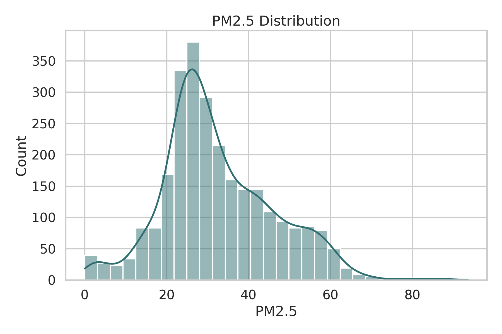

图 2 给出了二级地理组样本规模分布。可以看到，不同来源之间的组大小差异非常明显：一部分组样本充足，而另一部分代理组样本较少。这说明在按 `CITY` 分组的交叉验证中，模型需要频繁面对低支持度地理组的外推问题。

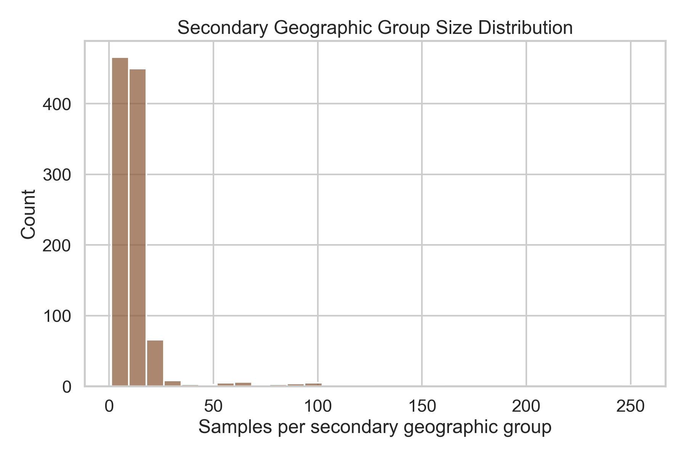

图 3 为数值特征相关性热力图。`NOX`、`SO2` 与 PM2.5 呈现出较为明显的相关关系，`wind`、`ppt` 等变量更像调制因子。图 4 进一步展示了关键变量与目标的散点关系，可以观察到整体上不存在简单的单调线性模式，而且不同国家和区域之间存在明显的尺度差异，因此采用树模型以及结构化融合模型具有现实必要性。

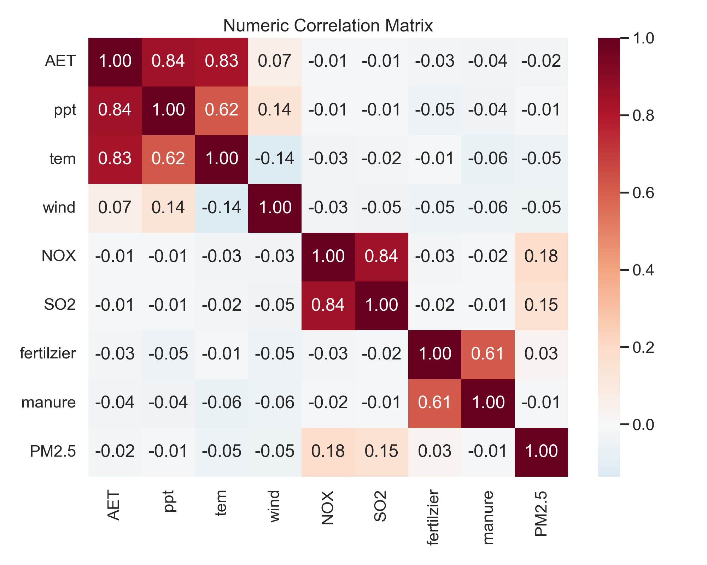

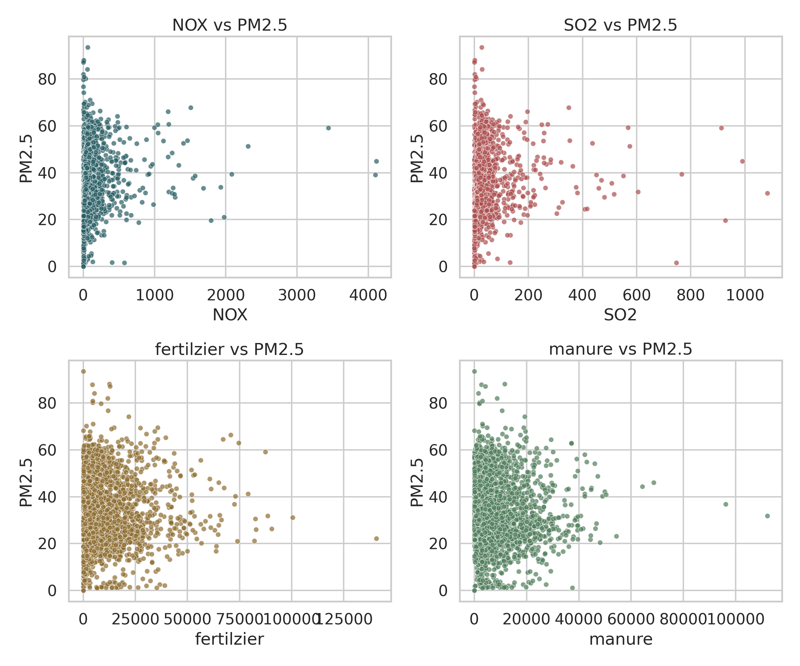

### 3.3 为什么不将 COUNTY 作为主类别特征

在区域级环境数据中，最容易造成虚高性能的因素之一，是直接将高基数区域标识作为普通类别变量输入模型。若 `COUNTY` 被显式编码，模型可能主要学习“该区域是否在训练集中出现过”这一身份信息，而非污染形成的可迁移规律。

本文不将 `COUNTY` 作为主类别特征进入统一建模流程，主要基于三点考虑。其一，`COUNTY` 的高基数和近唯一性会显著增强模型的记忆倾向，不利于跨地理组泛化。其二，本文主协议已经采用 `GroupKFold(CITY)`，若再引入更细粒度的县级或区域显式编码，将进一步放大地理身份信息。其三，在多源数据场景下，不同来源的最细粒度编码含义并不完全一致，直接将其统一编码反而会引入新的噪声。基于以上原因，本文保留 `COUNTY` 作为原始元信息，但在正式特征工程中仅保留 `COUNTRY`、`PROVINCE` 与 `CITY` 作为主要类别特征。

### 3.4 问题定义

设第 $i$ 个区域样本的输入特征为 $x_i$，其目标值为 $y_i$，则本文研究任务可形式化为监督回归问题：

$$
\hat{y}_i = f(x_i),
$$

其中 $\hat{y}_i$ 表示模型对 PM2.5 浓度的预测值。本文关注的重点并非任意构造更复杂的函数 $f$，而是设计一个能够在严格地理分组协议下同时适应跨国家差异、跨区域偏移和低支持度分组挑战的预测函数。

### 3.5 评估协议与评价指标

为识别随机划分带来的地理泄漏，并对模型进行严格评价，本文设置三套交叉验证协议：

1. `RandomKFold(5)`：作为随机划分对照；
2. `GroupKFold(5, CITY)`：作为主协议，强调跨二级地理组泛化；
3. `GroupKFold(5, PROVINCE)`：作为更严格的跨一级地理组泛化对照。

评价指标采用 RMSE、MAE 和 R²。RMSE 用于反映整体误差量级，MAE 用于衡量平均绝对偏差，R² 用于描述模型对目标方差的解释程度。本文所有主结论均以 `GroupKFold(CITY)` 为依据，而随机划分结果仅用于量化地理泄漏和跨域泛化代价，不作为最终性能优劣的唯一依据。

---

## 4 研究方法

### 4.1 统一特征工程

为保证不同模型之间的公平比较，本文首先设计统一特征工程模块。该模块并非单纯追求特征数量增加，而是围绕污染机理、农业环境背景和区域相对差异进行构造，具体包括以下步骤。

1. 对所有数值变量进行 `1%` 和 `99%` 分位裁剪，以减弱极端值对模型分裂行为的影响。
2. 对 `ppt`、`NOX`、`SO2`、`fertilzier`、`manure` 等偏态变量进行 `log1p` 变换，减小长尾分布影响。
3. 构造污染协同特征，如 `NOX_plus_SO2`、`NOX_div_SO2`。
4. 构造农业投入与气象交互特征，如 `fertilzier_x_wind`、`manure_x_ppt`、`SO2_x_wind` 和 `NOX_x_tem`。
5. 构造省内相对强度特征，如 `province_z_NOX`、`province_z_ppt` 等，以刻画样本相对所在省份背景的偏离程度。
6. 构造样本支撑度特征，如 `province_sample_count`、`city_sample_count` 和 `is_low_support_city`，用于反映不同区域的样本充足程度。

上述特征工程具有两方面作用：一方面保留了较强的可解释性，便于后续结合环境机理进行讨论；另一方面为多专家融合提供了相对稳定而不过度冗余的输入基础。

### 4.2 强基线模型体系

在基线设置上，本文选取了以下代表性模型：

- Ridge
- RandomForest
- HistGradientBoosting
- XGBoost
- LightGBM
- CatBoost
- TabPFN

这组模型覆盖了线性模型、Bagging 树、Boosting 树以及 foundation model 风格的先验模型。设置如此广覆盖的基线体系，目的并不在于简单增加实验数量，而是在不同类型归纳偏置之间建立充分对照，为 GeoPFNMix 家族的设计选择提供依据。例如，GeoPFNMix-Lite 中选择 RF 作为全局专家，是因为其在早期跨城市实验中表现出较好的稳定性；GeoPFNMix-CatBoost 的提出，则源于 CatBoost 在类别信息处理与整体预测精度上的优势。

### 4.3 GeoPFNMix 的提出：动机、目标与总体框架

#### 4.3.1 提出动机

GeoPFNMix 的提出源于如下判断：单一模型虽然能够学习一定的非线性关系，但往往难以同时兼顾全局规律、区域系统偏差和小样本先验支持。具体而言：

1. 单模型通常难以清晰区分“整体污染形成机制”与“区域背景差异”；
2. 对低样本城市而言，仅依赖本地有限样本难以充分支撑稳定学习；
3. 若将所有复杂性都交给高容量元学习器处理，则容易在 OOF 元特征较少的场景下产生过拟合。

基于此，本文将问题拆解为三个相互配合的部分：由全局专家负责拟合总体非线性关系，由地理残差分支处理区域系统偏差，由异构先验专家提供不同于树模型的归纳偏置，最后通过低容量 stacking 在受控复杂度下完成融合。

#### 4.3.2 设计目标

GeoPFNMix 的核心设计目标包括：

1. 以跨城市泛化为首要目标，避免围绕随机划分优化结构。
2. 明确各模块职责，使全局规律建模、区域偏差处理和先验补充相互分工。
3. 采用低容量融合器，以降低小样本场景下的元学习过拟合风险。
4. 支持可插拔的先验专家，使 LightGBM 与 TabPFN 可以在同一框架中切换。
5. 兼顾工程可复现性，使模型能够在无人值守环境下稳定运行。

#### 4.3.3 总体形式

GeoPFNMix 的总体预测函数可表示为：

$$
\hat{y} = g\big(\hat{y}_{global}, \hat{y}_{global} + \hat{r}_{geo}, \hat{y}_{prior}, m(x)\big),
$$

其中，$\hat{y}_{global}$ 表示全局专家预测，$\hat{r}_{geo}$ 表示地理残差校正，$\hat{y}_{prior}$ 表示先验专家预测，$m(x)$ 表示支撑度、专家分歧等元特征。公式的意义不在于形式复杂，而在于强调不同模块承担不同职责：GeoPFNMix 通过结构化拆分，使总体关系学习、区域校正和先验补充能够分别建模，再以低自由度融合器重组为最终预测。

### 4.4 地理层级残差校正

给定全局专家预测 $\hat{y}_{global}$，定义样本残差为：

$$
r_i = y_i - \hat{y}_{global,i}.
$$

随后，对残差建立省级与城市级的收缩校正：

$$
\hat{r}_i = b_0 + b_{province(i)} + b_{city(i)}.
$$

其中，$b_0$ 为全局残差均值，$b_{province(i)}$ 与 $b_{city(i)}$ 分别表示省级和城市级的收缩效应。为避免低样本城市被局部噪声主导，本文未直接使用原始局部均值，而是采用与样本量相关的收缩形式进行平滑，使样本充足的地区更接近局部经验，样本稀缺的地区更接近全局或上层级平均。

这一模块的意义在于，它显式建模了区域系统偏差，使模型结构更符合地理分层问题的直觉，也为后续分析“残差分支在不同先验条件下是否仍具价值”提供了结构基础。

### 4.5 GeoPFNMix-Lite 的提出

#### 4.5.1 提出动机

GeoPFNMix 的完整结构虽然在概念上较为完整，但在小中样本、强分组交叉验证场景中，复杂结构并不必然带来更优泛化。项目早期实验发现，当 OOF 元特征有限、城市样本支持不足时，额外分支和更高自由度的后处理模块容易引入方差，导致结果不稳定。基于这一观察，本文提出 GeoPFNMix-Lite，作为面向稳定交付与受控复杂度的轻量化子配置。

#### 4.5.2 设计目标

GeoPFNMix-Lite 的设计目标主要体现在以下三点：

1. 保留 GeoPFNMix“异构专家融合”的核心思想；
2. 降低模型结构复杂度，使其更适应小中样本与强分组协议；
3. 在不依赖复杂授权环境的情况下，维持一套可稳定执行的研究流程。

#### 4.5.3 结构定义

GeoPFNMix-Lite 的初始定义为：

> `GeoPFNMix-Lite = RF 全局专家 + LightGBM 先验专家 + 线性 stacking`

在获得 TabPFN 授权后，进一步得到：

> `GeoPFNMix-Lite-TabPFN = RF 全局专家 + TabPFN 先验专家 + 线性 stacking`

由此可见，Lite 并非绑定某一先验模型，而是一种强调低容量融合、易于扩展的结构策略。LightGBM 版本保证了框架可执行性，TabPFN 版本则用于验证更强先验加入后框架是否仍能获益。

### 4.6 GeoPFNMix-CatBoost 的提出

#### 4.6.1 提出动机

随着实验推进，CatBoost 在主协议下展现出比 RF 更强的单模型表现，这提示框架上限不仅受残差分支和先验专家影响，也受到全局专家质量的直接制约。因此，本文提出 GeoPFNMix-CatBoost，在保持 GeoPFNMix 整体结构思想不变的前提下，将全局专家由 RF 替换为 CatBoost。

CatBoost 的引入具有明确动机：其对类别变量处理更自然，对 `PROVINCE` 和 `CITY` 等地理类别特征更友好，同时在中小样本表格任务中表现稳定。由此，可以进一步考察“增强全局专家能力”是否与“增强先验能力”构成两条相互独立但同样有效的方法演化路线。

#### 4.6.2 设计目标

GeoPFNMix-CatBoost 的设计目标包括：

1. 在保持框架解释性的前提下，提高全局专家的表达能力；
2. 观察“更强骨干 + 地理残差 + 异构先验”的组合是否优于 RF 系列版本；
3. 使论文的方法演化路径更加清晰，即 GeoPFNMix 为总框架，GeoPFNMix-Lite 为轻量化版本，GeoPFNMix-CatBoost 为增强全局专家版本。

#### 4.6.3 结构定义

GeoPFNMix-CatBoost 的初始定义为：

> `GeoPFNMix-CatBoost = CatBoost 全局专家 + 地理残差校正 + LightGBM 先验专家 + 线性 stacking`

在引入 TabPFN 先验后，进一步形成：

> `GeoPFNMix-CatBoost-TabPFN = CatBoost 全局专家 + 地理残差校正 + TabPFN 先验专家 + 线性 stacking`

由此，GeoPFNMix 家族形成了从总框架、轻量化版本、增强骨干版本，到 PFN 先验增强版本的完整谱系。

### 4.7 先验专家的作用：从 LightGBM 到 TabPFN

GeoPFNMix 引入先验专家的核心逻辑在于：当全局专家已经是较强的树模型时，再引入与其归纳偏置过于相似的模型，未必能够提供有效补充。理想的先验专家应与全局专家在学习机制上形成差异。LightGBM 在项目早期承担了这一“可执行、开放、稳定”的先验角色，而 TabPFN 则在授权问题解决后，成为更符合 PFN 设想的先验模型。

将 TabPFN 作为先验专家具有三方面意义。第一，它更贴近“面向小样本任务提供结构化先验”的原始设想。第二，它使 GeoPFNMix 名称中的 PFN 不再停留在概念层面，而进入正式实验流程。第三，它使论文能够围绕“先验质量提升是否会改变最优结构”展开更完整的讨论。

### 4.8 训练与推理流程

GeoPFNMix 家族的训练过程可概括为：

1. 读取原始数据并移除 `OBJECTID_1`，保留 `PROVINCE` 和 `CITY` 作为主类别特征；
2. 执行统一特征工程，生成裁剪、对数、交互、分省相对强度和样本支撑度特征；
3. 训练全局专家，得到总体预测；
4. 若启用残差分支，则基于训练集残差构建省级和城市级收缩校正；
5. 训练异构先验专家，得到第二路预测；
6. 构建元特征，包括全局预测、残差校正预测、先验预测、专家分歧和支撑度等；
7. 使用低容量线性 stacking 在 OOF 元特征上训练融合器；
8. 在测试或验证样本上按相同流程生成最终预测。

这一流程的特点在于，即使模型属于融合模型，各组成部分仍具有相对清晰的职责划分，便于工程实现与结果解释。

---

## 5 实验设计与实现细节

### 5.1 运行环境

本文的代码开发与文稿整理主要在 Windows 11 本地环境中完成，正式结果则通过 Colab A100 GPU 环境重跑后同步回本地仓库。正式实验环境对应 Python 3.12.13、NVIDIA A100 40GB GPU、约 83 GiB RAM；本地环境用于代码修订、文稿更新和结果校验，对应 Windows 11、Python 3.13.5、AMD Ryzen 9 7950X CPU 和约 63.1 GiB 内存。项目通过 `python -m pip install -e .` 以可编辑模式安装依赖，核心依赖包括 `scikit-learn`、`xgboost`、`lightgbm`、`catboost`、`shap`、`tabpfn` 和 `openpyxl` 等。

为适应无人值守执行条件，项目增加了本地 `HF_token.py` 读取逻辑、`.gitignore` 忽略规则以及 TabPFN 的 headless 授权检查与回退机制。这样做的目的在于保证：当 PFN 先验可用时，实验能够自动运行；当 PFN 先验不可用时，框架仍能安全回退到 LightGBM 先验而不中断主流程。由于 `HF_token.py` 避免了与 Python 标准库 `token` 的命名冲突，因此相比早期 `token.py` 方案更适合作为长期维护版本。

### 5.2 实验脚本与输出产物

表 3 给出了与实验和论文直接相关的主要脚本及其输出关系。

表 3 关键脚本与输出关系

| 脚本 | 作用 | 主要输出 |
|---|---|---|
| `scripts/run_eda.py` | 数据审计与基础图表生成 | `eda_summary.json`、目标分布图、相关图 |
| `scripts/run_baselines.py` | 多模型多协议基线实验 | `baseline_summary.csv`、各模型 OOF 与 folds |
| `scripts/run_geopfnmix.py` | GeoPFNMix 家族消融与显著性检验 | `geopfnmix_ablation_summary.csv`、显著性结果 |
| `scripts/run_analysis_assets.py` | 论文图表与补充分析资产生成 | 热力图、消融图、误差图、省级误差图、SHAP 图 |

其中，`run_baselines.py` 与 `run_geopfnmix.py` 都支持 `--device {auto,cpu,gpu}` 参数。当参数设置为 `gpu` 且当前环境存在可用 CUDA 设备时，TabPFN、CatBoost 以及 XGBoost 等可加速部分会自动切换到 GPU；若当前环境没有 CUDA，则脚本会安全回退到 CPU。该设计使得项目既能在本地 CPU 环境中稳定复现，也能在 Colab A100 等环境中高效完成正式实验。

### 5.3 评价指标与显著性检验

本文采用 RMSE、MAE 和 R² 作为主评价指标。RMSE 对大误差更敏感，适合反映整体误差量级；MAE 更能稳定反映平均偏差水平；R² 用于评价模型对目标方差的解释程度。

为判断模型差异是否具有统计学意义，本文基于 OOF 样本绝对误差采用 Wilcoxon 配对检验。相比仅汇报均值指标，这一做法能够更清楚地回答“模型改进是否稳定存在”，从而增强结论的可靠性。

### 5.4 分析资产设计

为避免论文只停留在结果表罗列层面，本文在正式实验之后进一步构建如下分析资产：

1. 不同协议下的 RMSE 热力图；
2. GeoPFNMix 家族的多指标消融图；
3. 当前最佳融合模型的 OOF 预测散点图；
4. 当前最佳模型在不同 PM2.5 区间上的误差图；
5. 省级 MAE 分布图；
6. 最佳全局专家的 SHAP 全局重要性图。

这些图表分别对应协议差异、方法比较、预测拟合、误差结构、区域偏差与可解释性等不同分析维度，使实验结论不仅能“给出结果”，也能“解释结果”。

### 5.5 无人值守复现与一致性保障

考虑到本文后期实验已将 TabPFN 纳入正式比较，而 TabPFN 的运行依赖额外认证链路，因此工程可复现性成为提交版论文中必须交代的内容。为保证实验在无人值守环境中的可执行性，项目在实现层面增加了本地令牌导入、授权状态识别和自动回退机制：当 `HF_TOKEN` 与 `TABPFN_TOKEN` 均可用时，TabPFN 基线与 PFN 先验实验自动启用；本地环境中也可以通过根目录私有文件 `HF_token.py` 提供这两个令牌；当 PFN 先验因认证或运行环境原因不可用时，GeoPFNMix 的先验分支会安全回退到 LightGBM，从而避免整体实验流程中断。

除此之外，本文还通过统一脚本入口、统一输出目录和统一结果表命名方式，减少实验结果在不同阶段出现版本漂移的风险。所有关键实验均通过 `scripts/run_eda.py`、`scripts/run_baselines.py --device gpu`、`scripts/run_geopfnmix.py --device gpu` 和 `scripts/run_analysis_assets.py` 顺序产出，相关图表与表格统一保存于 `artifacts/` 目录中。这种工程组织方式虽然不直接提升模型分数，但对于保证论文、图表、结果表和日志之间的一致性具有重要意义，也是提交版论文能够保持可验证性的基础。

---

## 6 实验结果与分析

### 6.1 基线结果：多协议下的单模型表现

在完成多源数据标准化和 Colab A100 GPU 正式重跑后，表 4 给出了三套评估协议下的最佳单模型结果。

表 4 不同协议下的最佳单模型结果

| 协议 | 最优单模型 | RMSE | MAE | R² |
|---|---|---:|---:|---:|
| `RandomKFold` | TabPFN | 4.8426 | 2.1188 | 0.8425 |
| `GroupKFold(CITY)` | CatBoost | 6.0109 | 3.2069 | 0.7542 |
| `GroupKFold(PROVINCE)` | CatBoost | 6.8052 | 4.5704 | 0.6820 |

这一结果具有两个重要含义。其一，TabPFN 仍然是很强的单模型，但它的优势主要体现在随机划分或近似同分布场景下；一旦进入更严格的地理分组协议，类别处理能力更强、对分布偏移更稳健的 CatBoost 反而成为最优单模型。其二，随机划分与地理分组之间的差距被进一步凸显：与随机划分最优单模型相比，`GroupKFold(CITY)` 和 `GroupKFold(PROVINCE)` 的最佳 RMSE 分别增加 `24.13%` 和 `40.53%`。这说明若忽略地理分组，模型性能会被系统性高估。

图 5 展示了不同基线模型在三套协议下的 RMSE 热力图。可以观察到，几乎所有模型在地理分组协议下都会出现性能下降；其中，TabPFN 的随机划分优势最强，但 CatBoost 在严格分组条件下更稳定，这种“最强单模型随协议变化而变化”的现象正是本文采用多协议比较的价值所在。

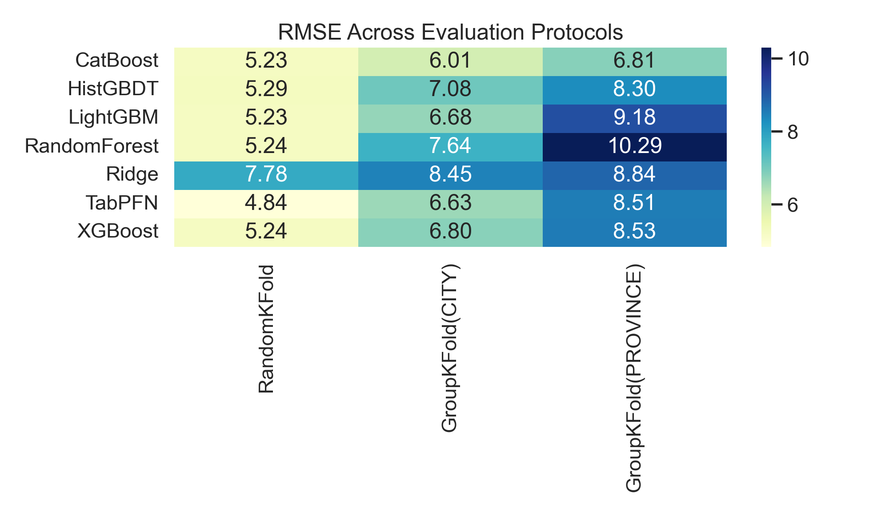

表 5 给出了主协议 `GroupKFold(CITY)` 下各单模型的完整结果。

表 5 `GroupKFold(CITY)` 下的基线结果

| 模型 | RMSE | MAE | R² |
|---|---:|---:|---:|
| CatBoost | 6.0109 | 3.2069 | 0.7542 |
| TabPFN | 6.6310 | 4.0478 | 0.7031 |
| LightGBM | 6.6828 | 4.2645 | 0.6944 |
| XGBoost | 6.7986 | 4.3365 | 0.6831 |
| HGBT | 7.0753 | 4.6046 | 0.6584 |
| RF | 7.6447 | 5.1453 | 0.6017 |
| Ridge | 8.4532 | 5.6997 | 0.5165 |

可见，在严格地理分组协议下，Boosting 树整体竞争力更强，CatBoost 相比单模型 TabPFN 的 RMSE 进一步降低约 `9.35%`。这说明在更强的跨域异质性条件下，显式利用 `COUNTRY`、`PROVINCE` 和 `CITY` 等类别信息的能力，比单纯依赖小样本先验更重要。

### 6.2 GeoPFNMix 家族的整体消融

在单模型基线基础上，本文进一步比较 GeoPFNMix 家族不同变体在主协议下的表现。表 6 给出了完整消融结果。

表 6 GeoPFNMix 家族消融结果（`GroupKFold(CITY)`）

| 模型 | 说明 | RMSE | MAE | R² |
|---|---|---:|---:|---:|
| RF | RF 单模型基线 | 7.6447 | 5.1453 | 0.6017 |
| CatBoost | CatBoost 单模型基线 | 6.0138 | 3.2047 | 0.7540 |
| TabPFN | TabPFN 单模型基线 | 6.6310 | 4.0478 | 0.7031 |
| GeoPFNMix-no-prior | RF + 地理残差校正 | 7.6237 | 5.1266 | 0.6038 |
| GeoPFNMix-Lite | RF + LightGBM 先验 + stacking | 6.3829 | 3.7506 | 0.7227 |
| GeoPFNMix-Lite-TabPFN | RF + TabPFN 先验 + stacking | 6.2711 | 3.7003 | 0.7339 |
| GeoPFNMix | RF + 残差 + LightGBM 先验 + stacking | 6.3911 | 3.7542 | 0.7220 |
| GeoPFNMix-TabPFN | RF + 残差 + TabPFN 先验 + stacking | 6.2891 | 3.7093 | 0.7323 |
| GeoPFNMix-CatBoost | CatBoost + 残差 + LightGBM 先验 + stacking | 5.9488 | 3.1088 | 0.7598 |
| GeoPFNMix-CatBoost-TabPFN | CatBoost + 残差 + TabPFN 先验 + stacking | **5.9342** | 3.1168 | **0.7612** |

由表 6 可以得到五点主要结论。

第一，GeoPFNMix 作为总框架是成立的。无论是 Lite 版本、完整版本，还是 CatBoost 骨干版本，其中多个配置都优于其对应的单模型基线，说明“结构化拆分 + 异构融合”在本任务中具有实际意义。

第二，数据扩展后的主导因素发生了变化。在旧版单源实验中，Lite 结构的优势较为突出；而在当前多源数据上，`GeoPFNMix-CatBoost` 与 `GeoPFNMix-CatBoost-TabPFN` 占据最优区间，说明当 `COUNTRY` 和跨区域类别信息进入主导特征后，更强的全局专家变得更加重要。

第三，GeoPFNMix-Lite 依旧具有研究价值。它相对 RF 单模型的 RMSE 降低 `16.50%`、MAE 降低 `27.11%`，证明“控制结构复杂度 + 引入异构先验”的设计仍然有效；只是随着数据规模和异质性上升，Lite 不再是全局最优，而更适合作为复杂度控制的核心对照。

第四，残差分支在更大数据集上不再像早期实验那样明显拖累。`GeoPFNMix-Lite` 与 `GeoPFNMix` 的均值差异已经非常小，说明在更大规模、更高异质性的数据上，残差分支至少不再是显著负担。

第五，当前最佳模型 `GeoPFNMix-CatBoost-TabPFN` 在 RMSE 上略优于 `GeoPFNMix-CatBoost`，但其 MAE 略高于后者。这说明 TabPFN 先验主要改善了大误差样本和整体 RMSE，而未必在所有指标上同时占优。

图 6 给出了主协议下 GeoPFNMix 家族的 RMSE 对比。可以观察到，CatBoost 骨干版本整体位于性能前沿，而 RF 骨干版本更多承担对照和方法解释的角色。

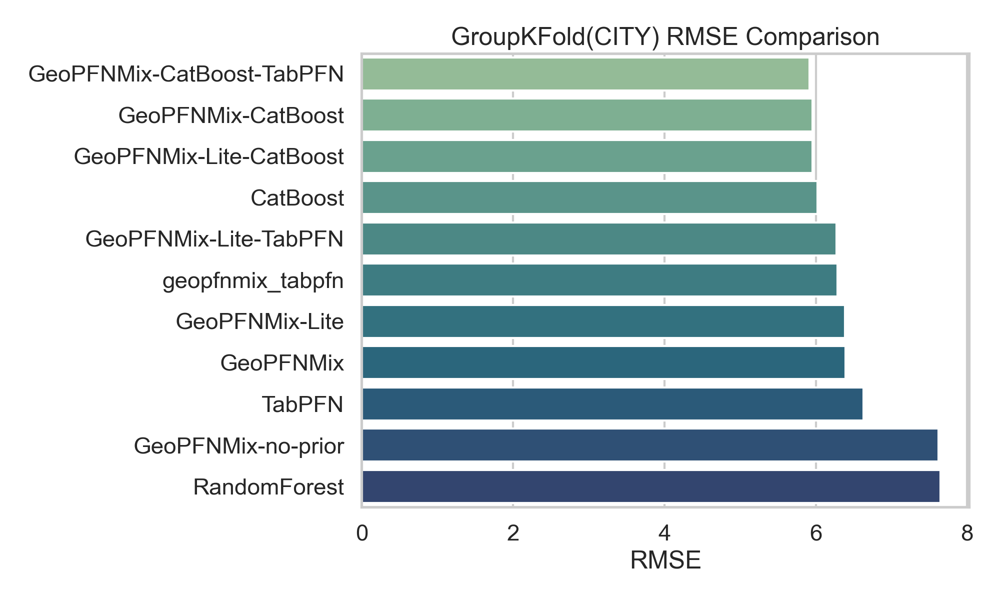

图 7 进一步展示了 RMSE 和 MAE 两个指标上的消融差异。可以看出，不同模型在两个指标上的受益结构并不完全相同，但最优区间主要由 CatBoost 骨干版本占据。

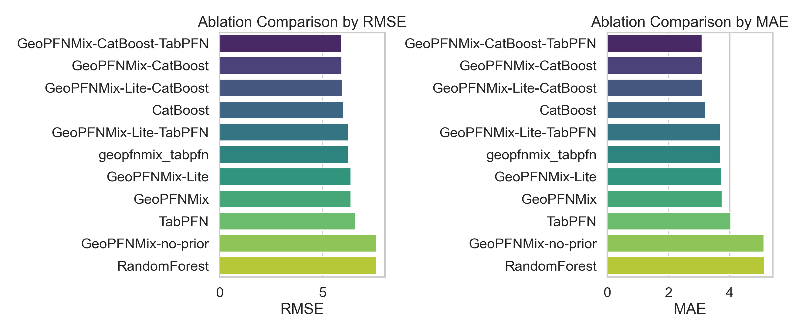

### 6.3 GeoPFNMix-Lite 的角色再评估

GeoPFNMix-Lite 在本文中仍具有特殊地位。其意义不再只是“阶段性最优配置”，而是作为一个复杂度受控、解释清晰、在不同数据规模下都能稳定工作的核心对照。

首先，从 RF 系列内部比较看，`GeoPFNMix-Lite` 与 `GeoPFNMix` 的 RMSE 分别为 `6.3829` 与 `6.3911`，Wilcoxon 配对检验 `p=0.9875`，说明在当前多源数据规模下，两者几乎没有统计学差异。与早期“小样本下 Lite 明显优于 Full”的现象相比，当前结果更像是在说明：随着数据量和异质性增加，残差分支的额外复杂度不再显著伤害模型，但也未形成决定性优势。

其次，Lite 版本相较 RF 单模型的提升仍然十分明显。`GeoPFNMix-Lite` 相比 RF 的 RMSE 下降 `16.50%`、MAE 下降 `27.11%`，配对检验结果数值下溢为 `0.0`，说明这种改进不仅体现在均值指标上，也稳定存在于样本级误差分布上。

再次，在接入 TabPFN 后，Lite 结构仍表现出良好的兼容性。`GeoPFNMix-Lite-TabPFN` 相比单模型 TabPFN 的 RMSE 下降 `5.43%`、MAE 下降 `8.58%`，配对检验 `p=2.11e-145`。这表明 Lite 的价值并未因为“最终冠军换成 CatBoost 骨干版本”而消失，它仍然是验证“强先验如何通过低容量结构被稳定吸收”的重要证据。

### 6.4 GeoPFNMix-CatBoost 的提出价值

GeoPFNMix-CatBoost 的研究意义在于，它回答了另一个与 Lite 不同的问题：当单模型基线中出现更强的类别友好型模型时，GeoPFNMix 框架是否仍然能够吸收并利用这一更强骨干。

实验结果表明，`GeoPFNMix-CatBoost` 相比 CatBoost 单模型的 RMSE 下降约 `1.03%`，MAE 下降约 `3.06%`，并在 Wilcoxon 检验中达到 `p=2.55e-31`。这说明更强全局专家与结构化融合并不矛盾，相反，CatBoost 骨干使 GeoPFNMix 在多源数据上获得了更高上限。

进一步地，`GeoPFNMix-CatBoost-TabPFN` 将 RMSE 继续降至 `5.9342`，相较单模型 CatBoost 总体 RMSE 降低 `1.28%`、MAE 降低 `2.81%`，且其相对单模型 CatBoost 的样本级误差改进在 Wilcoxon 检验中达到 `p=4.72e-13`。虽然它相对 `GeoPFNMix-CatBoost` 的 RMSE 提升幅度仅为 `0.25%`，但依然提示：当全局专家已经足够强时，TabPFN 先验仍能在少量困难样本上带来额外收益。

因此，GeoPFNMix-CatBoost 的提出并非“简单换一个骨干模型”，而是回答了 GeoPFNMix 框架在多源异质数据上是否仍具一般性的问题。当前结果说明，答案是肯定的。

### 6.5 TabPFN 作为先验专家的价值分析

TabPFN 在本文中具有双重身份：它既是强单模型基线，也是可插拔的先验专家。多协议结果显示，TabPFN 的这两种身份并不等价。

作为单模型，TabPFN 在 `RandomKFold` 下表现最优，这说明其小样本先验在近似同分布场景中非常有效；但在 `GroupKFold(CITY)` 和 `GroupKFold(PROVINCE)` 下，它均被 CatBoost 超越，提示 PFN 先验并不能自动解决更强的地理分布偏移问题。

作为先验专家，TabPFN 的收益则体现为“与强骨干或低容量融合结构形成互补”。对 RF-Lite 和 RF-Full 家族而言，接入 TabPFN 后的均值 RMSE 都有所下降，但与对应 LightGBM 先验版本相比，Wilcoxon 检验分别为 `p=0.1127` 和 `p=0.0738`，尚未达到传统显著性阈值。这说明在 RF 骨干下，TabPFN 先验的平均收益存在，但稳定性仍受限于整体骨干能力。

相较之下，在 CatBoost 骨干下，TabPFN 先验的作用更加清晰。`GeoPFNMix-CatBoost-TabPFN` 相比 `GeoPFNMix-CatBoost` 的差异达到 `p=0.0133`，说明当全局专家已经较好吸收类别与跨域结构后，TabPFN 提供的补充信息更容易被 stacking 捕捉并转化为稳定改进。

### 6.6 显著性检验

表 7 汇总了关键模型对之间的 Wilcoxon 配对检验结果。

表 7 关键模型 Wilcoxon 配对检验结果

| 对比 | p 值 | 结论 |
|---|---:|---|
| RF vs GeoPFNMix-Lite | `0.0` | Lite 显著优于 RF |
| RF vs GeoPFNMix | `0.0` | Full 显著优于 RF |
| GeoPFNMix-Lite vs GeoPFNMix | `0.9875` | Lite 与 Full 无显著差异 |
| CatBoost vs GeoPFNMix-CatBoost | `2.55e-31` | CatBoost 版融合显著优于单模型 CatBoost |
| CatBoost vs GeoPFNMix-CatBoost-TabPFN | `4.72e-13` | 最佳融合显著优于单模型 CatBoost |
| GeoPFNMix vs GeoPFNMix-CatBoost | `6.50e-213` | CatBoost 骨干显著优于 RF 全模型 |
| GeoPFNMix vs GeoPFNMix-TabPFN | `7.38e-02` | Full 结构接入 TabPFN 的收益未达显著 |
| GeoPFNMix-Lite vs GeoPFNMix-Lite-TabPFN | `1.13e-01` | Lite 结构接入 TabPFN 的收益未达显著 |
| GeoPFNMix-Lite-TabPFN vs GeoPFNMix-TabPFN | `4.31e-07` | 强先验下 Lite-TabPFN 仍优于 Full-TabPFN |
| GeoPFNMix-CatBoost vs GeoPFNMix-CatBoost-TabPFN | `1.33e-02` | TabPFN 先验在 CatBoost 骨干下带来显著收益 |
| TabPFN vs GeoPFNMix-Lite-TabPFN | `2.11e-145` | Lite-TabPFN 显著优于单模型 TabPFN |
| TabPFN vs GeoPFNMix-CatBoost-TabPFN | `0.0` | 最佳融合显著优于单模型 TabPFN |

从表 7 可以看出，本轮多源数据实验最值得强调的结论不再是“Lite 一定显著优于 Full”，而是“CatBoost 骨干版本的结构化融合改进最稳定，且 TabPFN 先验在强骨干上更容易转化为显著收益”。这也意味着论文的最终叙事需要从“轻量结构获胜”修正为“数据扩展后，强骨干与先验互补共同主导最优结果”。

### 6.7 误差结构分析

图 8 为当前最佳融合模型 `GeoPFNMix-CatBoost-TabPFN` 的 OOF 预测散点图。可以看到，大多数低中污染样本拟合较为集中，但高污染尾部仍存在明显散布。

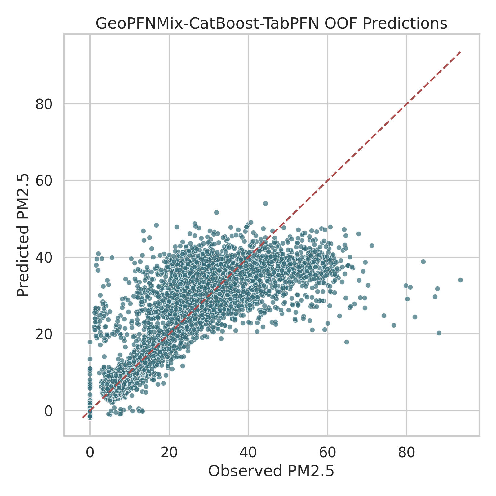

为进一步分析模型在不同污染区间的表现，本文按照真实 PM2.5 值划分四个区间，并统计误差，如表 8 所示。

表 8 当前最佳融合模型在不同 PM2.5 区间的误差

| PM2.5 区间 | 样本数 | MAE | RMSE |
|---|---:|---:|---:|
| `<20` | 9802 | 1.7381 | 3.4863 |
| `20-35` | 1651 | 5.9038 | 7.4059 |
| `35-50` | 651 | 7.5169 | 9.0523 |
| `>=50` | 341 | 20.8556 | 22.7805 |

从表 8 可以发现，模型在主体分布区间表现较好，尤其是在 `<20` 的低污染主体区间上 MAE 仅为 `1.7381`；而在 `>=50` 的高污染尾部，误差显著增大。这说明当前模型的主要难点已不在整体均值水平，而在于少量高污染极端样本的稳定拟合。

图 9 进一步以柱状图形式展示了上述结果。

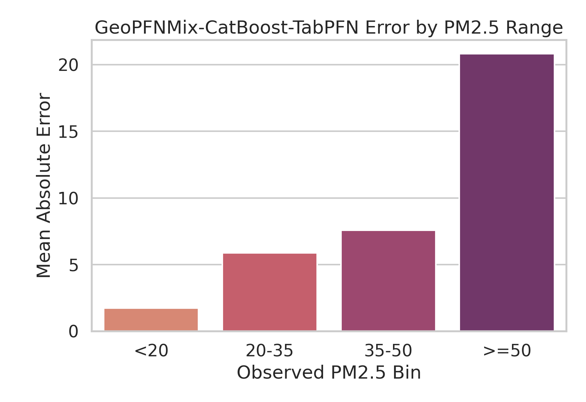

图 10 展示了一级地理组平均绝对误差分布。由于图形环境中的中文标签显示存在兼容性问题，图中统一采用英文或代码化标签。从总体趋势看，部分中国省级区域的误差仍然偏高，而若干欧盟和美国组的误差很低，这反映出区域分布偏移、目标尺度差异和组内方差差异仍然对模型表现产生显著影响。

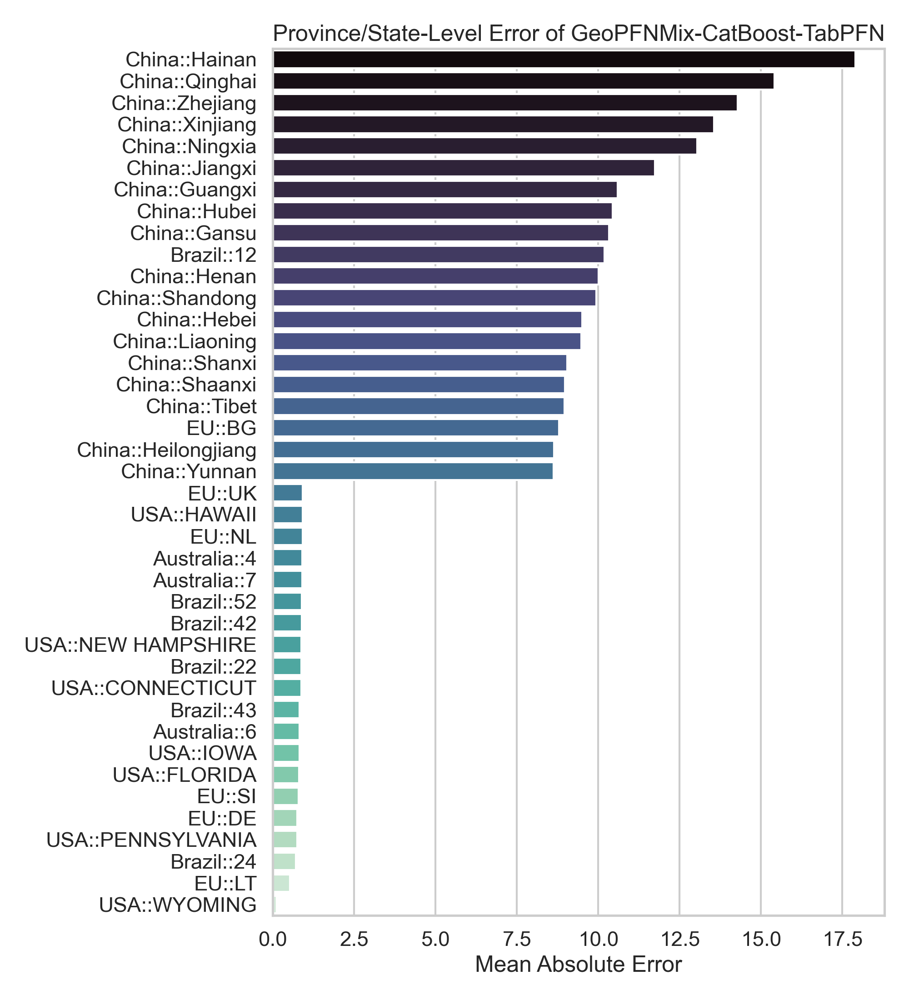

表 9 列出了误差最高和最低的若干一级地理组。

表 9 一级地理组误差高低对比

| 误差较高区域 | MAE | 误差较低区域 | MAE |
|---|---:|---|---:|
| `China::海南省` | 17.79 | `EU::SI` | 0.71 |
| `China::青海省` | 15.47 | `Brazil::24` | 0.70 |
| `China::浙江省` | 14.30 | `EU::DE` | 0.70 |
| `China::新疆维吾尔自治区` | 13.49 | `EU::LT` | 0.34 |
| `China::宁夏回族自治区` | 13.08 | `USA::WYOMING` | 0.09 |

### 6.8 可解释性分析

由于当前最佳融合模型为 `GeoPFNMix-CatBoost-TabPFN`，其全局专家为 CatBoost，因此本文采用“整体误差分析 + 最佳全局专家 SHAP 解释”相结合的策略进行分析。图 11 展示了当前最佳全局专家的 SHAP 全局重要性结果。

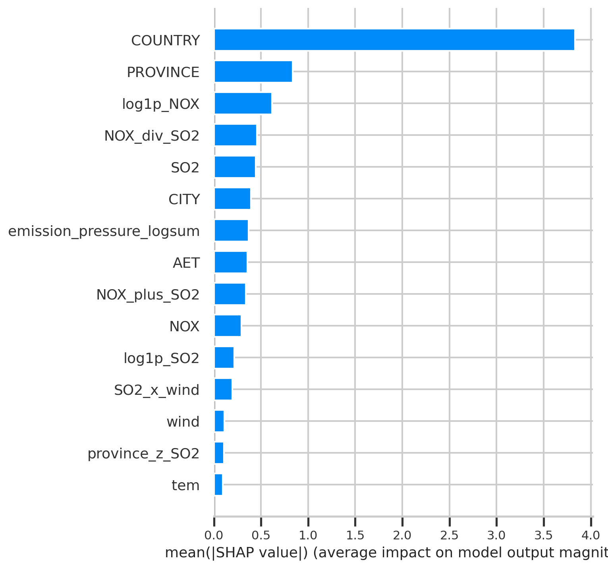

表 10 给出了前 10 个重要特征。

表 10 最佳全局专家 SHAP Top 10

| 排名 | 特征 | 平均绝对 SHAP |
|---:|---|---:|
| 1 | `COUNTRY` | 3.8931 |
| 2 | `PROVINCE` | 0.8585 |
| 3 | `log1p_NOX` | 0.6183 |
| 4 | `NOX_div_SO2` | 0.4759 |
| 5 | `SO2` | 0.4353 |
| 6 | `CITY` | 0.4016 |
| 7 | `AET` | 0.3787 |
| 8 | `emission_pressure_logsum` | 0.3646 |
| 9 | `NOX_plus_SO2` | 0.3379 |
| 10 | `NOX` | 0.2885 |

上述结果最值得注意的现象是 `COUNTRY` 的重要性显著高于其他特征。这说明在多源数据场景下，跨国家或跨区域来源差异已经成为模型必须首先处理的域偏移因素；与此同时，污染前体物、排放协同特征和气象变量依然构成了可迁移规律的核心主体。该解释结果与前述协议差异和误差结构分析相互印证，说明本文的特征设计和方法结构与问题本身具有较好一致性。

### 6.9 协议差异与泛化代价讨论

从提交版论文的角度，仅报告“最佳模型是谁”还不够，更重要的是解释在不同协议下为何会出现如此明显的性能差异。结合表 4 和热力图结果可以发现，`RandomKFold` 下的最佳 RMSE 为 `4.8426`，而 `GroupKFold(CITY)` 下最优单模型的 RMSE 上升到 `6.0109`，当前最佳融合模型 `GeoPFNMix-CatBoost-TabPFN` 也仅能将其降至 `5.9342`。这意味着即使引入融合结构，严格地理分组下的预测难度仍比随机划分高出约 `22.54%`。

这一现象说明，区域 PM2.5 预测中的很多可学习模式都具有明显地理属性和来源属性。当训练集与测试集共享高度相似的国家背景和区域分布时，模型能够较容易利用来源差异完成预测；而一旦要求模型面对未见过的二级地理组或一级地理组，它必须更多依赖污染变量、气象变量以及相对强度特征中的可迁移规律。也正因为如此，本文认为强调地理分组协议，不仅是实验设置问题，更是研究结论是否可信的前提。

进一步看，`GroupKFold(PROVINCE)` 下所有模型的性能都较 `GroupKFold(CITY)` 进一步下降，这意味着当前框架已经能够在跨二级地理组场景下获得稳定改进，但跨一级地理组的泛化仍可能受到更强分布偏移影响。因此，协议差异不仅揭示了已有模型的能力边界，也为后续引入更强空间特征、域适配方法和更严格空间验证策略提供了明确方向。

---

## 7 讨论

### 7.1 GeoPFNMix、GeoPFNMix-Lite 与 GeoPFNMix-CatBoost 的关系

在本文的研究叙事中，GeoPFNMix、GeoPFNMix-Lite 和 GeoPFNMix-CatBoost 并非彼此孤立的模型名称，而是同一研究路径中的三个关键节点。

GeoPFNMix 是总框架，代表一种针对地理异质性表格数据的结构化问题分解方式：全局专家负责学习总体非线性规律，残差分支负责显式刻画区域系统偏差，先验专家负责补充不同归纳偏置，stacking 负责有限度融合。其价值在于提供了一种可解释、可扩展的建模语言。

GeoPFNMix-Lite 是对总框架的轻量化实现，强调在当前样本规模和评估协议下，复杂度控制同样是模型设计的一部分。它说明对于强分组、异质数据问题，“减少不必要自由度”本身就是一种有效策略。即便在本轮多源数据实验中 Lite 不再是最终冠军，它依旧承担着两个重要角色：一是作为 RF 骨干路线的核心强对照，二是作为验证“低容量结构如何吸收异构先验”的方法学证据。

GeoPFNMix-CatBoost 则代表另一条演化路线，即在不放弃框架结构的前提下，通过更强全局专家提高模型上限。它的提出表明，GeoPFNMix 并不是只对某一种骨干模型有效，而是具有更一般的结构意义。更重要的是，本轮正式结果恰恰说明：在多源数据和显著域偏移条件下，这条“增强全局专家”的路线已经超过 Lite 路线，成为当前最有效的演化方向。

### 7.2 为什么最优结果出现在 GeoPFNMix-CatBoost-TabPFN

从实验结果看，`GeoPFNMix-CatBoost-TabPFN` 在主协议下取得了最优 RMSE 和最优 R²。本文认为，这一结果主要由以下几个因素共同决定。

首先，多源数据显著放大了类别层级的重要性。SHAP 结果显示 `COUNTRY` 是全局专家最重要的特征，`PROVINCE` 与 `CITY` 也排在前列，这意味着跨国家和跨区域来源差异已经成为主导因素。在这种条件下，CatBoost 对类别特征的建模优势直接转化为更强的全局骨干能力。

其次，更大规模的数据使残差分支和 stacking 有了更好的发挥空间。与早期单源实验相比，当前完整结构不再因为样本过小而明显受损，说明当骨干足够强、样本覆盖更广时，GeoPFNMix 的完整框架更容易稳定吸收额外结构信息。

最后，TabPFN 在这里扮演的并不是“替代 CatBoost 的主模型”，而是“为强骨干补充不同归纳偏置的先验专家”。它相对 `GeoPFNMix-CatBoost` 带来的收益并不大，但已经达到统计显著，说明在困难样本和大误差样本上，它确实提供了 CatBoost 本身尚未完全覆盖的信息。

### 7.3 本研究的局限

尽管本文已完成从数据审计、基线构建、方法设计、TabPFN 对照、显著性检验到图表资产的完整流程，但仍存在以下局限。

第一，数据为静态表格而非时空序列，无法显式刻画污染传播、季节变化和时间滞后效应。第二，当前多源数据虽然已统一到同一字段结构，但部分来源的地理层级需要依赖编码代理恢复，这种代理层级并不等价于真实空间邻接关系。第三，当前缺少经纬度、地形、土地利用、交通强度、产业结构和遥感 AOD 等更丰富的空间特征，这限制了模型上限。第四，虽然 TabPFN 已正式纳入实验，但更大规模的 foundation model 对照仍不充分。第五，当前解释性分析主要围绕最佳全局专家展开，尚未对整个融合系统提供统一解释框架。

### 7.4 对毕业设计完整性的意义

从本科毕业设计的角度看，本文的价值不仅体现在最终分数上，更体现在研究过程的完整性上。本文已覆盖数据理解、问题定义、协议设计、强基线构建、创新模型提出、方法演化、显著性检验、误差分析、解释性分析和工程复现等多个环节。相较于仅比较少量模型并汇报单一指标的工作，这种完整研究链条更能体现问题意识、方法意识与工程实现能力。

同时，GeoPFNMix 家族形成了较为清晰的答辩叙事路径：先从多源数据标准化与地理泄漏问题切入，说明为何需要地理分组协议；再引出 GeoPFNMix 作为总框架，进一步说明 Lite 和 CatBoost 两条演化路线的必要性；最后借助 TabPFN 的正式接入完成 PFN 先验增强的实证验证。这种叙事逻辑有助于提升论文整体的完整度与说服力。

### 7.5 后续工作展望

未来可进一步开展以下研究。

1. 设计更严格的空间泛化协议，如 leave-one-country-out、leave-one-province-out 或空间块交叉验证。
2. 引入更多空间辅助特征，如经纬度、路网、人口密度、土地利用和遥感产品，以减少模型对 `COUNTRY` 代理信息的依赖。
3. 增加不确定性估计，使模型能够在输出点预测的同时给出置信区间。
4. 进一步研究 TabPFN 与不同骨干、不同样本规模及不同域偏移强度下的适配关系，探索最优融合复杂度。
5. 构建轻量化演示系统，将模型结果用于答辩展示和交互解释。

---

## 8 结论

本文围绕多源农业环境静态表格数据上的 PM2.5 回归预测任务，构建了一条较为完整的研究路线。通过对 Australia、Brazil、China、EU 和 USA 五个来源数据进行统一标准化，本文得到 12445 条样本、5 个国家或区域、144 个一级地理组和 1025 个二级地理组，并明确指出随机划分会显著高估模型性能，因而确立 `GroupKFold(CITY)` 作为主评估协议。

在实验层面，本文构建了覆盖线性模型、树模型与 foundation model 风格模型的强基线体系。结果表明，`TabPFN` 在随机划分下表现最优，而在严格地理分组协议下，`CatBoost` 成为最强单模型。这一现象说明，在多源异质数据场景中，类别结构和地理分布偏移对模型优劣具有决定性影响。

在方法层面，本文提出 GeoPFNMix 总框架，并进一步发展出 GeoPFNMix-Lite 与 GeoPFNMix-CatBoost 两条关键演化路线。前者体现了在地理泛化任务中控制结构复杂度的重要性，后者体现了增强全局专家能力对于提升框架上限的意义。在获得 TabPFN 授权后，本文进一步构造 `GeoPFNMix-Lite-TabPFN`、`GeoPFNMix-TabPFN` 和 `GeoPFNMix-CatBoost-TabPFN` 等扩展版本，使 PFN 先验真正进入正式实验。

实验结果表明，当前最佳融合模型为 `GeoPFNMix-CatBoost-TabPFN`，在主协议下取得 `RMSE=5.9342`、`MAE=3.1168`、`R²=0.7612`；而 `GeoPFNMix-CatBoost` 也取得了几乎相当的强结果，证明“增强全局专家”已经成为当前数据条件下更有效的演化方向。同时，GeoPFNMix-Lite 依然保留了重要研究价值，因为它证明了在 RF 骨干下，控制结构复杂度和低容量融合可以稳定优于单模型 RF，并为先验专家的接入提供清晰基线。

总体而言，本文不仅形成了一个可复现、可解释、可扩展的毕业设计研究成果，也为后续进一步引入真实空间特征、更严格空间泛化协议和更强 foundation model 奠定了基础。

---

## 参考文献

1. Yury Gorishniy, Ivan Rubachev, Valentin Khrulkov, Artem Babenko. *Revisiting Deep Learning Models for Tabular Data*. NeurIPS 2021. OpenReview: https://openreview.net/forum?id=i_Q1yrOegLY
2. Noah Hollmann, Samuel Müller, Katharina Eggensperger, Frank Hutter. *TabPFN: A Transformer That Solves Small Tabular Classification Problems in a Second*. ICLR 2023. arXiv: https://arxiv.org/abs/2207.01848
3. Prior Labs. *TabPFN Quickstart*. https://docs.priorlabs.ai/quickstart
4. Min Duan, Yufan Sun, Binzhe Zhang, Chi Chen, Tao Tan, Yihua Zhu. *PM2.5 Concentration Prediction in Six Major Chinese Urban Agglomerations: A Comparative Study of Various Machine Learning Methods Based on Meteorological Data*. Atmosphere, 2023, 14(5), 903. https://doi.org/10.3390/atmos14050903
5. *Quantify the role of anthropogenic emission and meteorology on air pollution using machine learning approach: A case study of PM2.5 during the COVID-19 outbreak in Hubei Province, China*. Environmental Pollution, 2022. PubMed: https://pubmed.ncbi.nlm.nih.gov/35121018/
6. Xingxuan Zhang, Gang Ren, Han Yu, Hao Yuan, Hui Wang, Jiansheng Li, Jiayun Wu, Lang Mo, Li Mao, Mingchao Hao, et al. *LimiX: Unleashing Structured-Data Modeling Capability for Generalist Intelligence*. arXiv:2509.03505, 2025. Official repo: https://github.com/limix-ldm-ai/LimiX

---

## 附录 A 关键实验资产与复现说明

本文正式实验使用 `data/` 目录中的多源数据文件，并在 Colab A100 GPU 环境中完成基线与融合模型重跑。若仅在本地 CPU 环境中复现，也可将 `--device gpu` 改为 `--device auto` 或 `--device cpu`。

本文主要实验资产保存在 `artifacts/` 目录下，重要文件包括：

- `artifacts/tables/baseline_summary.csv`
- `artifacts/tables/protocol_best_models.csv`
- `artifacts/tables/protocol_generalization_gap.csv`
- `artifacts/tables/geopfnmix_ablation_summary.csv`
- `artifacts/tables/geopfnmix_significance_pairs.csv`
- `artifacts/tables/geopfnmix_error_by_target_bin.csv`
- `artifacts/tables/province_level_mae.csv`
- `artifacts/tables/best_global_expert_shap_top10.csv`
- `artifacts/figures/baseline_protocol_heatmap.png`
- `artifacts/figures/group_city_model_comparison.png`
- `artifacts/figures/geopfnmix_ablation_metrics.png`
- `artifacts/figures/best_geopfnmix_scatter.png`
- `artifacts/figures/geopfnmix_error_by_target_bin.png`
- `artifacts/figures/province_level_mae.png`
- `artifacts/figures/best_global_expert_shap_bar.png`

若需完整复现实验，可依次执行以下脚本：

```bash
python scripts/run_eda.py
python scripts/run_baselines.py --device gpu
python scripts/run_geopfnmix.py --device gpu
python scripts/run_analysis_assets.py
```

## 附录 B GeoPFNMix 家族命名说明

`GeoPFNMix` 中的 `Geo` 指向地理层级意识，`PFN` 指向先验专家方向，`Mix` 指向异构专家融合。因此，GeoPFNMix 从一开始即被设计为一个框架性名称，而非某一不可变的单点模型。

在此基础上，`GeoPFNMix-Lite` 表示对总框架的轻量化实现，强调在保证异构融合思想的前提下控制结构复杂度；`GeoPFNMix-CatBoost` 表示在总框架下替换更强全局专家的增强版本；当 TabPFN 授权链路打通后，Lite 与 CatBoost 两条路线又进一步延伸出 TabPFN 先验增强版本。由此，GeoPFNMix 家族形成了一条较为清晰的方法演化路径。
